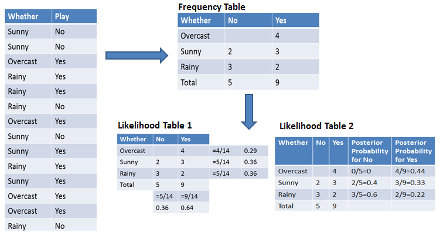

---
output:
  pdf_document: default
  html_document: default
  word_document: default
---
# Otros Clasificadores

## Clasificador Bayesiano

Bajo el modelo de aprendizaje estadístico, suponga que se quiere estimar $f$ usando el conjunto de entrenamiento $\{(x_1,y_1),\ldots,(x_n,y_n)\}$ donde $y_1,\ldots,y_n$ es categórica. Para evaluar la precisión del clasificador $\hat f$ podemos usar la tasa de error:

$$\frac 1 n \sum_{i=1}^nI(y_i\neq \hat y_i)$$

donde $\hat y_i$ es el nivel predecido de la variable categórica para el individuo $i$-ésimo. La tasa de error mide la proporción de observaciones mal clasificadas por $\hat f$ dentro del conjunto de entrenamiento. El mismo concepto se puede aplicar en el conjunto de prueba, es decir si $Z_0$ es el conjunto de índices de datos de prueba con tamaño $m$:

\begin{align}
\frac 1 m \sum_{i \in Z_0}I(y_i\neq \hat y_i)
(\#eq:cerror)
\end{align}

Decimos que un clasificador es bueno cuando el error de prueba en \@ref(eq:cerror) es el más pequeño.

Es posible demostrar que el error de prueba se minimiza cuando $\hat f$ asigna a cada observación el nivel con la probabilidad más alta dados los predictores, es decir se asigna la clase $j$ a la observación $x_0$ en donde 
$$P(Y=j|X=x_0)$$

es máximo. A este clasificador se le llama *clasificador bayesiano*. En el caso en que el número de niveles o categorías de la variable dependiente es 2 ($j=1,2$), entonces se selecciona el nivel $j$-ésimo si:
$$P(Y=j|X=x_0)>0.5$$

Al conjunto $\{x_0: P(Y=j|X=x_0)=0.5\}$ se le llama frontera de decisión de Bayes. 

La *tasa bayesiana de error* del clasificador para un conjunto de datos fijos es:
$1-\max_j P(Y=j|X=x_0)$. En general la tasa de error bayesiana sería:
$$1-E\left[\max_j P(Y=j|X)\right]$$

Para el caso de clasificación la tasa de error bayesiana es equivalente al error irreducible.

Inconveniente: en datos reales no conocemos $P(Y=j|X=x_0)$. Se puede aproximar estas probabilidades usando lo que se conoce como _Bayes ingenuo_ (_Naïve Bayes_). 


- Paso 1: Calcule la probabilidad previa para las etiquetas de clase dadas 
- Paso 2: Encuentre la probabilidad de verosimilitud con cada atributo para cada clase 
- Paso 3: Ponga estos valores en la fórmula de Bayes y calcule la probabilidad posterior. 
- Paso 4: Revise qué clase tiene una probabilidad más alta, dado que la entrada pertenece a la clase de probabilidad más alta.





## Método de k vecinos más cercanos (KNN)

Este método aproxima la probabilidad condicional del clasificador bayesiano. Dado un entero $K$ y una observación de prueba $x_0$, el clasificador hace lo siguiente 
1. Encuentra los primeros \(K\) vecinos  más cercanos (usando alguna distancia) de observaciones que son más cercanas a $x_0$: $\mathcal N_0$
2. Luego calcula 

$$P(Y=j|X=x_0) = \frac{1}{K}\sum_{i \in \mathcal N_0}I(y_i=j)$$

3. Finalmente, siguiendo la regla de bayes se selecciona la categoría con probabilidad condicional máxima.


## Análisis Discriminante

Recuerden que en el caso del modelo logístico, se tiene que:
$$P(Y=1|X=x)=\frac{e^{\beta_0+\beta_1X_1+\cdots+\beta_pX_p}}{1+e^{\beta_0+\beta_1X_1+\cdots+\beta_pX_p}}$$
donde $X_1,\ldots,X_p$ son los predictores. Para el modelo logístico tenemos los siguientes inconvenientes:

- Cuando las clases están muy separadas, los parámetros del modelo logístico tienden a ser muy inestables.

- Cuando la distribución de los predictores es aproximadamente normal en cada una de las clases, entonces el modelo discriminante lineal es más estable que el logístico.

- El modelo logístico aplica solamente en el caso de 2 clases.

Suponga que se quiere clasificar una observación en $K\geq 2$ clases. Sea $\pi_k$ la probabilidad previa de que la observación provenga de la clase $k$-ésima. Sea 
$$f_k(x)=P(X=x|Y=k)$$
por el teorema de Bayes:
$$P_k(x)=P(Y=k|X=x)=\frac{\pi_kf_k(x)}{\sum_{l=1}^K \pi_lf_l(x)}$$

Estimación de los componentes:

- $\pi_k$: proporción de observaciones en el conjunto de entrenamiento que pertenecen a la clase $k$-ésima.
- $f_k(x)$: supuesto paramétrico que define el tipo de análisis discriminante.

### Análisis discriminante lineal

#### Caso p=1

Asuma que 
$$f_k(x)=\frac{1}{\sqrt{2\pi}\sigma_k}\exp\left(-\frac{1}{2\sigma_k^2}(x-\mu_k)^2\right)$$
donde $\mu_k$ y $\sigma_k$ son la media y desviación estándar para cada clase en la variable dependiente. Asumiendo que $\sigma^2=\sigma_1^2=\cdots=\sigma_K^2$ se puede comprobar que el clasificador bayesiano asigna la clase $k$ si

\begin{align}
\delta_k(x)=x\frac{\mu_k}{\sigma^2}-\frac{\mu_k^2}{2\sigma^2}+\log(\pi_k)
(\#eq:LDA)
\end{align}

es el máximo entre los valores correspondientes a cada clase. A esta función se le llama *función discriminante*.

El método de análisis discriminante lineal (LDA) asume que:
\begin{align*}
\hat \mu_k&=\frac{1}{n_k}\sum_{i:y_i=k}x_i\\
\hat \sigma^2&=\frac{1}{n-K}\sum_{k=1}^K\sum_{i:y_i=k}(x_i-\hat \mu_k)^2\\
\hat \pi_k &=\frac{n_k}{n}
\end{align*}

como estimadores plug-in en \@ref(eq:LDA).

#### Caso p>1

Generalizando la sección anterior, podemos asumir que $X=(X_1,\ldots,X_p)$ proviene de una distribución Gaussiana multivariada. Es decir, asuma que las observaciones en la clase $k$ tienen distribución $N(\mu_k,\Sigma)$ donde $\mu_k$: vector de medias para la clase $k$ y $\Sigma$ es la matriz de varianza-covarianza para todas las $K$ clases. 

La función discriminante en este caso sería:
$$\delta_k(x)=x^T\Sigma^{-1} \mu_k-\frac 1 2\mu_k^T \Sigma^{-1}\mu_k+\log \pi_k$$
El método LDA sustituye los parámetros en la fórmula anterior con estimadores empíricos, tal y como se hizo para $p=1$. La escogencia de la clase estimada sigue el mismo criterio.

![Simulación de Análisis Discriminante Lineal [@James2013b]](manual_figures/LDA.png)

### Análisis discriminante cuadrático

Bajo los supuestos del LDA, asuma que $\Sigma_k$ es la matriz de covarianza para la clase $k$. En este caso las funciones discriminantes tendrían la forma:
$$\delta_k(x)=-\frac 1 2 (x-\mu_k)^T\Sigma_k^{-1}(x-\mu_k)-\frac 1 2 \log |\Sigma_k|+\log \pi_k$$
Al uso de las funciones anteriores como herramientas de clasificación se le llama Análisis Discriminante Cuadrático (QDA). 

Relación LDA vs QDA:

- LDA es menos flexible que QDA, por la diferencia en el número de parámetros. Por lo tanto LDA tiene menos varianza que QDA.
- Si el supuesto de varianzas constantes en LDA no es adecuado, entonces el sesgo es alto.
- QDA es más adecuado que LDA cuando el número de observaciones es relativamente alto, debido a que el supuesto de varianzas constantes es más difícil de alcanzar.

Comparación de métodos:

- LDA y regresión logística producen fronteras de decisión lineales. 
- LDA asume más sobre el comportamiento de los datos, con respecto a la regresión logística.
- KNN es no paramétrico, por lo tanto produce fronteras de decisión más flexibles que LDA o QDA. El grado de suavidad del clasificador (en términos de sus fronteras) depende del parámetro $K$.
- QDA ofrece fronteras de decisión más flexibles que LDA o logística.
- KNN no tiene la misma capacidad de interpretabilidad que la regresión logística.
- Como KNN depende de la distancia entre observaciones, entonces la escala de las covariables importa.

## Laboratorio

Datos sociodemográficos y de productos de aseguramiento de 5822 clientes. La variable dependiente es si cada cliente adquirió un seguro de remolques (https://liacs.leidenuniv.nl/~puttenpwhvander/library/cc2000/data.html). 

```{r}
library(ISLR)
data(Caravan)
dim(Caravan)
head(Caravan)
```

Vamos a usar las herramientas en el paquete *tidymodels* para efectuar una comparación entre los métodos de clasificación que hemos visto en clase. El objetivo es clasificar a los clientes entre compradores/no compradores del seguro (variable dependiente: Purchase, covariables: el resto)

```{r}
library(tidymodels)
library(tidyverse)
```


El primer paso es construir una separación de conjunto de entrenamiento y de conjunto de prueba:
```{r}
set.seed(1234)
Caravan.split <- initial_split(Caravan, prop = 0.8, strata = Purchase)
Caravan.training <- Caravan.split %>% training()
Caravan.testing <- Caravan.split %>% testing()
```

Como vamos a usar el método KNN, lo conveniente es estandarizar todas las covariables:

```{r}
Caravan.recipe <- recipe(Purchase ~ ., data = Caravan.training) %>%
  step_normalize(all_predictors(), -all_outcomes())
```
y aplicamos la receta sobre el conjunto de prueba para verificar que la receta funciona bien:

```{r}
Caravan.recipe %>% prep() %>%
  bake(new_data = Caravan.testing)
```

### Clasificador logístico

Vamos a ajustar un modelo logístico a los datos. Primero especificamos el modelo:

```{r}
modelo_logistico <- logistic_reg() %>%
  set_engine('glm') %>%
  set_mode('classification')
```

y después definimos un objeto tipo *workflow* para unir el tratamiento de datos (recipe) con el modelo:

```{r}
logistico_wf <- workflow() %>%
  add_model(modelo_logistico) %>%
  add_recipe(Caravan.recipe)
```

y ajustamos el modelo:
```{r}
logistico_ajuste <- logistico_wf %>% fit(data=Caravan.training)
```

Obtenemos predicciones en el conjunto de prueba:
```{r}
predicciones_probs <- predict(logistico_ajuste, new_data = Caravan.testing, type='prob')
predicciones_categ <- predict(logistico_ajuste, new_data = Caravan.testing)
head(predicciones_probs)
head(predicciones_categ)
```

Unimos todos los resultados en un solo arreglo:

```{r}
resultados_logistico <- Caravan.testing %>% 
  dplyr::select(Purchase) %>%
  bind_cols(predicciones_categ) %>%
  bind_cols(predicciones_probs)

head(resultados_logistico)
```

y podemos calcular la matriz de confusión:

```{r}
conf_mat(resultados_logistico,truth = Purchase,estimate = .pred_class)
```

curva ROC:

```{r}
roc_curve(resultados_logistico,truth = Purchase,estimate = .pred_No) %>%
  autoplot()
```
y finalmente el área bajo la curva ROC:

```{r}
roc_auc(resultados_logistico,truth = Purchase,estimate = .pred_No)
```

Existe otra alternativa de ajuste con el comando *last_fit* que automatiza el proceso:
```{r}
last_fit_logistica <- logistico_wf %>%
  last_fit(split = Caravan.split)
```

Obtenemos métricas:

```{r}
last_fit_logistica %>% collect_metrics()
```

y predicciones:

```{r}
head(last_fit_logistica %>% collect_predictions())
```

### Análisis Discriminante Lineal

Usando el mismo procedimiento de datos anterior, definimos el modelo LDA:

```{r}
library(discrim)
modelo_lda <- discrim_linear() %>%
  set_engine('MASS') %>%
  set_mode('classification')
```

flujo de trabajo:
```{r}
lda_wf <- workflow() %>%
  add_model(modelo_lda) %>%
  add_recipe(Caravan.recipe)
```

ajuste del modelo:
```{r}
last_fit_lda <- lda_wf %>%
  last_fit(split = Caravan.split)
```

Métricas de LDA:
```{r}
last_fit_lda %>% collect_metrics()
```

curva ROC:

```{r}
lda_predicciones <- last_fit_lda %>% collect_predictions()
lda_predicciones %>% roc_curve(truth = Purchase, estimate = .pred_No) %>%
  autoplot()
```

y matriz de confusión:
```{r}
lda_predicciones %>% conf_mat(truth = Purchase, estimate = .pred_class)
```

### Análisis Discriminante Cuadrático

En este caso usaremos otro generador (*klaR*). 

```{r}
library(klaR)
```


Nota: El argumento *frac_common_cov=1* permite hacer LDA en lugar de QDA.

```{r}
modelo_qda <- discrim_regularized(frac_common_cov = 0) %>%
  set_engine('klaR') %>%
  set_mode('classification')
```

```{r}
qda_wf <- workflow() %>%
  add_model(modelo_qda) %>%
  add_recipe(Caravan.recipe)

last_fit_qda <- qda_wf %>%
  last_fit(split = Caravan.split)
```

```{r}
last_fit_qda %>% collect_metrics()
qda_predicciones <- last_fit_qda %>% collect_predictions()
qda_predicciones %>% roc_curve(truth = Purchase, estimate = .pred_No) %>%
  autoplot()
qda_predicciones %>% conf_mat(truth = Purchase, estimate = .pred_class)
```

### K vecinos más cercanos

En el caso del KNN se va a seleccionar el número de vecinos a través de validación cruzada, usando como métrica el AUC. 

Este método requiere la siguiente librería para funcionar

```{r}
library(kknn)
```


Primero definimos los conjuntos bajo el k-fold:

```{r}
set.seed(178)

Caravan.folds <- vfold_cv(Caravan.training, v = 5, strata = Purchase)
```

y definimos el modelo KNN y el flujo de trabajo:

```{r}
modelo_knn <- nearest_neighbor(neighbors = tune()) %>%
  set_engine('kknn') %>%
  set_mode('classification')

knn_wf <- workflow() %>%
  add_model(modelo_knn) %>%
  add_recipe(Caravan.recipe)
```

Definimos una grilla de posibles valores de # de vecinos que usaremos en el k-fold:

```{r}
k_grid <- tibble(neighbors = c(50, 75, 100, 125, 150, 175, 200, 225))

set.seed(178)
knn_tuning <- knn_wf %>%
  tune_grid(resamples = Caravan.folds, grid = k_grid)
```

y se selecciona el modelo con el mejor AUC:
```{r}
knn_tuning %>% show_best('roc_auc')
```

mejor modelo y actualización del flujo de trabajo:

```{r}
mejor_knn <- knn_tuning %>% 
  select_best(metric = 'roc_auc')

final_knn_wf <- knn_wf %>% finalize_workflow(mejor_knn)
```

Ahora ajustamos el modelo y analizamos su rendimiento con los conjuntos de entrenamiento y prueba iniciales:

```{r}
last_fit_knn <- final_knn_wf %>% last_fit(split = Caravan.split)

last_fit_knn %>% collect_metrics()

knn_predicciones <- last_fit_knn %>% 
                   collect_predictions()
knn_predicciones %>% roc_curve(truth = Purchase, estimate = .pred_No) %>%
  autoplot()
knn_predicciones %>% conf_mat(truth = Purchase, estimate = .pred_class)
```

Máquinas de soporte vectorial

```{r}
modelo_svm <- svm_poly(degree = 1) %>%
  set_mode("classification") %>%
  set_engine("kernlab", scaled = FALSE)

svm_wf  <- workflow() %>%
  add_model(modelo_svm) %>%
  add_recipe(Caravan.recipe)

last_fit_svm <- svm_wf %>%
  last_fit(split = Caravan.split)

last_fit_svm %>% collect_metrics()
svm_predicciones <- last_fit_svm %>% collect_predictions()
svm_predicciones %>% roc_curve(truth = Purchase, estimate = .pred_No) %>%
  autoplot()
svm_predicciones %>% conf_mat(truth = Purchase, estimate = .pred_class)
```
```{r}
modelo_svm <- svm_poly(degree = 2) %>%
  set_mode("classification") %>%
  set_engine("kernlab", scaled = FALSE)

svm_wf  <- workflow() %>%
  add_model(modelo_svm) %>%
  add_recipe(Caravan.recipe)

last_fit_svm <- svm_wf %>%
  last_fit(split = Caravan.split)

last_fit_svm %>% collect_metrics()
svm_predicciones <- last_fit_svm %>% collect_predictions()
svm_predicciones %>% roc_curve(truth = Purchase, estimate = .pred_No) %>%
  autoplot()
svm_predicciones %>% conf_mat(truth = Purchase, estimate = .pred_class)
```
```{r}
modelo_svm <- svm_poly(degree = 3) %>%
  set_mode("classification") %>%
  set_engine("kernlab", scaled = FALSE)

svm_wf  <- workflow() %>%
  add_model(modelo_svm) %>%
  add_recipe(Caravan.recipe)

last_fit_svm <- svm_wf %>%
  last_fit(split = Caravan.split)

last_fit_svm %>% collect_metrics()
svm_predicciones <- last_fit_svm %>% collect_predictions()
svm_predicciones %>% roc_curve(truth = Purchase, estimate = .pred_No) %>%
  autoplot()
svm_predicciones %>% conf_mat(truth = Purchase, estimate = .pred_class)
```

```{r}
modelo_svm <- svm_poly(degree = 4) %>%
  set_mode("classification") %>%
  set_engine("kernlab", scaled = FALSE)

svm_wf  <- workflow() %>%
  add_model(modelo_svm) %>%
  add_recipe(Caravan.recipe)

last_fit_svm <- svm_wf %>%
  last_fit(split = Caravan.split)

last_fit_svm %>% collect_metrics()
svm_predicciones <- last_fit_svm %>% collect_predictions()
svm_predicciones %>% roc_curve(truth = Purchase, estimate = .pred_No) %>%
  autoplot()
svm_predicciones %>% conf_mat(truth = Purchase, estimate = .pred_class)
```


```{r}
library(kernlab)
set.seed(1)
sim_data <- tibble(
  x1 = rnorm(40),
  x2 = rnorm(40),
  y  = factor(rep(c(-1, 1), 20))
) %>%
  mutate(x1 = ifelse(y == 1, x1 + 1.5, x1),
         x2 = ifelse(y == 1, x2 + 1.5, x2))
```

```{r}
ggplot(sim_data, aes(x1, x2, color = y)) +
  geom_point()
```

```{r}
svm_linear_spec <- svm_poly(degree = 1) %>%
  set_mode("classification") %>%
  set_engine("kernlab", scaled = FALSE)
```

```{r}
svm_linear_fit <- svm_linear_spec %>% 
  set_args(cost = 10) %>%
  fit(y ~ ., data = sim_data)

svm_linear_fit
```


```{r}
library(kernlab)
svm_linear_fit %>%
  extract_fit_engine() %>%
  plot()
```

Si reducimos el costo
```{r}
svm_linear_fit <- svm_linear_spec %>% 
  set_args(cost = 0.1) %>%
  fit(y ~ ., data = sim_data)

svm_linear_fit
```

```{r}
svm_linear_wf <- workflow() %>%
  add_model(svm_linear_spec %>% set_args(cost = tune())) %>%
  add_formula(y ~ .)

set.seed(1234)
sim_data_fold <- vfold_cv(sim_data, strata = y)

param_grid <- grid_regular(cost(), levels = 10)

tune_res <- tune_grid(
  svm_linear_wf, 
  resamples = sim_data_fold, 
  grid = param_grid
)

autoplot(tune_res)
```

```{r}
best_cost <- select_best(tune_res, metric = "accuracy")

svm_linear_final <- finalize_workflow(svm_linear_wf, best_cost)

(svm_linear_fit <- svm_linear_final %>% fit(sim_data))
```

Kernels en alta dimensión

```{r}
set.seed(1)
sim_data2 <- tibble(
  x1 = rnorm(200) + rep(c(2, -2, 0), c(100, 50, 50)),
  x2 = rnorm(200) + rep(c(2, -2, 0), c(100, 50, 50)),
  y  = factor(rep(c(1, 2), c(150, 50)))
)

sim_data2 %>%
  ggplot(aes(x1, x2, color = y)) +
  geom_point()
```


```{r}
svm_rbf_spec <- svm_rbf() %>%
  set_mode("classification") %>%
  set_engine("kernlab")
```


```{r}
svm_rbf_fit <- svm_rbf_spec %>%
  fit(y ~ ., data = sim_data2)
```

```{r}
svm_rbf_fit %>%
  extract_fit_engine() %>%
  plot()
```
```{r}
set.seed(2)
sim_data2_test <- tibble(
  x1 = rnorm(200) + rep(c(2, -2, 0), c(100, 50, 50)),
  x2 = rnorm(200) + rep(c(2, -2, 0), c(100, 50, 50)),
  y  = factor(rep(c(1, 2), c(150, 50)))
)
```

```{r}
augment(svm_rbf_fit, new_data = sim_data2_test) %>%
  roc_curve(truth = y, estimate = .pred_1) %>%
  autoplot()
```

## Ejercicios 

- Del libro [@James2013b] 
    - Capítulo 4:  10, 11, 13.
