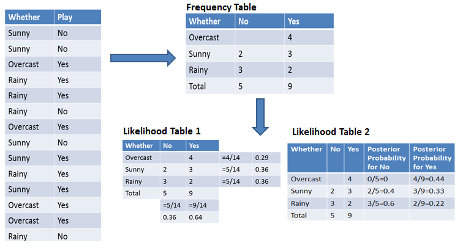
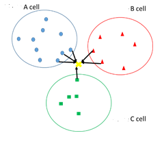

--- 
title: "Notas Curso de Estadística II"
author: "Maikol Solís Chacón y Luis Barboza Chinchilla"
date: "Actualizado el 23 junio, 2022"
site: bookdown::bookdown_site
documentclass: book
fontsize: 12pt
monofont: "Source Code Pro"
colorlinks: true
bibliography: [bibliografia.bib]
biblio-style: authoryear
biblatexoptions: [url=false, doi=false, eprint=false, isbn=false]
# link-citations: yes
description: ""
---


# Introducción

Estas son las notas de clase del curso CA0403: Estadística Actuarial II para el primer semestre del 2022.

 

<!--chapter:end:index.Rmd-->


# Estimación no-paramétrica de densidades
 
## Histograma

El histograma es una de las estructuras básicas en estadística y es una herramienta descriptiva que permite visualizar la distribución de los datos sin tener conocimiento previo de los mismos. En esta sección definiremos el histograma más como un estadístico que como una herramienta de visualización de datos.

### Construcción Estadística

Suponga que \(X_1,X_2, \dots ,X_n\) es una muestra independiente que proviene de una distribución desconocida $f$. En este caso no asumiremos que $f$ tenga alguna forma particular, que permita definirla de manera paramétrica como en el curso anterior.

Construcción:

- Seleccione un origen \(x_0\) y divida la linea real en _segmentos_.
\begin{equation*}
B_j = [x_0 +(j - 1)h,x_0 + jh), \quad j\in \mathbb{Z}
\end{equation*}

- Cuente cuántas observaciones caen en el segmento $B_j$. Denótelo como \(n_j\).


\begin{center}\includegraphics[width=1\linewidth]{Notas-Curso-Estadistica_files/figure-latex/observaciones-histograma-1} \end{center}
- Divida el número de observaciones en $B_j$ por el tamaño de muestra \(n\) y el ancho de banda \(h\) de cada caja.
\begin{equation*}
f_j = \frac{n_j}{nh}
\end{equation*}
De esta forma si se suma las áreas definidas por el histograma da un total de 1.

- Cuente la frecuencia por el tamaño de muestra $n$ y el ancho de banda $h$. 
\begin{equation*}
    f_j = \frac{n_j}{nh}
    \end{equation*}

- Dibuje el histograma.


\begin{center}\includegraphics[width=1\linewidth]{Notas-Curso-Estadistica_files/figure-latex/ejemplo-inicial-histograma-1} \end{center}

Formalmente el histograma es el


\begin{equation*}
\hat{f}_h(x) = \frac{1}{nh} \sum_{i = 1}^{n} \sum_{j} I(X_i\in B_j) I(x\in B_j),
\end{equation*}

donde $I$ es la indicadora.

### Construcción probabilística

Denote $m_j=jh-h/2$ el centro del segmento,


\begin{align*}
    \mathbb{P}\left(X\in \left[m_j - \frac{h}{2},m_j + \frac{h}{2} \right)\right)
      & =
    \int_{m_j - \frac{h}{2}}^{m_j + \frac{h}{2}} f(u)du                                             \\
      & \approx f(m_j)h
\end{align*}

Otra forma de aproximarlo es:


\begin{equation*}
    \mathbb{P} \left(X\in \left[m_j - \frac{h}{2},m_j + \frac{h}{2}\right) \right)  \approx   \frac{1}{n} \#
    \left\{X\in \left[m_j - \frac{h}{2},m_j + \frac{h}{2}\right) \right\}
\end{equation*}

Acomodando un poco la expresión


\begin{equation*}
\hat{f}_h(m_j) =  \frac{1}{nh} \#
\left\{X\in \left[m_j - \frac{h}{2},m_j + \frac{h}{2}\right) \right\}
\end{equation*}


### Propiedades estadísticas

Note que el estimador de histograma $\hat f_h$ tiende a ser más suave conforme aumenta el ancho de banda $h$. 

### Propiedades estadísticas 

Suponga que  \(x_0 = 0\) y que \(x \in B_j\) es un punto fijo, entonces el estimador evaluado en $x$ es:


\begin{equation*}
\hat{f}_h(x) =  \frac{1}{nh} \sum_{i = 1}^{n} I(X_i \in B_j)
\end{equation*}


### Sesgo

Para calcular el sesgo primero calculamos:


\begin{align*}
\mathbb{E}\left[ \hat{f}_h(x)\right]
& =  \frac{1}{nh} \sum_{i = 1}^{n} \mathbb{E}\left[ I(X_i \in B_j)\right] \\
& = \frac{1}{nh} n \mathbb{E}\left[ I(X_i \in B_j)\right]
\end{align*}

donde \(I(X_i \in B_j)\) es una variable Bernoulli con valor esperado:

\begin{align*}
\mathbb{E}\left[ I(X_i \in B_j)\right] = \mathbb{P}\left(I(X_i \in
B_j)=1\right) = \int_{(j - 1)h}^{jh} f(u)du.
\end{align*}

Entonces,
\begin{align*}
\mathbb{E}\left[{f}_h(x)\right]
& = \frac{1}{h} \int_{(j - 1)h}^{jh} f(u)du
\end{align*}

y por lo tanto el sesgo de $\hat f_h(x)$ es: 
\begin{equation*}
Sesgo(\hat{f}_h(x)) = \frac{1}{h} \int_{(j -
1)h}^{jh} f(u)du - f(x)
\end{equation*}

Esto se puede aproximar usando Taylor alrededor del centro
$m_j = jh - h/2$ de $B_j$ de modo que
$f(u) - f(x) \approx f^{\prime}(m_j)(u - x)$.


\begin{equation*}
Sesgo(\hat{f}_h(x)) =  \frac{1}{h} \int_{(j -
1)h}^{jh} [f(u) - f(x)] du \approx f^\prime(m_j)(m_j - x)
\end{equation*}
Entonces se puede concluir que:


- $\hat f_h(x)$ es un estimador sesgado de $f(x)$.
- El sesgo tiende a ser cero cerca del punto medio de $B_j$.
- El sesgo es creciente con respecto a la pendiente de la verdadera densidad evaluada en el punto medio $m_j$.

### Varianza

Dado que todos los $X_i$ son i.i.d., entonces


\begin{align*}
\mathrm{Var}\left( \hat{f}_h(x)\right) & =
\mathrm{Var}\left( \frac{1}{nh} \sum_{i = 1}^{n} I(X_i \in B_j)\right)                                  \\
& = \frac{1}{n^2h^2} n\mathrm{Var}\left( I(X_i \in B_j)\right)
\end{align*}


La variable $I$ es una bernoulli con parametro
$\int_{(j - 1)h}^{h} f(u)du$ por lo tanto su varianza es el


\begin{equation*}
\mathrm{Var}\left( \hat{f}_h(x)\right)\, =
\frac{1}{nh^2} \left(\int_{(j - 1)h}^{h} f(u)du \right)\left( 1 -\int_{(j - 1)h}^{h} f(u)du \right)
\end{equation*}


::: {.exercise #unnamed-chunk-4}
Usando un desarrollo de Taylor como en la parte anterior, pruebe que:
\begin{equation*}
\mathrm{Var}\left( \hat{f}_h(x)\right)\approx
\frac{1}{nh} f(x)
\end{equation*}
:::

Consecuencias:

- La varianza del estimador es proporcional a $f(x)$.
- La varianza decrece si el ancho de banda $h$ crece.

### Error cuadrático medio

El error cuadrático medio del histograma es el


\begin{equation*}
\mathrm{MSE}\left( \hat{f}_h(x)\right) =
\mathrm{E}\left[\left(\hat{f}_h(x) - f(x)\right)^2\right] = \mathrm{Sesgo}^2\left( \hat{f}_h(x)\right) + \mathrm{Var}\left( \hat{f}_h(x)\right).
\end{equation*}


::: {.exercise #unnamed-chunk-5}
¿Pueden probar la segunda igualdad de la expresión anterior?
:::


Retomando los términos anteriores se puede comprobar que:

\begin{align} 
\mathrm{MSE}\left( \hat{f}_h(x)\right) = \frac{1}{nh} f(x) +
f^\prime \left\{ \left( j - \frac{1}{2} \right) h \right\}^2 \left\{ \left( j -
\frac{1}{2} \right) h - x \right\}^2 \\
+ o\left(h \right) + 		o\left(\frac{1}{nh} \right)
(\#eq:MSE)
\end{align}

::: {.remark}
Si \(h \to 0\) y \(nh \to \infty\) entonces \(\mathrm{MSE}\left(  \hat{f}_h(x)\right) \to 0 \). Es decir, conforme usamos más observaciones, pero el ancho de banda de banda no decrece tan rápido, entonces el error cuadrático medio converge a 0.

Como \(\mathrm{MSE}\left(  \hat{f}_h(x)\right) \to 0 \) (convergencia en \(\mathbb{L}^2\)) implica que \(\hat{f}_h(x) \stackrel{\mathcal{P}}{\to} f(x)\), entonces \(\hat{f}_h\) es consistente. Además según la fórmula \@ref(eq:MSE), concluimos lo siguiente: 

-   Si $h\to 0$, la varianza crece (converge a $\infty$) y el sesgo
    decrece (converge a $f^\prime (0)x^2$).
-   Si $h\to \infty$, la varianza decrece (hacia 0) y el sesgo crece
    (hacia $\infty$)

:::
::: {.exercise #unnamed-chunk-8}
Si $f\sim N(0,1)$, aproxime los componentes de sesgo, varianza y MSE, y grafíquelos para distintos valores de $h$. 
:::

Solución:


\begin{center}\includegraphics[width=1\linewidth]{Notas-Curso-Estadistica_files/figure-latex/MSE-histograma-1} \end{center}

### Error cuadrático medio integrado

Uno de los problemas con el \(\mathrm{MSE}\left(  \hat{f}_h(x)\right)\) es que depende de $x$ y de la función de densidad $f$ (desconocida). Integrando con respecto a $x$ el MSE se logra resolver el primer problema:
  
\begin{align*}
\mathrm{MISE}\left(  \hat{f}_h\right)
& = \mathrm{E}\left[
\int_{ -\infty}^{\infty} \left\{
\hat{f}_h(x) - f(x)
\right\}^2 dx
\right]                                                       \\
& = \int_{ -\infty}^{\infty} \mathrm{E}\left[
\left\{
\hat{f}_h(x) - f(x)
\right\}^2
\right] dx                                                    \\
& = \int_{ -\infty}^{\infty}\mathrm{MSE}(\hat{f}_h(x)) \, dx
\end{align*}

Al $\mathrm{MISE}$ se le llama error cuadrático medio integrado. Además,


\begin{align*}
\mathrm{MISE} (\hat{f}_h)
& \approx \int_{ -\infty}^{\infty} \frac{1}{nh} f(x)dx                                                                                                                                          \\
& + \int_{ -\infty}^{\infty}\, \sum_{j}^{} I(x\in B_j) \left\{ \left( j- \frac{1}{2} \right)h -x  \right\}^2 \left [f^\prime \left( \left\{j - \frac{1}{2}\right\}h \right)  \right]^2 dx \\
& = \frac{1}{nh} + \sum_{j}^{} \left [f^\prime \left( \left\{j - \frac{1}{2}\right\}h \right)  \right]^2 \int_{ B_j}    \left\{ \left( j- \frac{1}{2} \right)h -x  \right\}^2 dx          \\
& =\frac{1}{nh} + \frac{h^2}{12} \sum_{j} \left [f^\prime \left( \left\{j - \frac{1}{2}\right\}h \right)  \right]^2                                                                       \\
& \approx \frac{1}{nh} + \frac{h^2}{12} \int \{f^\prime(x)\}^2 dx                                                                                                                         \\
& =\frac{1}{nh} + \frac{h^2}{12} \Vert f^\prime\Vert_{2}^2
\end{align*}

la cual es una buena aproximación si $h\rightarrow 0$. A este último término se le llama MISE asintótico.

### Ancho de banda óptimo para el histograma

El MISE tiene un comportamiento asintótico similar al observado en el MSE. La figura siguiente presenta el comportamiento de la varianza, sesgo y MISE para nuestro ejemplo anterior:

\begin{figure}

{\centering \includegraphics[width=1\linewidth]{Notas-Curso-Estadistica_files/figure-latex/MISE-histograma-1} 

}

\caption{ }(\#fig:MISE-histograma)
\end{figure}

Un problema frecuente en los histogramas es que la mala elección del parámetro $h$ causa que estos no capturen toda la estructura de los datos. Por ejemplo, en el siguiente caso se muestra histogramas construídos a partir de 1000 números aleatorios según una $N(0,1)$, bajo 4 distintas escogencias de ancho de banda.


\begin{center}\includegraphics[width=1\linewidth]{Notas-Curso-Estadistica_files/figure-latex/unnamed-chunk-10-1} \end{center}

Un criterio más preciso para seleccionar el ancho de banda es a través de la minimización del MISE:


\begin{equation*}
\frac{\partial \mathrm{MISE}(f_{h})}{\partial h} = -\frac{1}{nh^2} + \frac{1}{6} h \Vert f^\prime\Vert_{2}^2 = 0
\end{equation*}

lo implica que


\begin{equation*}
h_{opt} = \left(\frac{6}{n\Vert f^\prime\Vert_{2}^2}\right) ^{1/3} = O\left( n^{-1/3} \right).
\end{equation*}

y por lo tanto


\begin{equation*}
\mathrm{MISE}(\hat{f}_{h}) = \frac{1}{n} \left(\frac{n\Vert f^\prime\Vert_{2}^2}{6}\right)  ^{1/3}
\end{equation*}

::: {.remark name="Recuerde de Estadística I"}
Si \(X_1, \ldots, X_n \sim f_{\theta} \) i.i.d, con \(\mathrm{Var}(X) = \sigma^2\) y media $\theta$, recuerde que el estimador \(\hat{\theta}\)  de \(\theta\) tiene la característica que

\begin{equation*}
\mathrm{MSE}(\theta) = \mathrm{Var}(\hat{\theta}) +
\mathrm{Sesgo}^2(\hat{\theta}) = \frac{\sigma^2}{n}
\end{equation*}
:::

Según la nota anterior la tasas de convergencia del histograma es más lenta que la de un estimador parámetrico considerando la misma cantidad de datos, tal y como se ilustra en el siguiente gráfico:


\begin{center}\includegraphics[width=1\linewidth]{Notas-Curso-Estadistica_files/figure-latex/unnamed-chunk-12-1} \end{center}


Finalmente, podemos encontrar el valor óptimo  del ancho de banda ($h=$ 0.2725) del conjunto de datos en el ejemplo anterior.  

\begin{center}\includegraphics[width=1\linewidth]{Notas-Curso-Estadistica_files/figure-latex/unnamed-chunk-14-1} \end{center}

::: {.exercise #unnamed-chunk-15}
Verifique que en el caso normal estándar: $h_{opt}\approx 3.5 n^{-1/3}$.
:::


## Estimación de densidades basada en kernels.

### Primera construcción

Sea $X_{1},\ldots,X_{n}$ variables aleatorias i.i.d. con distribución $f$ en $\mathbb{R}$. La distribución de  $f$ es $F(x)=\int_{-\infty}^{x}f(t)dt$.

La distribución empírica de $F$ es:
\[
F_{n}(x)=\frac{1}{n}\sum_{i=1}^{n}I(X_{i}\leq x).
\]

Por la ley de los grandes números tenemos que \(F_{n}(x)
\xrightarrow{c.s} F(x)\) para todo  $x$ en $\mathbb{R}$, conforme
$n\rightarrow\infty$. Entonces, $F_{n}(x)$ es un estimador consistente de $F(x)$ para todo $x$ in $\mathbb{R}$.

::: {.remark}
¿Podríamos derivar \(F_n\) para encontrar el estimador \(\hat{f}_n\)?
:::

La respuesta es si (más o menos).

Suponga que $h>0$ tenemos la aproximación 
\[
f(x)\approx\frac{F(x+h)-F(x-h)}{2h}.
\]

Remplazando $F$  por su estimador  $F_{n}$, defina
\[
\hat{f}_{n}^{R}(x)=\frac{F_{n}(x+h)-F_{n}(x-h)}{2h},
\] 
donde $\hat{f}_{n}^{R}(x)$ es el estimador de *Rosenblatt* .

Podemos rescribirlo de la forma, 
\[
\hat{f}_{n}^{R}(x)=\frac{1}{2nh}\sum_{i=1}^{n}I(x-h<X_{i}\leq x+h)=\frac{1}{nh}\sum_{i=1}^{n}K_{0}\left(\frac{X_{i}-x}{h}\right)
\]
con  $K_{0}(u)=\frac{1}{2}I(-1<u\leq1)$, lo cual es equivalente al caso del histograma.


### Otra construcción

Con el histograma construimos una serie de segmentos fijo \(B_{j}\) y contabamos el número de datos que estaban **contenidos en $B_{j}$**

::: {.remark}
¿Qué pasaría si cambiamos la palabra **contenidos** por **alrededor de "x"**?
:::

Suponga que se tienen intervalos de longitud $2h$, es decir, intervalos de la forma $[x-h,x+h)$.

El estimador de histograma se escribe como


\begin{equation*}
\hat{f_{h}}(x) = \dfrac{1}{2hn} \# \{ X_i \in [x-h,x+h) \}.
\end{equation*}

Note que si definimos
\begin{equation*}
K(u)=\frac{1}{2} I \left( \left\vert u \right\vert \leq 1 \right)
\end{equation*}
con \(u = \frac{x-x_i}{h}\), entonces parte del estimador de histograma se puede escribir como:
\begin{equation*}
\frac{1}{2}\# \{ X_i \in [x-h,x+h) \}
=\sum_{i=1}^{n} K\left( \frac{x-x_{i}}{h} \right)
=\sum_{i=1}^{n}  \frac{1}{2} I \left( \left\vert \frac{x-x_{i}}{h}
\right\vert \leq 1 \right)
\end{equation*}

Finalmente se tendría que


\begin{equation*}
\hat{f}_{h}\left( x \right) = \frac{1}{nh}\sum_{i=1}^{n} K\left( \frac{x-x_{i}}{h} \right)
\end{equation*}

<!-- \begin{center} -->

<!-- \includegraphics[width=\linewidth]{manual_figure/np-density-interval-crop.pdf} -->

<!-- \end{center} -->

::: {.remark}
¿Qué pasaría si cambiaríamos la función \(K\) del histograma por una más general? Esto permitiría incluir la noción de "cercanía" de cada dato alrededor de $x$.
:::

Esta función debería cumplir las siguientes características:

-   $K(u)\geq 0$.
-   $\int_{-\infty}^{\infty} K(u)du = 1$.
-   $\int_{-\infty}^{\infty} u K(u)du = 0$.
-   $\int_{-\infty}^{\infty} u^{2} K(u)du <\infty$.

Por ejemplo:


- **Uniforme:** \(\frac{1}{2} I \left( \left\vert u \right\vert \leq 1 \right)\).
- **Triangular:** \( (1-|u|) I \left( \left\vert u \right\vert \leq 1 \right)\).
- **Epanechnikov:** \(\frac{3}{4} (1-u^{2}) I \left( \left\vert u \right\vert \leq 1 \right)\).
- **Gaussian:** \(\frac{1}{\sqrt{2\pi}} \exp \left( -\frac{1}{2}u^{2} \right)\).


\begin{center}\includegraphics[width=1\linewidth]{Notas-Curso-Estadistica_files/figure-latex/unnamed-chunk-19-1} \end{center}

Entonces se tendría que la expresión general para un estimador por núcleos (kernel) de $f$:


\begin{equation*}
\hat{f}_{h}\left( x \right) = \frac{1}{nh}\sum_{i=1}^{n} K\left( \frac{x-x_{i}}{h} \right)=\frac{1}{n}\sum_{i=1}^{n} K_h(x-x_{i}) 
\end{equation*}

donde $x_1,\ldots,x_n$ es una muestra i.i.d. de $f$,
\begin{align*}
K_h(\cdot)=\frac 1 h K(\cdot /h).
\end{align*}
y $K$ es un kernel según las 4 propiedades anteriores. 

::: {.remark}
¿Qué pasaría si modificamos el ancho de banda \(h\) para un mismo kernel?
:::

Nuevamente controlaríamos la suavidad del estimador a como se ilustra a continuación:


\begin{center}\includegraphics[width=1\linewidth]{Notas-Curso-Estadistica_files/figure-latex/unnamed-chunk-21-1} \end{center}

Inconveniente: no tenemos aún un criterio para un $h$ óptimo.

::: {.remark}
¿Qué pasaría si modificamos el kernel para un mismo ancho de banda \(h\)?
:::
Usando 1000 números aleatorios según una normal estándar, con un ancho de banda fijo ($h=0.3$) podemos ver que no hay diferencias muy marcadas entre los estimadores por kernel:

\begin{center}\includegraphics[width=1\linewidth]{Notas-Curso-Estadistica_files/figure-latex/unnamed-chunk-23-1} \end{center}

Recordemos nuevamente la fórmula


\begin{equation*}
\hat{f}_{h}\left( x \right) = \frac{1}{nh}\sum_{i=1}^{n} K\left( \frac{x-X_{i}}{h} \right)
\end{equation*}

Cada sumando de esta expresión es una función de la variable $x$. Si la integramos se obtiene que

\begin{equation*}
\frac{1}{nh}\int K\left( \frac{x-X_{i}}{h} \right) dx
= \frac{1}{nh} \int K\left( u \right) h du
= \frac{1}{n} \int K(u) du
= \frac{1}{n}
\end{equation*}

En el siguiente gráfico se generan 10 puntos aleatorios según una normal estándar (rojo) y se grafica cada uno de los 10 componentes del estimador de la densidad usando kernels gaussianos (azul). El estimador resultante aparece en color negro. Note que cada uno de los 10 componentes tiene la misma área bajo la curva, la cual en este caso es 0.1. 

\begin{center}\includegraphics[width=1\linewidth]{Notas-Curso-Estadistica_files/figure-latex/unnamed-chunk-24-1} \end{center}


### Propiedades Estadísticas

Al igual que en el caso de histograma, también aplica lo siguiente:

\begin{align*}
\mathrm{MSE}(\hat{f}_{h}(x)) & =\mathrm{Var}(\hat{f}_{h}(x))+\mathrm{Sesgo}^{2} (\hat{f}_{h}(x))            \\
\mathrm{MISE}(\hat{f}_{h})   & =\int\mathrm{Var}(\hat{f}_{h}(x))dx+\int\mathrm{Sesgo}^{2}(\hat{f}_{h}(x))dx
\end{align*}

donde

\(\mathrm{Var}\left(\hat{f}_{h}(x)\right)=\mathbb{E}\left[\hat{f}_{h}(x)-\mathbb{E}\hat{f}_{h}(x)\right]^{2}\) and \(\mathrm{Sesgo}\left(\hat{f}_{h}(x)\right)=\mathbb{E}\left[\hat{f}_{h}(x)\right]-f(x)\).


En el caso de la varianza:

\begin{align*}
\mathrm{Var}(\hat{f}_{h}(x))
& =\mathrm{Var}\left(\frac{1}{n}\sum_{i=1}^{n}K\left(\frac{x-X_{i}}{h}\right)\right)          \\
& =\frac{1}{n^{2}h^{2}}\sum_{i=1}^{n}\mathrm{Var}\left(K\left(\frac{x-X_{i}}{h}\right)\right) \\
& =\frac{1}{nh^{2}}\mathrm{Var}\left(K\left(\frac{x-X}{h}\right)\right)                       \\
& =\frac{1}{nh^{2}}\left\{
\textcolor{red}{\mathbb{E}\left[K^{2}\left(\frac{x-X}{h}\right)\right]}
-\left\{
\textcolor{blue}{\mathbb{E}\left[K\left(\frac{x-X}{h}\right)\right]}
\right\}^{2}
\right\}.
\end{align*} Usando que: \begin{align*}
\textcolor{red}{\mathbb{E}\left[K^{2}\left(\frac{x-X}{h}\right)\right]}
& =\int K^{2}\left(\frac{x-s}{h}\right)f(s)ds            \\
& =h\int K^{2}\left(u\right)f(uh+x)du                    \\
& =h\int K^{2}\left(u\right)\left\{ f(x)+o(1)\right\} du \\
& =h\left\{ \Vert K\Vert_{2}^{2}f(x)+o(1)\right\} .
\end{align*}


\begin{align*}
\textcolor{blue}{\mathbb{E}\left[K\left(\frac{x-X}{h}\right)\right]}
& =\int K\left(\frac{x-s}{h}\right)f(s)ds            \\
& = h\int K\left(u\right)f(uh+x)du                    \\
& =h\int K\left(u\right)\left\{ f(x)+o(1)\right\} du \\
& =h\left\{f(x)+o(1)\right\} .
\end{align*}


Por lo tanto se obtiene que


\begin{equation*}
\mathrm{Var}\left(\hat{f}_{h}(x)\right) = \frac{1}{nh} \Vert K\Vert_{2}^{2}f(x) + o\left(\frac{1}{nh}\right), \text{ si } nh\to \infty.
\end{equation*}

### Sesgo

Para el sesgo tenemos


\begin{align*}
\mathrm{Sesgo}\left(\hat{f}_{h}(x)\right)
& = \mathbb{E}\left[\hat{f}_{h}(x)\right]-f(x)                                                  \\
& = \frac{1}{nh} \sum_{i=1}^{n} \mathrm{E}\left[K\left( \frac{x-X_{i}}{h} \right)\right] - f(x) \\
& = \frac{1}{h}\mathrm{E}\left[K\left( \frac{x-X_{1}}{h} \right)\right] - f(x)                  \\
& = \int \frac{1}{h} K\left( \frac{x-u}{h}\right)f(u)du -f(x)                                   \\
\end{align*}


::: {.exercise #unnamed-chunk-25}
Usando el cambio de variable \(s=\frac{u-x}{h}\) y las propiedades del kernel pruebe que

\begin{equation*}
\mathrm{Sesgo}\left(\hat{f}_{h}(x)\right) = \frac{h^{2}}{2} f^{\prime\prime} \mu_{2}(K) + o(h^{2}), \text{ si } h\to 0
\end{equation*}
donde \(\mu_{2}=\int s^{2}K(s)ds\).

:::
::: {.remark}
En algunas pruebas más formales, se necesita además que  $f^{\prime\prime}$ sea absolutamente continua y que $\int(f^{\prime\prime\prime}(x))dx<\infty$.}
:::


En el siguiente gráfico se ilustra el estimador no paramétrico de la distribución de tiempos entre erupciones en la muy conocida tabla de datos *faithful*. El estimador se calcula bajo dos distintas escogencias de ancho de banda. 


\begin{center}\includegraphics[width=1\linewidth]{Notas-Curso-Estadistica_files/figure-latex/unnamed-chunk-28-1} \end{center}

::: {.remark}
Note como los cambios en el ancho de banda modifican la suavidad (sesgo) y el aplanamiento de la curva (varianza).
:::

### Error cuadrático medio y Error cuadrático medio integrado

El error cuadrático medio se escribe 


\begin{align*}
\mathrm{MSE}(\hat{f}_{h}(x))
& = \mathrm{Sesgo}\left(\hat{f}_{h}(x)\right)^{2} + \mathrm{Var}\left(\hat{f}_{h}(x)\right)                                                 \\
& = \frac{h^{4}}{4}\left(\mu_{2}(K)f^{\prime\prime}(x)\right)^{2}+\frac{1}{nh}\Vert K\Vert_{2}^{2}f(x)+o(h^{4})+o\left(\frac{1}{nh}\right).
\end{align*}


Y el error cuadrático medio integrado se escribe como, 

\begin{align*}
\mathrm{MISE}\left(\hat{f}_{h}\right) & = \int \mathrm{MSE}\left(\hat{f}_{h}(x)\right)dx                                                                                                        \\
& = \int \mathrm{Sesgo}\left(\hat{f}_{h}(x)\right)^{2} + \mathrm{Var}\left(\hat{f}_{h}(x)\right)dx                                                        \\
& = \frac{h^{4}}{4}\mu_{2}^{2}(K)\left\Vert f^{\prime\prime}(x)\right\Vert_{2}^{2} +\frac{1}{nh}\Vert K\Vert_{2}^{2}+o(h^{4})+o\left(\frac{1}{nh}\right).
\end{align*}


Al igual que en el caso del histograma, el estimador por kernels es un estimador consistente de $f$ si $h\rightarrow 0$ y $nh\rightarrow \infty$. Además el MISE depende directamente de $f''$.

### Ancho de banda óptimo

Minimizando el $\mathrm{MISE}$ con respecto a $h$ obtenemos

\begin{equation*}
h_{opt}=\left(\frac{\Vert K\Vert_{2}^{2}}{\Vert f^{\prime\prime}\Vert_{2}^{2}\left(\mu_{2}(K)\right)^{2}n}\right)^{1/5}=O\left( n^{-1/5} \right).
\end{equation*}


::: {.remark}
De forma práctica, $h_{opt}$ no es un estimador útil de $h$ porque depende de $\Vert f^{\prime\prime}\Vert_{2}^{2}$  que es desconocido. Más adelante veremos otra forma de encontrar este estimador.
:::

Evaluando $h_{opt}$ en el $\mathrm{MISE}$ tenemos que


\begin{equation*}
\mathrm{MISE}(\hat{f}_{h})=\frac{5}{4}\left(\Vert K\Vert_{2}^{2}\right)^{4/5}\left(\Vert f^{\prime\prime}\Vert_{2}^{2}\mu_{2}(K)\right)^{2/5}n^{-4/5} = O\left( n^{-4/5} \right).
\end{equation*}

y por lo tanto la tasa de convergencia del MISE a 0 es más rápida que para el caso del histograma:


\begin{center}\includegraphics[width=1\linewidth]{Notas-Curso-Estadistica_files/figure-latex/unnamed-chunk-31-1} \end{center}


::: {.remark}
Como se comentó anteriormente, el principal inconveniente del ancho de banda:
\begin{equation*}
h_{opt}=\left(\frac{\Vert K\Vert_{2}^{2}}{\Vert f^{\prime\prime}\Vert_{2}^{2}\left(\mu_{2}(K)\right)^{2}n}\right)^{1/5}=O\left( n^{-1/5} \right).
\end{equation*}
es que depende de $f''$.
:::

A continuación se explica dos posibles métodos para determinar para aproximar el ancho de banda óptimo:

#### Referencia normal

::: {.remark}
Este método es más efectivo si se conoce que la verdadera distribución es bastante suave, unimodal y simétrica. Más adelante veremos otro método para densidades más generales.
:::

Asuma que $f$ es normal distribuida y se utiliza un kernel $K$ gausiano.
Entonces se tiene que


\begin{align*}
\hat{h}_{rn} & =\left(\frac{\Vert K\Vert_{2}^{2}}{\Vert f^{\prime\prime}\Vert_{2}^{2}\left(\mu_{2}(K)\right)^{2}n}\right)^{1/5}=O\left( n^{-1/5} \right) \\
& =1.06 \hat{\sigma} n^{-1/5}.
\end{align*}

donde


\begin{equation*}
\hat{\sigma} = \sqrt{\frac{1}{n-1} \sum_{i=1}^{n} \left( x_{i}-\bar{x}^{2} \right)}
\end{equation*}

::: {.exercise #unnamed-chunk-35}
Pruebe que la ecuación anterior es verdadera. Utilice el hecho de que:
\begin{align*}
\Vert f^{\prime\prime}\Vert_{2}^{2}=\sigma^{-5}\int \phi^{\prime \prime}(x)^2 dx
\end{align*}
donde $\phi$ es la función de densidad de una $N(0,1)$.
:::

::: {.remark}
El principal inconveniente de \(\hat{h}_{rn}\) es su sensibilidad a los valores extremos:
:::

::: {.example #unnamed-chunk-37}
La varianza empírica de  1, 2, 3, 4, 5, es  2.5.

La varianza empírica de 1, 2, 3, 4, 5, 99, es 1538.
:::

Para solucionar el problema anterior, se puede considerar una medida más robusta de variación, por ejemplo el rango intercuantil IQR:

\begin{equation*}
\mathrm{IQR}^{X} = Q^{X}_{3} - Q^{X}_{1}
\end{equation*}
donde \(Q^{X}_{1}\) y \(Q^{X}_{3}\) son el primer y tercer cuartil de un conjunto de datos \(X_{1},\ldots, X_n\).

Con el supuesto que \(X\sim \mathcal{N}(\mu,\sigma^{2})\) entonces \(\displaystyle Z = \frac{X-\mu}{\sigma} \sim \mathcal{N}(0,1)\) y entonces:

\begin{align*}
\mathrm{IQR}
& = Q^{X}_{3} - Q^{X}_{1}                                                     \\
& = \left( \mu+\sigma Q^{Z}_{3} \right) - \left( \mu+\sigma Q^{Z}_{1} \right) \\
& = \sigma \left(Q^{Z}_{3} - Q^{Z}_{1} \right)                                \\
& \approx \sigma \left( 0.67 - (-0.67) \right)                                 \\
& =1.34 \sigma.
\end{align*}

Por lo tanto
$\displaystyle \hat{\sigma} = \frac{\widehat{\mathrm{IQR}}^{X}}{1.34}$

Podemos sustituir la varianza empírica de la fórmula inicial y tenemos
\begin{equation*}
\hat{h}_{rn} = 1.06 \frac{\widehat{\mathrm{IQR}}^{X}}{1.34} n^{-\frac{1}{5}} \approx 0.79\  \widehat{\mathrm{IQR}}^{X}\ n^{-\frac{1}{5}}
\end{equation*}

Combinando ambos estimadores, podemos obtener,


\begin{equation*}
\hat{h}_{rn} = 1.06 \min \left\{\frac{\widehat{\mathrm{IQR}}^{X}}{1.34}, \hat{\sigma }\right\} n^{-\frac{1}{5}}
\end{equation*}

pero esta aproximación es conveniente bajo el escenario de que la densidad $f$ sea similar a una densidad normal.

#### Validación Cruzada

Defina el *error cuadrático integrado* como \begin{align*}
\mathrm{ISE}(\hat{f}_{h}) & =\int\left(\hat{f}_{h}(x)-f(x)\right)^{2}dx\nonumber                   \\
& =\int \hat{f}_{h}^{2}(x)dx-2\int \hat{f}_{h}(x)f(x)dx+\int f^{2}(x)dx.
\end{align*}

::: {.remark}
El MISE es el valor esperado del ISE.
:::

Nuestro objetivo es minimizar el ISE con respecto a $h$.

Primero note que $\int f^{2}(x)dx$ NO DEPENDE de $h$. Podemos minimizar
la expresión \begin{equation*}
\mathrm{ISE}(\hat{f}_{h})-\int f^{2}(x)dx=
\textcolor{red}{\int\hat{f}_{h}^{2}(x)dx}
-2
\textcolor{blue}{\int\hat{f}_{h}(x)f(x)dx}
\end{equation*}

Vamos a resolver esto en dos pasos partes

**Integral** $\textcolor{blue}{\int\hat{f}_{h}(x)f(x)dx}$


**Integral \(\textcolor{blue}{\int\hat{f}_{h}(x)f(x)dx}\)**   

El término \(\textcolor{blue}{\int\hat{f}_{h}(x)f(x)dx}\) es el valor esperado de
\(\mathrm{E}\left[\hat{f}_h(X)\right]\). Su estimador empírico sería:
\begin{equation*}
\widehat{\mathrm{E}\left[\hat{f}_h(X)\right]}
= \frac{1}{n}\sum_{i=1}^{n}\hat{f}_{h}(X_{i})
=\frac{1}{n^{2}h}\sum_{i=1}^{n}\sum_{j=1}^{n}
K\left(\frac{X_{j}-X_{i}}{h}\right).
\end{equation*}

::: {.remark}
El problema con esta expresión es que las observaciones que se usan para estimar la esperanza son las mismas que se usan para estimar \(\hat{f}_{h}(x)\) (Se utilizan doble).
:::

La solución es remover la $i^{\text{ésima}}$ observación de
$\hat{f}_{h}$ para cada $i$.

Redefiniendo el estimador anterior tenemos una estimación de $\int \hat{f}_{h}(x)f(x)dx$ a través de:
\[
\frac{1}{n}\sum_{i=1}^{n}\hat{f}_{h,-i}(X_{i}),
\]
donde (estimador *leave-one-out*)
\[
\hat{f}_{h,-i}(x)=\frac{1}{(n-1)h}\sum_{\substack{j=1\\ j\neq i}}^{n}K\left( \frac{x-X_{j}}{h} \right) .
\]

de esta forma nos aseguramos que las observaciones que se usan para calcular $\hat{f}_{h,-i}(x)$ son independientes de la observación que uno usa para definir el estimador de $E[\hat f_h(x)]$.

Siguiendo con el término $\textcolor{red}{\int\hat{f}_{h}^{2}(x)dx}$
note que este se puede reescribir como


\begin{align*}
\textcolor{red}{\int\hat{f}_{h}^{2}(x)dx}
& =\int\left(\frac{1}{nh}\sum_{i=1}^{n}K\left( \frac{x-X_{i}}{h} \right)\right)^{2}dx                                    \\
& =\frac{1}{n^{2}h^{2}}\sum_{i=1}^{n}\sum_{i=1}^{n}\int K\left(\frac{x-X_{i}}{h}\right)K\left(\frac{x-X_{j}}{h}\right)dx \\
& =\frac{1}{n^{2}h}\sum_{i=1}^{n}\sum_{i=1}^{n}\int K\left(u\right)K\left(\frac{X_{i}-X_{j}}{h}-u\right)du               \\
& =\frac{1}{n^{2}h}\sum_{i=1}^{n}\sum_{i=1}^{n}K*K\left(\frac{X_{i}-X_{j}}{h}\right).
\end{align*}

donde $K*K$ es la convolución de $K$ consigo misma.

Finalmente tenemos la función,


Finalmente definimos la función objetivo del criterio de validación cruzada como:

\[
\mathrm{CV}(h)=\frac{1}{n^{2}h}\sum_{i=1}^{n}\sum_{j=1}^{n}K*K\left(\frac{X_{i}-X_{j}}{h}\right)-\frac{2}{n(n-1)h}\sum_{i=1}^{n}\mathop{\sum_{j=1}^{n}}_{j\neq i}K\left( \frac{X_{i}-X_{j}}{h} \right).
\]

::: {.remark}
Note que \(\mathrm{CV}(h)\) no depende de \(f\) o sus derivadas y además la función objetivo se adapta automáticamente a las características de la densidad $f$.
:::


### Intervalos de confianza para estimadores de densidad no paramétricos

Usando los resultados anteriores y asumiendo que $h=cn^{-\frac{1}{5}}$
entonces


\begin{equation*}
n^{\frac{2}{5}} \left\{ \hat{f}_{h}(x) -f(x)\right\}
\xrightarrow{\mathcal{L}} \mathcal{N}\left(\underbrace{\frac{c^{2}}{2} f^{\prime\prime}
\mu_{2}(K)}_{b_{x}}, \underbrace{\frac{1}{c}f(x) \left\Vert K \right\Vert_{2}^{2}}_{v_{x}}\right).
\end{equation*}

Si $z_{1-\frac{\alpha}{2}}$ es el cuantil $1-\frac{\alpha}{2}$ de una
distribución normal estándar, entonces


\begin{align*}
1-\alpha
& \approx \mathbb{P}\left(b_{x}-z_{1-\frac{\alpha}{2}} v_{x} \leq n^{2 / 5}\left\{\widehat{f}_{h}(x)-f(x)\right\} \leq b_{x}+z_{1-\frac{\alpha}{2}} v_{x}\right) \\
& =\mathbb{P}\left(\widehat{f}_{h}(x)-n^{-2 / 5}\left\{b_{x}+z_{1-\frac{\alpha}{2}} v_{x}\right\}\right.                                                         \\
& \qquad\qquad \left. \leq f(x)\leq \hat{f}_{h}(x)-n^{-2 / 5}\left\{b_{x}-z_{1-\frac{\alpha}{2}} v_{x}\right\}\right)
\end{align*}

Esta expresión nos dice que con una probabilidad de $1-\alpha$ se tiene
que


\begin{equation*}
\begin{aligned}
& \left[\hat{f}_{h}(x)-\frac{h^{2}}{2} f^{\prime \prime}(x) \mu_{2}(K)-z_{1-\frac{\alpha}{2}} \sqrt{\frac{f(x)\|K\|_{2}^{2}}{n h}}\right. \\
& \left.\widehat{f}_{h}(x)-\frac{h^{2}}{2} f^{\prime \prime}(x) \mu_{2}(K)+z_{1-\frac{a}{2}} \sqrt{\frac{f(x)\|K\|_{2}^{2}}{n h}}\right]
\end{aligned}
\end{equation*}

Al igual que en los casos anteriores, este invtervalo no es útil ya que
depende de $f(x)$ y $f^{\prime\prime} (x)$.

Si $h$ es pequeño relativamente a $n^{-\frac{1}{5}}$ entonces el segundo
término $\frac{h^{2}}{2} f^{\prime \prime}(x) \mu_{2}(K)$ podría ser
ignorado.

Si \(h\) es pequeño relativamente a \(n^{-\frac{1}{5}}\) entonces el segundo término \(\frac{h^{2}}{2} f^{\prime \prime}(x) \mu_{2}(K)\) podría ser ignorado.

Podemos reemplazar \(f(x)\) por su estimador \(\hat{f}_{h}(x)\).  Entonces tendríamos una intervalo aplicable a nuestro caso:


\begin{equation*}
\left[\hat{f_{h}}(x)-z_{1-\frac{\alpha}{2}} \sqrt{\frac{\hat{f_{h}}(x)\|K\|_{2}^{2}}{n h}}, \hat{f}_{h}(x)+z_{1-\frac{\alpha}{2}} \sqrt{\frac{\hat{f}_{h}(x)\|\mathrm{K}\|_{2}^{2}}{n h}}\right]
\end{equation*}

::: {.remark}
Este intervalo de confianza está definido para $x$ fijo y no permite hacer inferencia sobre toda la función $f$. Una forma de determinar la banda de confianza de toda la función $f$ es a través de la fórmula 3.52 en la página 62 de [@HardleNonparametric2004].
:::

## Laboratorio

Comenzaremos con una librería bastante básica llamada
\texttt{KernSmooth}.

### Efecto de distintos Kernels en la estimación


```r
x <- read.csv("data/stockres.txt")
x <- unlist(x)
```


```r
summary(x)
```

```
##       Min.    1st Qu.     Median       Mean    3rd Qu.       Max. 
## -0.6118200 -0.0204085 -0.0010632 -0.0004988  0.0215999  0.1432286
```


```r
library(KernSmooth)

fhat_normal <- bkde(x, kernel = "normal", bandwidth = 0.05)
plot(fhat_normal, type = "l")
```


\begin{center}\includegraphics[width=1\linewidth]{Notas-Curso-Estadistica_files/figure-latex/unnamed-chunk-45-1} \end{center}

```r
fhat_unif <- bkde(x, kernel = "box", bandwidth = 0.05)
plot(fhat_unif, type = "l")
```


\begin{center}\includegraphics[width=1\linewidth]{Notas-Curso-Estadistica_files/figure-latex/unnamed-chunk-45-2} \end{center}

```r
fhat_epanech <- bkde(x, kernel = "epanech", bandwidth = 0.05)
plot(fhat_epanech, type = "l")
```


\begin{center}\includegraphics[width=1\linewidth]{Notas-Curso-Estadistica_files/figure-latex/unnamed-chunk-45-3} \end{center}

```r
fhat_biweight <- bkde(x, kernel = "biweight", bandwidth = 0.05)
plot(fhat_biweight, type = "l")
```


\begin{center}\includegraphics[width=1\linewidth]{Notas-Curso-Estadistica_files/figure-latex/unnamed-chunk-45-4} \end{center}

```r
fhat_triweight <- bkde(x, kernel = "triweight", bandwidth = 0.05)
plot(fhat_triweight, type = "l")
```


\begin{center}\includegraphics[width=1\linewidth]{Notas-Curso-Estadistica_files/figure-latex/unnamed-chunk-45-5} \end{center}

### Efecto del ancho de banda en la estimación

\*\* Kernel uniforme \*\*


```r
fhat <- bkde(x, kernel = "box", bandwidth = 0.001)
plot(fhat, type = "l")
```


\begin{center}\includegraphics[width=1\linewidth]{Notas-Curso-Estadistica_files/figure-latex/unnamed-chunk-46-1} \end{center}

```r
fhat <- bkde(x, kernel = "box", bandwidth = 0.5)
plot(fhat, type = "l")
```


\begin{center}\includegraphics[width=1\linewidth]{Notas-Curso-Estadistica_files/figure-latex/unnamed-chunk-46-2} \end{center}

\*\* Kernel Epanechnikov \*\*


```r
fhat <- bkde(x, kernel = "epa", bandwidth = 0.001)
plot(fhat, type = "l")
```


\begin{center}\includegraphics[width=1\linewidth]{Notas-Curso-Estadistica_files/figure-latex/unnamed-chunk-47-1} \end{center}

```r
fhat <- bkde(x, kernel = "epa", bandwidth = 0.5)
plot(fhat, type = "l")
```


\begin{center}\includegraphics[width=1\linewidth]{Notas-Curso-Estadistica_files/figure-latex/unnamed-chunk-47-2} \end{center}


```r
suppressMessages(library(tidyverse))
library(gganimate)

fani <- tibble()

for (b in seq(0.001, 0.02, length.out = 40)) {
    f <- bkde(x, kernel = "epa", bandwidth = b, gridsize = length(x))
    fani <- fani %>%
        bind_rows(tibble(xreal = sort(x), x = f$x,
            y = f$y, bw = b))
}

ggplot(data = fani) + geom_line(aes(x, y), color = "blue") +
    labs(title = paste0("Ancho de banda = {closest_state}")) +
    transition_states(bw) + view_follow() + theme_minimal(base_size = 20)

# anim_save('manual_figure/bandwidth-animation.gif')
```

<!-- \includemedia[ -->

<!-- label=bandwidth, -->

<!-- width=0.6\linewidth,height=0.45\linewidth, -->

<!-- addresource=manual_figure/bandwidth-animation.mp4, -->

<!-- transparent, -->

<!-- %transparent player background -->

<!-- activate=pageopen, -->

<!-- %show VPlayer's right-click menu -->

<!-- flashvars={ -->

<!-- source=manual_figure/bandwidth-animation.mp4 -->

<!-- &loop=true -->

<!-- % loop video -->

<!-- } -->

<!-- ]{}{VPlayer.swf} -->

::: {.remark}

- Construya una variable llamada `u` que sea una secuencia de -0.15 a 0.15 con un paso de 0.01
- Asigne `x` a los datos `stockrel` y calcule su media y varianza.
- Usando la función `dnorm` construya los valores de la distribución de los datos usando la media y varianza calculada anteriormente. Asigne a esta variable `f\_param`.
- Defina un ancho de banda `h` en 0.02
- Construya un histograma para estos datos con ancho de banda `h`. Llame a esta variable `f\_hist`
- Usando el paquete `KernSmooth` y la función `bkde`, construya una función que calcule el estimador no paramétrico con un núcleo Epanechivok para un ancho de banda  $h$.  Llame a esta variable `f\_epa`.
- Dibuje en el mismo gráfico la estimación paramétrica y no paramétrica.

:::


```r
x <- read.csv("data/stockres.txt")
x <- unlist(x)
# Eliminar nombres de las columnas
names(x) <- NULL

u <- seq(-0.15, 0.15, by = 0.01)

mu <- mean(x)
sigma <- sd(x)

f_param <- dnorm(u, mean = mu, sd = sigma)

h <- 0.02

n_bins <- floor(diff(range(x))/h)

f_hist <- hist(x, breaks = n_bins)
```


\begin{center}\includegraphics[width=1\linewidth]{Notas-Curso-Estadistica_files/figure-latex/unnamed-chunk-50-1} \end{center}

```r
f_epa <- as.data.frame(bkde(x, kernel = "epa", bandwidth = h))

x_df <- data.frame(x)

library(ggplot2)

ggplot(x_df, aes(x)) + geom_histogram(aes(y = ..density..),
    binwidth = 0.02, col = "black", fill = "white") +
    stat_function(fun = dnorm, args = list(mean = mu,
        sd = sigma), color = "red") + geom_line(data = f_epa,
    aes(x, y), color = "blue") + theme_minimal(base_size = 20)
```


\begin{center}\includegraphics[width=1\linewidth]{Notas-Curso-Estadistica_files/figure-latex/unnamed-chunk-50-2} \end{center}

### Ancho de banda óptimo

Usemos la regla de la normal o también conocida como Silverman.
**Primero recuerde que en este caso se asume que** $f(x)$ sigue una
distribución normal. En este caso, lo que se obtiene es que


\begin{align*}
\Vert f^{\prime \prime} \Vert_2^2 & = \sigma ^{-5} \int \{\phi^{\prime \prime}\}^2 dx              \\
& = \sigma ^{-5} \frac{3}{8\sqrt{\pi}} \approx 0.212 \sigma^{-5}
\end{align*}

donde $\phi$ es la densidad de una normal estándar.

El estimador para $\sigma$ es

$$
s = \sqrt{\frac{1}{n-1} \sum_{i=1}^n (x_i - \bar{x})^2  }.
$$

Y usando el cálculo realizado anteriormente, se obtiene que

$$
h_{normal} = \left( \frac{4 s^5}{3n} \right)^{1/5} \approx 1.06 s n^{-1/5}.
$$

Un estimador más robusto es

$$
h_{normal} =  1.06 \min \left\{ s , \frac{IQR}{1.34} \right\} n^{-1/5}.
$$

¿Por qué es $IQR / 1.34$?


```r
s <- sd(x)
n <- length(x)
```


```r
h_normal <- 1.06 * s * n^(-1/5)

h <- h_normal

n_bins <- floor(diff(range(x))/h)
f_hist <- hist(x, breaks = n_bins, plot = FALSE)
f_epa <- as.data.frame(bkde(x, kernel = "epa", bandwidth = h))

ggplot(x_df, aes(x)) + geom_histogram(aes(y = ..density..),
    binwidth = h, col = "black", fill = "white") +
    stat_function(fun = dnorm, args = list(mean = mu,
        sd = sigma), color = "red") + geom_line(data = f_epa,
    aes(x, y), color = "blue") + theme_minimal(base_size = 20)
```


\begin{center}\includegraphics[width=1\linewidth]{Notas-Curso-Estadistica_files/figure-latex/unnamed-chunk-52-1} \end{center}


```r
h_iqr <- 1.06 * min(s, IQR(x)/1.34) * n^(-1/5)

h <- h_iqr

n_bins <- floor(diff(range(x))/h)
f_hist <- hist(x, breaks = n_bins, plot = FALSE)
f_epa <- as.data.frame(bkde(x, kernel = "epa", bandwidth = h))

ggplot(x_df, aes(x)) + geom_histogram(aes(y = ..density..),
    binwidth = h, col = "black", fill = "white") +
    stat_function(fun = dnorm, args = list(mean = mu,
        sd = sigma), color = "red") + geom_line(data = f_epa,
    aes(x, y), color = "blue") + theme_minimal(base_size = 20)
```


\begin{center}\includegraphics[width=1\linewidth]{Notas-Curso-Estadistica_files/figure-latex/unnamed-chunk-53-1} \end{center}

Una librería más especializada es \texttt{np} (non-parametric).


```r
library(np)

x.eval <- seq(-0.2, 0.2, length.out = 200)

h_normal_np <- npudensbw(dat = x, bwmethod = "normal-reference")

dens.ksum <- npksum(txdat = x, exdat = x.eval, bws = h_normal_np$bw)$ksum/(n *
    h_normal_np$bw[1])

dens.ksum.df <- data.frame(x = x.eval, y = dens.ksum)

ggplot(x_df, aes(x)) + geom_histogram(aes(y = ..density..),
    binwidth = h_normal_np$bw, col = "black", fill = "white") +
    stat_function(fun = dnorm, args = list(mean = mu,
        sd = sigma), color = "red") + geom_line(data = dens.ksum.df,
    aes(x, y), color = "blue") + theme_minimal(base_size = 20)
```


\begin{center}\includegraphics[width=1\linewidth]{Notas-Curso-Estadistica_files/figure-latex/unnamed-chunk-54-1} \end{center}

### Validación cruzada

La forma que vimos en clase es la de validación cruzada por mínimos
cuadrados\`\`least-square cross validation'' la cual se puede ejecutar
con este comando.


```r
h_cv_np_ls <- npudensbw(dat = x, bwmethod = "cv.ls",
    ckertype = "epa", ckerorder = 2)
```

```
## 
Multistart 1 of 1 |
Multistart 1 of 1 |
Multistart 1 of 1 |
Multistart 1 of 1 /
Multistart 1 of 1 |
Multistart 1 of 1 |
                   
```

```r
dens.np <- npudens(h_cv_np_ls)

plot(dens.np, type = "b")
```


\begin{center}\includegraphics[width=1\linewidth]{Notas-Curso-Estadistica_files/figure-latex/unnamed-chunk-55-1} \end{center}


```r
dens.np.df <- data.frame(x = dens.np$eval[, 1], y = dens.np$dens)

ggplot(x_df, aes(x)) + geom_histogram(aes(y = ..density..),
    binwidth = h_cv_np_ls$bw, col = "black", fill = "white") +
    stat_function(fun = dnorm, args = list(mean = mu,
        sd = sigma), color = "red") + geom_line(data = dens.np.df,
    aes(x, y), color = "blue") + theme_minimal(base_size = 20)
```


\begin{center}\includegraphics[width=1\linewidth]{Notas-Curso-Estadistica_files/figure-latex/unnamed-chunk-56-1} \end{center}

### Temas adicionales

\*\* Reducción del sesgo \*\* Como lo mencionamos en el texto, una forma
de mejorar el sesgo en la estimación es suponer que la función de
densidad es más veces diferenciable.

Esto se logra asumiendo que el Kernel es más veces diferenciable.


```r
h_cv_np_ls <- npudensbw(dat = x, bwmethod = "cv.ls",
    ckertype = "epa", ckerorder = 4)
```

```
## 
Multistart 1 of 1 |
Multistart 1 of 1 |
Multistart 1 of 1 |
Multistart 1 of 1 /
Multistart 1 of 1 |
Multistart 1 of 1 |
                   
```

```r
dens.np <- npudens(h_cv_np_ls)

plot(dens.np, type = "b", lwd = 2)
```


\begin{center}\includegraphics[width=1\linewidth]{Notas-Curso-Estadistica_files/figure-latex/unnamed-chunk-57-1} \end{center}


```r
dens.np.df <- data.frame(x = dens.np$eval[, 1], y = dens.np$dens)

ggplot(x_df, aes(x)) + geom_histogram(aes(y = ..density..),
    binwidth = h_cv_np_ls$bw, col = "black", fill = "white") +
    stat_function(fun = dnorm, args = list(mean = mu,
        sd = sigma), color = "red") + geom_line(data = dens.np.df,
    aes(x, y), color = "blue") + theme_minimal(base_size = 20)
```


\begin{center}\includegraphics[width=1\linewidth]{Notas-Curso-Estadistica_files/figure-latex/unnamed-chunk-58-1} \end{center}

**Otra forma de estimar el ancho de banda** Otra forma de estimar ancho
de bandas óptimos es usando máxima verosimilitud. Les dejo de tarea
revisar la sección 1.1 del artículo de [@Hall1987] para entender su
estructura.


```r
h_cv_np_ml <- npudensbw(dat = x, bwmethod = "cv.ml",
    ckertype = "epanechnikov")
```

```
## 
Multistart 1 of 1 |
Multistart 1 of 1 |
Multistart 1 of 1 |
Multistart 1 of 1 /
Multistart 1 of 1 |
Multistart 1 of 1 |
                   
```

```r
dens.np <- npudens(h_cv_np_ml)

plot(dens.np, type = "b")
```


\begin{center}\includegraphics[width=1\linewidth]{Notas-Curso-Estadistica_files/figure-latex/unnamed-chunk-59-1} \end{center}


```r
dens.np.df <- data.frame(x = dens.np$eval[, 1], y = dens.np$dens)

ggplot(x_df, aes(x)) + geom_histogram(aes(y = ..density..),
    binwidth = h_cv_np_ml$bw, col = "black", fill = "white") +
    stat_function(fun = dnorm, args = list(mean = mu,
        sd = sigma), color = "red") + geom_line(data = dens.np.df,
    aes(x, y), color = "blue") + theme_minimal(base_size = 20)
```


\begin{center}\includegraphics[width=1\linewidth]{Notas-Curso-Estadistica_files/figure-latex/unnamed-chunk-60-1} \end{center}


```r
h_cv_np_ml <- npudensbw(dat = x, bwmethod = "cv.ml",
    ckertype = "epanechnikov", ckerorder = 4)
```

```
## 
Multistart 1 of 1 |
Multistart 1 of 1 |
Multistart 1 of 1 |
Multistart 1 of 1 /
Multistart 1 of 1 |
Multistart 1 of 1 |
                   
```

```r
dens.np <- npudens(h_cv_np_ml)

plot(dens.np, type = "b")
```


\begin{center}\includegraphics[width=1\linewidth]{Notas-Curso-Estadistica_files/figure-latex/unnamed-chunk-61-1} \end{center}


```r
dens.np.df <- data.frame(x = dens.np$eval[, 1], y = dens.np$dens)

ggplot(x_df, aes(x)) + geom_histogram(aes(y = ..density..),
    binwidth = h_cv_np_ml$bw, col = "black", fill = "white") +
    stat_function(fun = dnorm, args = list(mean = mu,
        sd = sigma), color = "red") + geom_line(data = dens.np.df,
    aes(x, y), color = "blue") + theme_minimal(base_size = 20)
```


\begin{center}\includegraphics[width=1\linewidth]{Notas-Curso-Estadistica_files/figure-latex/unnamed-chunk-62-1} \end{center}


```r
fani <- tibble()

for (b in seq(0.001, 0.05, length.out = 40)) {
    f <- npudens(tdat = x, ckertype = "epanechnikov",
        bandwidth.compute = FALSE, bws = b)
    fani <- fani %>%
        bind_rows(tibble(xreal = sort(x), x = f$eval$x,
            y = f$dens, bw = b))
}

ggplot(data = fani) + geom_line(aes(x, y), color = "blue") +
    labs(title = paste0("Ancho de banda = {closest_state}")) +
    theme_minimal(base_size = 20) + transition_states(bw) +
    view_follow()

# anim_save('manual_figure/bandwidth-animation-np.gif')
```

<!-- \includemedia[ -->

<!-- label=bandwidth, -->

<!-- width=0.6\linewidth,height=0.45\linewidth, -->

<!-- addresource=manual_figure/bandwidth-animation-np.mp4, -->

<!-- transparent, -->

<!-- %transparent player background -->

<!-- activate=pageopen, -->

<!-- %show VPlayer's right-click menu -->

<!-- flashvars={ -->

<!-- source=manual_figure/bandwidth-animation-np.mp4 -->

<!-- &loop=true -->

<!-- % loop video -->

<!-- } -->

<!-- ]{}{VPlayer.swf} -->

::: {.exercise #unnamed-chunk-64}
Implementar el intervalo confianza visto en clase para estimadores de densidades por núcleos y visualizarlo de en ggplot. 

**Si se atreven: ¿Se podría hacer una versión animada de ese gráfico para visualizar el significado real de este el intervalo de confianza?**
:::

## Ejercicios

Del libro de [@HardleNonparametric2004] hagan los siguientes ejercicios

1.  **Sección 2:** 1, 2, 3, 5, 7, 14
2.  **Sección 3:** 4, 8, 10, 11, 16,

<!--chapter:end:01-estimacion-densidades-no-parametricas.Rmd-->


# Jackknife y Bootstrap

Suponga que se quiere estimar un intervalo de confianza para la media
\(\mu\) desconocida de un conjunto de datos \(X_{1},\ldots, X_{n}\)
que tiene distribución  \(\mathcal{N}\left(\mu ,\sigma^{2}\right)\).

Primero se  conoce que

\begin{equation*}
\sqrt{n}\left( \hat{\mu} - \mu \right)
\sim \mathcal{N}\left(0,\sigma^{2}\right),
\end{equation*}

y esto nos permite escribir el intervalo de confianza como

\begin{equation*}
\left[ \hat{\mu} - \hat{\sigma}z_{1-\frac{\alpha}{2}} ,
\hat{\mu} + \hat{\sigma}z_{1-\frac{\alpha}{2}}\right]
\end{equation*}

donde \(z_{1-\frac{\alpha}{2}}\) es el cuantil \(1-\frac{\alpha}{2}\)
de una normal estándar.

La expresión anterior es posible dado que la distribución de \(\hat{\mu}\) es normal.

::: {.remark}
¿Qué pasaría si no conocemos la distribución de \(\hat{\mu}\)?
  
¿Cómo podemos encontrar ese intervalo de confianza?
:::


## Caso concreto

Suponga que tenemos la siguiente tabla de datos, que representa una
muestra de tiempos y distancias de viajes en Atlanta.

Cargamos la base de la siguiente forma:


```r
CommuteAtlanta <- read.csv2("data/CommuteAtlanta.csv")
```


\begin{tabular}{l|r|r|r|l}
\hline
City & Age & Distance & Time & Sex\\
\hline
Atlanta & 19 & 10 & 15 & M\\
\hline
Atlanta & 55 & 45 & 60 & M\\
\hline
Atlanta & 48 & 12 & 45 & M\\
\hline
Atlanta & 45 & 4 & 10 & F\\
\hline
Atlanta & 48 & 15 & 30 & F\\
\hline
Atlanta & 43 & 33 & 60 & M\\
\hline
\end{tabular}


Para este ejemplo tomaremos la variable \texttt{Time} que la
llamaremos \texttt{x} para ser más breves. En este caso note que


```r
x <- CommuteAtlanta$Time
```

La media es 29.11  y su varianza 429.2483968. Para efectos de lo que sigue, asignaremos la varianza a la variable \(T_n\)


```r
Tn <- var(x)
```

A partir de estos dos valores, ¿Cuál sería un intervalo de confianza
para la varianza?

Note que esta pregunta es difícil ya que no tenemos ningún tipo de
información adicional para inferir la variación de la varianza $T_n$.

Las dos técnicas que veremos a continuación nos permitirán extraer
_información adicional_ de la muestra para inferir propiedades distribucionales de $T_n$.

::: {.remark}
Para efectos de este capítulo, llamaremos \(T_{n}=T\left(
  X_{1},\ldots,X_{n}\right)\) al estadístico $T$ formado por la muestra de
los \(X_{i}\)'s.
:::


## Jackknife

Esta técnica fue propuesta por [@Quenouille1949]. Primero que todo se puede probar que existen estimadores que cumplen la siguiente propiedad:

\begin{equation}
\operatorname{Sesgo}\left(T_{n}\right)=\frac{a}{n}+\frac{b}{n^{2}}+O\left(\frac{1}{n^{3}}\right)
\end{equation}

para algún $a$ and $b$.

Por ejemplo sea $\sigma^{2}=\mathrm{Var}\left(X_{i}\right)$ y sea
$\widehat{\sigma}_{n}^{2}=n^{-1} \sum_{i=1}^{n}\left(X_{i}-\right.$
$\bar{X})^{2}$. Entonces,

\begin{equation*}
\mathbb{E}\left(\widehat{\sigma}_{n}^{2}\right)=
\frac{n-1}{n}\sigma^{2}
\end{equation*}

por lo tanto

\begin{equation*}
\mathrm{Sesgo} = -\frac{\sigma^{2}}{n}
\end{equation*}

Por lo tanto en este caso $a=-\sigma^{2}$ y $b=0$.

Defina \(T_{(-i)}\) como el estimador \(T_{n}\) pero eliminando el
\(i\)-ésimo elemento de la muestra.

Es claro que en este contexto, se tiene que

\begin{equation}
\operatorname{Sesgo}\left(T_{(-i)}\right)=\frac{a}{n-1}+\frac{b}{(n-1)^{2}}+O\left(\frac{1}{(n-1)^{3}}\right)
\end{equation}

::: {.exercise #unnamed-chunk-70}
Una forma fácil de construir los \(T_{(-i)}\) es primero replicando
la matriz de datos múltiple veces usando el producto de kronecker
:::


```r
n <- length(x)
jackdf <- kronecker(matrix(1, 1, n), x)
```


\begin{tabular}{r|r|r|r|r|r|r|r|r|r}
\hline
15 & 15 & 15 & 15 & 15 & 15 & 15 & 15 & 15 & 15\\
\hline
60 & 60 & 60 & 60 & 60 & 60 & 60 & 60 & 60 & 60\\
\hline
45 & 45 & 45 & 45 & 45 & 45 & 45 & 45 & 45 & 45\\
\hline
10 & 10 & 10 & 10 & 10 & 10 & 10 & 10 & 10 & 10\\
\hline
30 & 30 & 30 & 30 & 30 & 30 & 30 & 30 & 30 & 30\\
\hline
60 & 60 & 60 & 60 & 60 & 60 & 60 & 60 & 60 & 60\\
\hline
45 & 45 & 45 & 45 & 45 & 45 & 45 & 45 & 45 & 45\\
\hline
10 & 10 & 10 & 10 & 10 & 10 & 10 & 10 & 10 & 10\\
\hline
25 & 25 & 25 & 25 & 25 & 25 & 25 & 25 & 25 & 25\\
\hline
15 & 15 & 15 & 15 & 15 & 15 & 15 & 15 & 15 & 15\\
\hline
\end{tabular}


Y luego se elimina la diagonal


```r
diag(jackdf) <- NA
```


\begin{tabular}{r|r|r|r|r|r|r|r|r|r}
\hline
NA & 15 & 15 & 15 & 15 & 15 & 15 & 15 & 15 & 15\\
\hline
60 & NA & 60 & 60 & 60 & 60 & 60 & 60 & 60 & 60\\
\hline
45 & 45 & NA & 45 & 45 & 45 & 45 & 45 & 45 & 45\\
\hline
10 & 10 & 10 & NA & 10 & 10 & 10 & 10 & 10 & 10\\
\hline
30 & 30 & 30 & 30 & NA & 30 & 30 & 30 & 30 & 30\\
\hline
60 & 60 & 60 & 60 & 60 & NA & 60 & 60 & 60 & 60\\
\hline
45 & 45 & 45 & 45 & 45 & 45 & NA & 45 & 45 & 45\\
\hline
10 & 10 & 10 & 10 & 10 & 10 & 10 & NA & 10 & 10\\
\hline
25 & 25 & 25 & 25 & 25 & 25 & 25 & 25 & NA & 25\\
\hline
15 & 15 & 15 & 15 & 15 & 15 & 15 & 15 & 15 & NA\\
\hline
\end{tabular}


Cada columna contiene toda la muestra excepto el \(i\)-ésimo
elemento. Solo basta estimar la media de cada columna:


```r
T_i <- apply(jackdf, 2, var, na.rm = TRUE)
```


\begin{tabular}{r}
\hline
x\\
\hline
429.7098\\
\hline
428.1905\\
\hline
429.6023\\
\hline
429.3756\\
\hline
430.1087\\
\hline
428.1905\\
\hline
429.6023\\
\hline
429.3756\\
\hline
430.0764\\
\hline
429.7098\\
\hline
\end{tabular}


Definimos el estimador de sesgo _jackknife_ de $T_n$ como

\begin{equation*}
b_{jack} = (n-1) (\overline{T}_{n} - T_{n})
\end{equation*}

donde
\begin{equation*}
\overline{T}_{n} = \frac{1}{n} \sum_{i=1}^{n} T_{(-i)}
\end{equation*}

y el estimador corregido por sesgo es: $T_{jack}=T_n-b_{jack}$.


En nuestro caso tendríamos lo siguiente:


```r
(bjack <- (n - 1) * (mean(T_i) - Tn))
```

```
## [1] 0
```

Es decir, el sesgo aproximado (jackknife) del estimador $T_n$ es 0.


Si se asume que $T_n$ es un estimador del parámetro $\theta$ entonce se puede comprobar que \(b_{jack}\) cumple:


\begin{align*}
\mathbb{E}\left(b_{\text {jack}}\right)
&= (n-1)\left(\mathbb{E}\left[\overline{T}_{n}\right] -
\mathbb{E}\left[T_{n}\right]\right) \\
&= (n-1)\left(\mathbb{E}\left[\overline{T}_{n}\right] - \theta +
\theta - \mathbb{E}\left[T_{n}\right]\right) \\
& =(n-1)\left(\mathrm{Sesgo} \left(\overline{T}_{n}\right)
-\mathrm{Sesgo}\left(T_{n}\right)\right) \\
& =(n-1)\left[\left(\frac{1}{n-1}
-\frac{1}{n}\right)
a+\left(\frac{1}{(n-1)^{2}}
-\frac{1}{n^{2}}\right) b+O\left(\frac{1}{n^{3}}\right)\right] \\
& =\frac{a}{n}
+\frac{(2 n-1) b}{n^{2}(n-1)}
+O\left(\frac{1}{n^{2}}\right) \\
& =\operatorname{Sesgo}\left(T_{n}\right)
+O\left(\frac{1}{n^{2}}\right)\\
\end{align*}

::: {.remark}
Es decir, en general, el estimador \(b_{\text{jack}}\)  aproxima
correctamente \(\mathrm{Sesgo}\left( T_{n} \right)\) hasta con un
error del \(n^{-2}\).
:::


Podemos usar los $T_i$ para generar muestras adicionales para
estimar el parámetro \(\theta\) a través del siguiente estimador:

\[
\widetilde{T}_{i}=n T_{n}-(n-1) T_{(-i)}.
\]

::: {.remark}
A \(\widetilde{T}_{i}\) se le llaman **pseudo-valor** y
representa el aporte o peso que tiene la variable \(X_{i}\) para
estimar \(T_{n}\).
:::

::: {.exercise #unnamed-chunk-77}
Usado un cálculo similar para el \(b_{jack}\) pruebe que

\[
\operatorname{Sesgo}\left(T_{\text {jack}
}\right)=-\frac{b}{n(n-1)}+O\left(\frac{1}{n^{2}}\right)=O\left(\frac{1}{n^{2}}\right).
\]

¿Qué conclusión se obtiene de este cálculo?
:::


::: {.exercise #unnamed-chunk-78}
Los pseudo-valores se estiman de forma directa como,
:::


```r
pseudo <- n * Tn - (n - 1) * T_i

pseudo[1:10]
```

```
##  [1] 199.02972209 957.16225222 252.64417993 365.79679037  -0.06666345
##  [6] 957.16225222 252.64417993 365.79679037  16.09799519 199.02972209
```


Lo importante acá es notar la asociación o correspondencia que tiene con los datos reales,


```r
plot(x = x, y = pseudo)
```


\begin{center}\includegraphics[width=1\linewidth]{Notas-Curso-Estadistica_files/figure-latex/unnamed-chunk-80-1} \end{center}


Con estos pseudo-valores, es posible estimar la media y la varianza de
\(T_{n}\) con los siguientes estimadores respectivos:

\[
T_{\text {jack }}=\frac{1}{n} \sum_{i=1}^{n} \widetilde{T}_{i}
\]

y

\[
v_{jack}=\frac{\sum_{i=1}^{n}\left(\widetilde{T}_{i}-\frac{1}{n}
\sum_{i=1}^{n} \widetilde{T}_{i}\right)^{2}}{n-1}.
\]


<!-- # NO ESTOY SEGURO DE QUE LOS SEUDOVALORES SEAN INDEPENDIENTES. Dado que -->
<!-- # cada pseudovalor es independiente e idénticamente distribuido (iid), -->
<!-- # se deduce que su promedio se ajusta a una distribución normal a medida -->
<!-- # que el tamaño de la muestra aumenta. -->
::: {.remark}

Sin embargo, se puede demostrar fácilmente que se pueden usar
pseudovalores para construir una prueba normal de hipótesis.

Como los pseudovalores son idénticamente distribuidos entonces su promedio se ajusta de forma aproximada a una distribución normal a medida
que el tamaño de la muestra aumenta. Por lo tanto, tenemos que
\[
  \frac{\sqrt{n}\left(T_{jack}-\theta\right)}{\sqrt{v_{jack}}}
  \rightarrow N(0,1).
\]
:::


```r
(Tjack <- mean(pseudo))
```

```
## [1] 429.2484
```


```r
(Vjack <- var(pseudo, na.rm = TRUE))
```

```
## [1] 2701991
```


```r
(sdjack <- sqrt(Vjack))
```

```
## [1] 1643.774
```


```r
(z <- qnorm(1 - 0.05/2))
```

```
## [1] 1.959964
```


```r
c(Tjack - z * sdjack/sqrt(n), Tjack + z * sdjack/sqrt(n))
```

```
## [1] 285.1679 573.3289
```


## Bootstrap


Este método es un poco más sencillo de implementar que Jackknife y es
igualmente de eficaz. Este fue propuesto por Bradley Efron en [@Efron1979].

Primero recordemos que estamos estimando la variabilidad propia de un estadístico a partir de
una muestra. Asuma que este estadístico tiene la forma \(T_{n}=g\left( X_{1},\ldots,X_{n} \right)\)
donde \(g\) es cualquier función (media, varianza, quantiles, etc).


Supongamos que conocemos la distribución real de los \(X\)'s, llamada \(F(x)\) y asumamos que $T_n=\bar X_n$. Si uno
quisiera estimar la varianza de \(T_n\) basta con hacer

\begin{equation*}
\mathbb{V}_{F}\left(T_{n}\right):=\mathrm{Var}_{F}\left(T_{n}\right)
= \frac{\sigma^{2}}{n}=\frac{\int x^{2}  dF(x)-\left(\int x
dF(x)\right)^{2}}{n}
\end{equation*}

donde \(\sigma^{2} = \mathrm{Var}\left(X\right)\) y el subindice \(F\) es solo para indicar la dependencia con la distribución real.

Ahora dado que no tenemos la distribución  real \(F(x)\), una opción es utilizar el estimador empírico \(\hat{F}_n\) como estimador plug-in en la formulación de la varianza de $T_n$.

De manera sencilla se puede resumir la técnica de bootstrap como una simulación iid de la distribución \(\hat{F}_n\) de modo que se pueda conocer la varianza del estadístico $T_n$.

En simples pasos la técnica es

1.  Seleccione \(X_{1}^{*}, \ldots, X_{n}^{*} \sim \widehat{F}_{n}\)
2.  Estime \(T_{n}^{*}=g\left(X_{1}^{*}, \ldots, X_{n}^{*}\right)\)
3.  Repita los Pasos 1 y 2, \(B\) veces para obtener \(T_{n, 1}^{*}, \ldots, T_{n, B}^{*}\)
4.  Estime
\[
v_{\mathrm{boot}}=\frac{1}{B} \sum_{b=1}^{B}\left(T_{n, b}^{*}-\frac{1}{B} \sum_{r=1}^{B} T_{n, r}^{*}\right)^{2}
\]


Por la ley de los grandes números tenemos que

\begin{equation}
v_{\mathrm{boot}} \stackrel{\mathrm{a.s.}}{\longrightarrow} \mathbb{V}_{\widehat{F}_{n}}\left(T_{n}\right), \quad  \text{si} \quad B\rightarrow \infty.
\end{equation}

además llamaremos,

\begin{equation*}
\widehat{\mathrm{se}}_{\mathrm{boot}}=\sqrt{v_{\mathrm{boot}}}
\end{equation*}

En pocas palabras lo que tenemos es que


\begin{align*}
\text  {Mundo Real: }
& F
& \Longrightarrow  X_{1}, \ldots, X_{n}
& \Longrightarrow
& T_{n} = g\left(X_{1}, \ldots, X_{n}\right) \\
\text {Mundo Bootstrap: }
& \widehat{F}_{n}
& \Longrightarrow  X_{1}^{*}, \ldots, X_{n}^{*}
& \Longrightarrow
& T_{n}^{*}=g\left(X_{1}^{*}, \ldots, X_{n}^{*}\right)
\end{align*}

En términos de convergencia lo que se tiene es que
\[
\mathrm{Var}_{F}\left(T_{n}\right) \overbrace{\approx}^{O(1 / \sqrt{n})} \mathrm{Var}_{\widehat{F}_{n}}\left(T_{n}\right) \overbrace{\approx}^{O(1 / \sqrt{B})} v_{b o o t}
\]

producto de la ley de grandes números en ambos casos.

::: {.remark}
¿Cómo extraemos una muestra de \(\hat{F}_n\)?
:::


Recuerden que \(\hat{F}_{n}\) asigna la probabilidad de \(\frac{1}{n}\) a cada valor usado para construirla.

Por lo tanto, todos los puntos originales \(X_{1},\ldots,X_{n}\) tienen probabilidad \(\frac{1}{n}\) de ser escogidos, que resulta ser equivalente a un muestreo con remplazo \(n\)-veces.

Así que basta cambiar el punto 1. del algoritmo mencionando anteriormente con


1. Seleccione una muestra con remplazo  \(X_{1}^{*}, \ldots, X_{n}^{*}\) de  \(X_{1},\ldots,X_{n}\).


::: {.exercise #unnamed-chunk-88}
En este ejemplo podemos tomar \(B=1000\) y construir esa cantidad de veces nuestro estimador de varianza:
:::


```r
B <- 1000
Tboot_b <- NULL

for (b in 1:B) {
    xb <- sample(x, size = n, replace = TRUE)
    Tboot_b[b] <- var(xb)
}

Tboot_b[1:10]
```

```
##  [1] 345.1819 493.5279 273.3998 446.3071 426.0340 384.2662 383.2132 455.8139
##  [9] 462.3363 594.5774
```


```r
plot(Tboot_b)
```


\begin{center}\includegraphics[width=1\linewidth]{Notas-Curso-Estadistica_files/figure-latex/unnamed-chunk-90-1} \end{center}

```r
hist(Tboot_b)
```


\begin{center}\includegraphics[width=1\linewidth]{Notas-Curso-Estadistica_files/figure-latex/unnamed-chunk-90-2} \end{center}

  Por supuesto podemos encontrar los estadísticos usuales para esta nueva muestra


```r
(Tboot <- mean(Tboot_b))
```

```
## [1] 428.066
```


```r
(Vboot <- var(Tboot_b))
```

```
## [1] 5504.701
```


```r
(sdboot <- sqrt(Vboot))
```

```
## [1] 74.19367
```

::: {.remark}
Si $\hat \theta$ es un estimador de $\theta$ (bajo cualquier método) entonces podemos sustituir el paso 1 en el algoritmo de Bootstrap por lo siguiente:

  1. Seleccione \(X_{1}^{*}, \ldots, X_{n}^{*} \sim F_{\hat \theta}\)

A este algoritmo modificado le llamamos Bootstrap paramétrico.
:::


### Intervalos de confianza

#### Intervalo Normal

Este es el más sencillo y se escribe como

\begin{equation}
T_{n} \pm z_{\alpha / 2} \widehat{\mathrm{Se}}_{\mathrm{boot}}
\end{equation}

::: {.remark}
Este intervalo solo funciona si la distribución de \(T_{n}\) es normal.
:::


El cálculo de este intervalo es

```r
c(Tn - z * sdboot, Tn + z * sdboot)
```

```
## [1] 283.8315 574.6653
```

#### Intervalo pivotal

Sea  \(\theta=T(F)\) y  \(\widehat{\theta}_{n}=T\left(\widehat{F}_{n}\right)\) y defina la cantidad pivotal  \(R_{n}=\widehat{\theta}_{n}-\theta .\)

Sea  \(H(r)\) la función de distribución del pivote:
\[
H(r)=\mathbb{P}_{F}\left(R_{n} \leq r\right).
\]

Además considere  \(C_{n}^{\star}=(a, b)\)  donde
\[
a=\widehat{\theta}_{n}-H^{-1}\left(1-\frac{\alpha}{2}\right) \quad \text { y } \quad b=\widehat{\theta}_{n}-H^{-1}\left(\frac{\alpha}{2}\right).
\]

Se sigue que
\begin{align*}
\mathbb{P}(a \leq \theta \leq b)
&=\mathbb{P}\left(\widehat{\theta}_{n}-b \leq R_{n} \leq \widehat{\theta}_{n}-a\right) \\
&=H\left(\widehat{\theta}_{n}-a\right)-H\left(\widehat{\theta}_{n}-b\right) \\
&=H\left(H^{-1}\left(1-\frac{\alpha}{2}\right)\right)-H\left(H^{-1}\left(\frac{\alpha}{2}\right)\right) \\
&=1-\frac{\alpha}{2}-\frac{\alpha}{2}=1-\alpha
\end{align*}

::: {.remark}
\(C_{n}^{\star}=(a, b)\)  es un intervalo de confianza al (\(1-\alpha\))%.

El problema es que este intervalo depende de \(H\) desconocido.

:::

Para resolver este problema, se puede construir una versión _bootstrap_ de \(H\) usando lo que sabemos hasta ahora:

\[
\widehat{H}(r)=\frac{1}{B} \sum_{b=1}^{B} I\left(R_{n, b}^{*} \leq r\right)
\]
donde \(R_{n, b}^{*}=\widehat{\theta}_{n, b}^{*}-\widehat{\theta}_{n}\).

Sea  \(r_{\beta}^{*}\) el cuantil muestral de tamaño  \(\beta\) de  \(\left(R_{n, 1}^{*}, \ldots, R_{n, B}^{*}\right)\) y sea \(\theta_{\beta}^{*}\) el cuantil muestral de tamaño  \(\beta\) de \(\left(\theta_{n, 1}^{*}, \ldots, \theta_{n, B}^{*}\right)\).

::: {.remark}
Según la notación anterior se cumple que:
\begin{equation*}
r_{\beta}^{*}= \theta_{\beta}^{*}-\widehat{\theta}_{n}
\end{equation*}
:::


A partir de loa estadísticos anteriores se puede construir un intervalo de confianza aproximado \(C_{n}=(\widehat{a}, \widehat{b})\) al (\(1-\alpha\))% donde:

\begin{align*}
\widehat{a}&= \widehat{\theta}_{n}-\widehat{H}^{-1}\left(1-\frac{\alpha}{2}\right) = \widehat{\theta}_{n}-r_{1-\alpha / 2}^{*} = \widehat{\theta}_{n}-\theta_{1-\alpha / 2}^{*} + \widehat{\theta}_{n} =2 \widehat{\theta}_{n}-\theta_{1-\alpha / 2}^{*} \\
\widehat{b} &=\widehat{\theta}_{n}-\widehat{H}^{-1}\left(\frac{\alpha}{2}\right)
=\widehat{\theta}_{n}-r_{\alpha / 2}^{*}
= \widehat{\theta}_{n}-\theta_{\alpha / 2}^{*} + \widehat{\theta}_{n}
=2 \widehat{\theta}_{n}-\theta_{\alpha / 2}^{*}
\end{align*}

::: {.remark}
El intervalo de confianza pivotal de tamaño \(1-\alpha\) es
\[
  C_{n}=\left(2 \widehat{\theta}_{n}-\widehat{\theta}_{((1-\alpha / 2) B)}^{*}, 2 \widehat{\theta}_{n}-\widehat{\theta}_{((\alpha / 2) B)}^{*}\right)
  \]
:::


El intervalo anterior para un nivel de 95\% se estima de la siguiente forma

```r
c(2 * Tn - quantile(Tboot_b, 1 - 0.05/2), 2 * Tn -
    quantile(Tboot_b, 0.05/2))
```

```
##    97.5%     2.5% 
## 267.1250 552.9294
```


#### Intervalo pivotal studentizado

Una versión mejorada del intervalo pivotal sería a través de la normalización de los estimadores de $T_n$:

\[
Z_{n}=\frac{T_{n}-\theta}{\widehat{\mathrm{se}}_{\mathrm{boot}}}.
\]
Como \(\theta\) es desconocido, entonces la versión a estimar es
\[
Z_{n, b}^{*}=\frac{T_{n, b}^{*}-T_{n}}{\widehat{\mathrm{se}}_{b}^{*}}
\]
donde  \(\widehat{\mathrm{se}}_{b}^{*}\) es un estimador del error estándar de  \(T_{n, b}^{*}\) no de \(T_{n}\).

::: {.remark}
Para calcular $Z_{n, b}^{*}$ requerimos estimar la varianza de \(T_{n,b}^*\) para cada \(b\).
:::

Con esto se puede obtener  cantidades \(Z_{n, 1}^{*}, \ldots, Z_{n, B}^{*}\) que debería ser próximos a \(Z_{n}\). (Bootstrap de los estadísticos normalizados)

Sea \(z_{\alpha}^{*}\) el \(\alpha\)-cuantil de \(Z_{n, 1}^{*}, \ldots, Z_{n, B}^{*},\) entonces  \(\mathbb{P}\left(Z_{n} \leq z_{\alpha}^{*}\right) \approx \alpha\).

Define el intervalo
\begin{equation*}
C_{n}=\left(T_{n}-z_{1-\alpha / 2}^{*} \widehat{\mathrm{se}}_{\mathrm{boot}}, T_{n}-z_{\alpha / 2}^{*} \widehat{\mathrm{se}}_{\mathrm{boot}}\right)
\end{equation*}

Justificado por el siguiente cálculo:


\begin{align*}
\mathbb{P}\left(\theta \in C_{n}\right) &=\mathbb{P}\left(T_{n}-z_{1-\alpha / 2}^{*} \widehat{\mathrm{Se}}_{\mathrm{boot}} \leq \theta \leq T_{n}-z_{\alpha / 2}^{*} \widehat{\mathrm{Se}}_{\mathrm{boot}}\right) \\
&=\mathbb{P}\left(z_{\alpha / 2}^{*} \leq \frac{T_{n}-\theta}{\mathrm{se}_{\mathrm{boot}}} \leq z_{1-\alpha / 2}^{*}\right) \\
&=\mathbb{P}\left(z_{\alpha / 2}^{*} \leq Z_{n} \leq z_{1-\alpha / 2}^{*}\right) \\
& \approx 1-\alpha
\end{align*}


Note que para este caso tenemos que hacer bootstrap para cada estimador bootstrap calculado.

```r
B <- 1000
Tboot_b <- NULL
Tboot_bm <- NULL
sdboot_b <- NULL

for (b in 1:B) {
    xb <- sample(x, size = n, replace = TRUE)
    Tboot_b[b] <- var(xb)
    for (m in 1:B) {
        xbm <- sample(xb, size = n, replace = TRUE)
        Tboot_bm[m] <- var(xbm)
    }
    sdboot_b[b] <- sd(Tboot_bm)
}

z_star <- (Tboot_b - Tn)/sdboot_b

hist(z_star)
```


\begin{center}\includegraphics[width=1\linewidth]{Notas-Curso-Estadistica_files/figure-latex/unnamed-chunk-102-1} \end{center}


```r
c(Tn - quantile(z_star, 1 - 0.05/2) * sdboot, Tn -
    quantile(z_star, 0.05/2) * sdboot)
```

```
##    97.5%     2.5% 
## 317.7259 707.0044
```


### Resumiendo


Resumiendo todos lo métodos de cálculo de intervalos obtenemos


```r
knitr::kable(data.frame(Metodo = c("Jackknife", "Bootstrap Normal",
    "Bootstrap Pivotal", "Bootstrap Pivotal Estudentizado"),
    Inferior = c(Tjack - z * sdjack/sqrt(n), Tn - z *
        sdboot, 2 * Tn - quantile(Tboot_b, 1 - 0.05/2),
        Tn - quantile(z_star, 1 - 0.05/2) * sdboot),
    Superior = c(Tjack + z * sdjack/sqrt(n), Tn + z *
        sdboot, 2 * Tn - quantile(Tboot_b, 0.05/2),
        Tn - quantile(z_star, 0.05/2) * sdboot)))
```


\begin{tabular}{l|r|r}
\hline
Metodo & Inferior & Superior\\
\hline
Jackknife & 285.1679 & 573.3289\\
\hline
Bootstrap Normal & 283.8315 & 574.6653\\
\hline
Bootstrap Pivotal & 271.2827 & 551.4989\\
\hline
Bootstrap Pivotal Estudentizado & 317.7259 & 707.0044\\
\hline
\end{tabular}

## Ejercicios


1. Repita los ejercicios anteriores para calcular intervalos de confianza para la distancia promedio y la varianza del desplazamiento de las personas. Use los métodos de Jackknife y Bootstrap (con todos sus intervalos de confianza).
Dada que la distancia es una medida que puede ser influenciada por distancias muy cortas o muy largas, se puede calcular el logaritmo de esta variable para eliminar la escala de la distancias.

2. Verifique que esta última variable se podría estimar paramétricamente con una distribución normal.
Repita los cálculos anteriores tomando como cuantiles los de una normal con media 0 y varianza 1.

3. Compare los intervalos calculados y comente los resultados.

4. Del libro [@Wasserman2006] **Sección 3:** 2, 3, 7, 9, 11.

  

<!--chapter:end:02-jacknife-bootstrap.Rmd-->


 
# Métodos lineales de regresión

**NOTA: Para los siguientes capítulos nos basaremos en los libros [@HastieElements2009] y [@James2013b].**


## Introducción al Aprendizaje Estadístico.

Supongamos que tenemos \(p\) variables de entrada que provocan una respuesta \(Y\) (variable dependiente) a través de la siguiente relación:

\begin{equation}
Y = f(X_{1},\ldots,X_{p}) + \varepsilon
(\#eq:regresion-general)
\end{equation}
donde \(f\) es desconocida, las variables \(X\)'s son las variables de entrada (covariables o predictores) y \(\varepsilon\) representa un error aditivo a la relación definida por $f$.


Hay dos motivos por los que estimamos \(f\):

1. **Predicción:** Si se estima \(f\) con \(\hat{f}\) entonces
\begin{equation*}
\hat{Y} = \hat{f}(X_{1},\ldots,X_{p}). 
\end{equation*}
asumiendo que el valor medio del error $\epsilon$ es cero. Si tuvieramos valores nuevos de los \(X\)'s entonces podríamos estimar el valor que el corresponde a \(Y\). 

En este caso obtener una estructura óptima o precisa de la función $\hat f$ no es importante, siempre y cuando sea posible obtener buenas predicciones de $Y$. Para entender mejor esta idea se puede definir:

  a. **Error reducible:** Error de \(\hat{f}\) alrededor de \(f\), el cual es propio de la escogencia del modelo. 
  a. **Error irreducible:** Error que escapa a una estimación perfecta de $f$. Puede venir de covariables no consideradas en el problema, fuentes de error que no se pueden cuantificar, etc.

\begin{align*}
\mathbb{E}\left[(\hat{Y}-Y\right)^2] 
&=  \mathbb{E}\left[\left(  f(X_{1},\ldots,X_{p}) + \varepsilon - \hat{f}(X_{1},\ldots,X_{p}) \right)^{2}  \right] \\
&= \underbrace{\left( f(X_{1},\ldots,X_{p})- \hat{f}(X_{1},\ldots,X_{p})  \right) ^{2} }_{\text{Reducible}}
+\underbrace{\mathrm{Var}\left(\varepsilon\right)}_{\text{irreducible}}.
\end{align*}
asumiendo que $f$ y $X$ son conocidas y determinísticas.

2. **Inferencia:**  Entender la relación entre \(X\) y \(Y\), es decir entender cómo $Y$ cambia como función de las covariables. 
En este caso sí nos interesa obtener un estimador preciso e interpretable de la función $f$. Las siguientes preguntas son de interés:
- ¿Cuáles covariables están asociadas con la variable respuesta o dependiente?
- ¿Cuál es la relación entre cada variable predictora y la respuesta?
- ¿La relación entre covariables y variable dependiente es lineal? o ¿la relación es más compleja?

### Formas de estimar $f$

El proceso de estimación de $f$ a través de $\hat f$ se realiza sobre un subconjunto de los datos disponibles. A este conjunto se le llama *datos de entrenamiento*. El resto de los datos se puede utilizar para probar la capacidad predictiva del modelo seleccionado. 

Existen varias clasificaciones de modelos para estimar $f$:

- Modelos paramétricos vs modelos no parámetricos. Los modelos pueden tener parámetros que facilitan el proceso de estimación, pero el número de parámetros debe ser conservador para evitar situaciones de *sobreajuste*. Los modelos no-paramétricos requieren de mucha información para dar un buen ajuste, sea a través de una muestra grande o a través de manipular parámetros generales de suavidad (ancho de banda).
- Modelos predictivos vs modelos interpretativos. Entre más flexible (complejo) sea un modelo, más dificil es su interpretación, por lo tanto más dificil es hacer inferencia. Hay modelos muy flexibles que permiten hacer muy buena predicción, pero fácilmente se puede caer en sobreajuste.
- Modelos supervisados vs no supervisados. ¿La variable $Y$ está disponible en la muestra?
- Modelos de regresión vs modelos de clasificación. ¿La variable $Y$ es continua o es una variable categórica?

### Medidas de bondad de ajuste

En el caso de regresión, la medida más utilizada es el Error Cuadrático Medio (MSE):
\begin{align*}
MSE=\frac 1 n \sum_{i=1}^n(y_i-\hat f(x_i))^2
\end{align*}
calculada sobre la base de entrenamiento del modelo para evaluar la capacidad de ajuste de $\hat f$. Para evaluar la capacidad predictiva del modelo se puede usar el mismo concepto sobre la *base de prueba*. La diferencia entre la magnitud del MSE en los dos conjuntos de datos, puede ser un indicador de sobreajuste. 

Para el caso de un problema de aprendizaje estadístico hay interpretaciones de los componentes de sesgo y varianza:

- *Varianza*: variación de $\hat f$ ante cambios en los datos de entrenamiento. Modelos más flexibles tienen mayor varianza.
- *Sesgo*: error al aproximar la realidad complicada con un modelo más simple.  Modelos más flexibles tienen menor sesgo.

**Estrategia de búsqueda de modelos**: conforme aumenta la flexibilidad de un modelo el sesgo disminuye, y la varianza no aumenta en el mismo ritmo. A partir de un cierto momento la disminución del sesgo no es lo suficientemente fuerte como para contrarrestar el crecimiento en varianza. 

**Conclusión**: un modelo parsimonioso posiblemente garantizará un valor óptimo en MSE.

## Regresión lineal

El caso más sencillo es cuando se asume que la relación es lineal y se describe de la siguiente forma: 

\begin{equation*}
Y = \beta_{0} + \beta_{1}X_{1} + \cdots +  \beta_{p}X_{p} + \varepsilon.
\end{equation*} 
 
 Aquí los valores \(\beta\)'s son constantes a estimar, las variables \(X\)'s son las variables de entrada y  \(\varepsilon\) es el error irreducible cometido por hacer esta aproximación. 
 

Las covariables en un modelo de regresión pueden ser: 

1. Cuantitativas: variables continuas. 
2. Categóricas: variables tipo factor que admiten un número de niveles. Estas variables pueden ser ordinales o nominales, dependiendo si hay un orden natural en la escala de los niveles. Para incorporarla en el modelo de regresión debemos *codificar* la variable:

::: {.example #unnamed-chunk-106}
Se tiene la variable \(G\) codificada con Casado (1), Soltero (2), Divorciado (3) y Unión Libre (4). Si queremos incorporar esta variable en una regresión podríamos usar la siguiente codificación: 

\begin{equation*}
X_{j} = \mathbf{1}_{\{G=j+1\}} 
\end{equation*} 

que resulta en la matriz 

\begin{equation*}
\begin{matrix}
X_{1} & X_{2} & X_{3}\\
0 & 0 & 0 \\
1 & 0 & 0 \\
0 & 1 & 0 \\
0 & 0 & 1 \\
\end{matrix}
\end{equation*}

Existen otras formas de codificar este tipo de variables, pero esta es una de las más usuales.

:::


### Forma matricial

Podemos escribir el modelo de regresión en forma matricial: 

\begin{equation*}
\boldsymbol{Y} = \boldsymbol{X}\boldsymbol{\beta} + \boldsymbol{\varepsilon}
\end{equation*}

donde 

\begin{multline*}
\boldsymbol{Y} = 
\begin{pmatrix}
Y_{1} \\
\vdots \\
Y_{n}
\end{pmatrix}_{n\times 1} 
\quad 
\boldsymbol{X} = 
\begin{pmatrix}
1 & X_{1,1} & \cdots & X_{p,1} \\
\vdots & \vdots & \cdots & \vdots\\
1 & X_{1,n}& \cdots & X_{p,n}
\end{pmatrix}_{n\times (p+1)}
\\
\boldsymbol{\varepsilon} = 
\begin{pmatrix}
\varepsilon_{1} \\
\vdots \\
\varepsilon_{n}
\end{pmatrix}_{n\times 1} 
\quad 
\boldsymbol{\beta} = 
\begin{pmatrix}
\beta_{0} \\
\beta_{1} \\
\vdots \\
\beta_{p}
\end{pmatrix}_{(p+1)\times 1} 
\end{multline*}

Suponemos que \(\mathbb{E}\left[\varepsilon_{i}\right] = 0\) y \(\mathrm{Var}\left(\varepsilon_{i}\right) = \sigma^{2}\).

La forma de resolver este problema es  por minimos cuadrados.  Es decir, buscamos el \(\hat{\beta}\) que cumpla lo siguiente:


\begin{align}
\hat{\beta} &= 
 \operatorname{argmin}_\beta (\boldsymbol{Y} - \boldsymbol{X} \boldsymbol{\beta})^{\top} (\boldsymbol{Y} - \boldsymbol{X} \boldsymbol{\beta})\\
 &=  \operatorname{argmin}_\beta \sum_{i=1}^n \left( Y_{i} -\beta_{0} - \sum_{j=1}^p X_{j,i} \beta_{j} \right)^2 
 (\#eq:minimos-cuadrados)
 \end{align}


Por lo tanto buscaríamos minimizar la suma de *residuos* al cuadrado.

Suponga que \(\gamma\) es un vector cualquiera en \(\mathbb{R}^{p+1}\)  y defina \(V := \{\boldsymbol{X}\boldsymbol{\gamma}, \gamma \in \mathbb{R}^{p+1}\}\), es decir el espacio lineal generado por las columnas (covariables) de $\boldsymbol{X}$. Buscamos entonces un vector $\beta$ que cumpla:

\begin{align*}
\boldsymbol{X}\boldsymbol{\beta}
 &= \operatorname{Proy}_{V} \boldsymbol{Y}
\end{align*}

Entonces dado que $\boldsymbol{Y}-\boldsymbol{X}\boldsymbol{\beta} \perp V$, es decir $\boldsymbol{Y}-\boldsymbol{X}\boldsymbol{\beta} \perp \boldsymbol{X}\boldsymbol{\gamma}, \forall \boldsymbol{\gamma} \in \mathbb{R}^{p+1}$ entonces:

\begin{align*}
 \boldsymbol{X}\boldsymbol{\gamma} \cdot \left(\boldsymbol{Y}-\boldsymbol{X}\boldsymbol{\beta}\right)  &=  0 \\
 \boldsymbol{\gamma}^{\top}\boldsymbol{X}^{\top}(\boldsymbol{Y}-\boldsymbol{X}\boldsymbol{\beta}) &=  0 \\
 \boldsymbol{\gamma}^{\top}\boldsymbol{X}^{\top}\boldsymbol{Y} &= \boldsymbol{\gamma}^{\top} \boldsymbol{X}^{\top} \boldsymbol{X}\boldsymbol{\beta}  \\
  \boldsymbol{X}^{\top}\boldsymbol{Y} &=  \boldsymbol{X}^{\top} \boldsymbol{X}\boldsymbol{\beta}  \\
  \boldsymbol{\beta}  &=  (\boldsymbol{X}^{\top} \boldsymbol{X})^{-1} \boldsymbol{X}^{\top}\boldsymbol{Y} 
\end{align*}


Donde se asume que \(\boldsymbol{X}^{\top} \boldsymbol{X}\) debe ser invertible. Si no es así, se puede construir su inversa generalizada pero no garantiza la unicidad de los \(\beta\)'s. Es decir, puede existir \(\hat{\beta} \neq \tilde{\beta}\) tal que \(\boldsymbol{X}\boldsymbol{\hat{\beta}} = \boldsymbol{X}\boldsymbol{\tilde{\beta}} \). A $\hat \beta$ se le llama estimador por mínimos cuadrados de $\beta$.

En el caso de predicción tenemos que 

\begin{align*}
\hat{Y} &=  X\hat \beta \\
&= \boldsymbol{X}(\boldsymbol{X}^{\top} \boldsymbol{X})^{-1} \boldsymbol{X}^{\top}\boldsymbol{Y} \\
&=  H \boldsymbol{Y} 
\end{align*}

Donde \(H\) es la matriz "techo" o  "hat". La matriz $H$ es la matriz de proyección de Y al espacio de las columnas de \(X\).

::: {.exercise #unnamed-chunk-107}
Suponga que tenemos la regresión simple

\begin{equation*}
Y = \beta_{0} + \beta_{1}X_{1}+\varepsilon.
\end{equation*}


Verifique que los estimadores de mínimos cuadrados de \(\beta_{0}\) y \(\beta_{1}\) son: 

\begin{align*}
\hat{\beta}_{1}&= \frac{\sum_{i=1}^{n}\left(X_{i}-\overline{X}\right)\left(Y_{i}-\overline{Y}\right)}{\sum_{i=1}^{n}\left(X_{i}-\overline{x}\right)^{2}} \\ 
\hat{\beta}_{0}&= \bar{Y}-\widehat{\beta}_{1} \bar{X}
\end{align*}

usando los siguiente métodos:

1. El método de proyecciones. 
2. Aplicando el criterio de mínimos cuadrados. Ecuación \@ref(eq:minimos-cuadrados).

:::

### Laboratorio

Usemos la base `mtcars` para los siguientes ejemplos. Toda la información de esta base se encuentra en `?mtcars`. 


```r
mtcars <- within(mtcars, {
    vs <- factor(vs, labels = c("V-Shape", "Straight-Line"))
    am <- factor(am, labels = c("automatic", "manual"))
    cyl <- factor(cyl)
    gear <- factor(gear)
    carb <- factor(carb)
})

head(mtcars)
```

```
##                    mpg cyl disp  hp drat    wt  qsec            vs        am
## Mazda RX4         21.0   6  160 110 3.90 2.620 16.46       V-Shape    manual
## Mazda RX4 Wag     21.0   6  160 110 3.90 2.875 17.02       V-Shape    manual
## Datsun 710        22.8   4  108  93 3.85 2.320 18.61 Straight-Line    manual
## Hornet 4 Drive    21.4   6  258 110 3.08 3.215 19.44 Straight-Line automatic
## Hornet Sportabout 18.7   8  360 175 3.15 3.440 17.02       V-Shape automatic
## Valiant           18.1   6  225 105 2.76 3.460 20.22 Straight-Line automatic
##                   gear carb
## Mazda RX4            4    4
## Mazda RX4 Wag        4    4
## Datsun 710           4    1
## Hornet 4 Drive       3    1
## Hornet Sportabout    3    2
## Valiant              3    1
```

```r
summary(mtcars)
```

```
##       mpg        cyl         disp             hp             drat      
##  Min.   :10.40   4:11   Min.   : 71.1   Min.   : 52.0   Min.   :2.760  
##  1st Qu.:15.43   6: 7   1st Qu.:120.8   1st Qu.: 96.5   1st Qu.:3.080  
##  Median :19.20   8:14   Median :196.3   Median :123.0   Median :3.695  
##  Mean   :20.09          Mean   :230.7   Mean   :146.7   Mean   :3.597  
##  3rd Qu.:22.80          3rd Qu.:326.0   3rd Qu.:180.0   3rd Qu.:3.920  
##  Max.   :33.90          Max.   :472.0   Max.   :335.0   Max.   :4.930  
##        wt             qsec                   vs             am     gear  
##  Min.   :1.513   Min.   :14.50   V-Shape      :18   automatic:19   3:15  
##  1st Qu.:2.581   1st Qu.:16.89   Straight-Line:14   manual   :13   4:12  
##  Median :3.325   Median :17.71                                     5: 5  
##  Mean   :3.217   Mean   :17.85                                           
##  3rd Qu.:3.610   3rd Qu.:18.90                                           
##  Max.   :5.424   Max.   :22.90                                           
##  carb  
##  1: 7  
##  2:10  
##  3: 3  
##  4:10  
##  6: 1  
##  8: 1
```


Observemos las relaciones generales de las variables de esta base de datos 


```r
ggplot(mtcars) + geom_point(aes(wt, mpg)) + theme_minimal()
```


\begin{center}\includegraphics[width=1\linewidth]{Notas-Curso-Estadistica_files/figure-latex/unnamed-chunk-109-1} \end{center}

El objetivo es tratar la eficiencia del automóvil `mpg` con respecto a su peso `wt`. 


Usaremos una regresión lineal para encontrar los coeficientes. 

Primero hay que construir la matriz de diseño


```r
X <- mtcars$wt
head(X)
```

```
## [1] 2.620 2.875 2.320 3.215 3.440 3.460
```

```r
Y <- mtcars$mpg
head(Y)
```

```
## [1] 21.0 21.0 22.8 21.4 18.7 18.1
```

```r
(beta1 <- solve(t(X) %*% X) %*% t(X) %*% Y)
```

```
##          [,1]
## [1,] 5.291624
```

```r
dfreg <- data.frame(x = X, yreg = X %*% beta1) %>%
    arrange(x)
```


```r
ggplot(data = data.frame(x = X, y = Y)) + geom_point(aes(x,
    y)) + geom_line(data = dfreg, aes(x, yreg), color = "red") +
    theme_minimal()
```


\begin{center}\includegraphics[width=1\linewidth]{Notas-Curso-Estadistica_files/figure-latex/unnamed-chunk-111-1} \end{center}

en donde podemos concluir que la relación lineal no modela de manera apropiada la relación observada en los datos. Por lo tanto es necesario incluir el intercepto $\beta_0$ al modelo lineal:


```r
X <- cbind(1, mtcars$wt)
head(X)
```

```
##      [,1]  [,2]
## [1,]    1 2.620
## [2,]    1 2.875
## [3,]    1 2.320
## [4,]    1 3.215
## [5,]    1 3.440
## [6,]    1 3.460
```

```r
Y <- mtcars$mpg
head(Y)
```

```
## [1] 21.0 21.0 22.8 21.4 18.7 18.1
```

```r
(beta01 <- solve(t(X) %*% X) %*% t(X) %*% Y)
```

```
##           [,1]
## [1,] 37.285126
## [2,] -5.344472
```

```r
dfreg <- data.frame(x = X, yreg = X %*% beta01) %>%
    arrange(x.2)
```

```r
ggplot(data = data.frame(x0 = X[, 1], x1 = X[, 2],
    y = Y)) + geom_point(aes(x1, y)) + geom_line(data = dfreg,
    aes(x.2, yreg), color = "red") + theme_minimal()
```


\begin{center}\includegraphics[width=1\linewidth]{Notas-Curso-Estadistica_files/figure-latex/unnamed-chunk-113-1} \end{center}

El mismo resultado se puede obtener a través del comando \verb|lm|: 


```r
lm(mpg ~ -1 + wt, data = mtcars)
```

```
## 
## Call:
## lm(formula = mpg ~ -1 + wt, data = mtcars)
## 
## Coefficients:
##    wt  
## 5.292
```

```r
lm(mpg ~ wt, data = mtcars)
```

```
## 
## Call:
## lm(formula = mpg ~ wt, data = mtcars)
## 
## Coefficients:
## (Intercept)           wt  
##      37.285       -5.344
```

Suponga que queremos trabajar con la variable categorica `cyl` (Número de cilindros) como única covariable.  Lo que se debe hacer es codificar la variable categórica: 


```r
X <- model.matrix(mpg ~ cyl, data = mtcars)

head(X)
```

```
##                   (Intercept) cyl6 cyl8
## Mazda RX4                   1    1    0
## Mazda RX4 Wag               1    1    0
## Datsun 710                  1    0    0
## Hornet 4 Drive              1    1    0
## Hornet Sportabout           1    0    1
## Valiant                     1    1    0
```

```r
(betas <- solve(t(X) %*% X) %*% t(X) %*% Y)
```

```
##                   [,1]
## (Intercept)  26.663636
## cyl6         -6.920779
## cyl8        -11.563636
```

```r
(cylreg <- lm(mpg ~ cyl, data = mtcars))
```

```
## 
## Call:
## lm(formula = mpg ~ cyl, data = mtcars)
## 
## Coefficients:
## (Intercept)         cyl6         cyl8  
##      26.664       -6.921      -11.564
```

```r
(betaslm <- coefficients(cylreg))
```

```
## (Intercept)        cyl6        cyl8 
##   26.663636   -6.920779  -11.563636
```


```r
# Efecto cyl4: cyl4 = 1, cyl6 = 0, cyl8 = 0

betaslm[1]
```

```
## (Intercept) 
##    26.66364
```

```r
# Efecto cyl6: cyl4 = 1, cyl6 = 1, cyl8 = 0

betaslm[1] + betaslm[2]
```

```
## (Intercept) 
##    19.74286
```

```r
# Efecto cyl8: cyl4 = 1, cyl6 = 0, cyl8 = 1

betaslm[1] + betaslm[3]
```

```
## (Intercept) 
##        15.1
```


## Propiedades estadísticas 

Hasta ahora se han hecho pocos supuestos acerca de la distribución de los datos. Si asumimos que las observaciones $Y_i$ son no correlacionadas y que tienen varianza constante $\sigma^2$ y además las covariables son fijas (no aleatorias), entonces:

\begin{align*}
E[\hat \beta]&=(\boldsymbol{X}^{\top} \boldsymbol{X})^{-1} \boldsymbol{X}^{\top}E[\boldsymbol{Y}] \\ 
&=(\boldsymbol{X}^{\top} \boldsymbol{X})^{-1} \boldsymbol{X}^{\top}\boldsymbol{X}\beta\\
&=\beta \\
\text{Var}[\hat \beta] &= (\boldsymbol{X}^{\top} \boldsymbol{X})^{-1} \boldsymbol{X}^{\top}\text{Var}[\boldsymbol{Y}] ((\boldsymbol{X}^{\top} \boldsymbol{X})^{-1} \boldsymbol{X}^{\top})^{\top} \\
& = \sigma^2 (\boldsymbol{X}^{\top} \boldsymbol{X})^{-1}
\end{align*}

Note que \(\sigma^{2}\) puede ser estimado a través de:
 
 \begin{align*}
 \hat{\sigma}^{2} 
 &=  \frac{1}{n-p-1} \sum_{i=1}^{n} \left( Y_{i} - \hat{Y}_{i}\right)^{2} \\
 &= \frac{1}{n-p-1}\left\Vert Y - X\hat{\beta} \right\Vert^{2} \\
 &=   \frac{1}{n-p-1} \left\Vert Y-\operatorname{Proy}_{V}Y \right\Vert^{2} 
 \end{align*}
 
 Otra forma de verlo es 
 \begin{align*}
Y-\operatorname{Proy}_{V}Y  
&= X\beta + \varepsilon -  \operatorname{Proy}_{V}( X\beta + \varepsilon) \\
&= X\beta - \operatorname{Proy}_{V}( \underbrace{X\beta}_{\in V}) + \varepsilon - \underbrace{\operatorname{Proy}_{V}( \varepsilon)}_{=0} \\
&= X\beta -X\beta + \varepsilon \\
&=  \operatorname{Proy}_{V^{\top}}( \varepsilon)
 \end{align*}

\begin{equation*}
\hat{\sigma}^{2} 
= \frac{1}{\operatorname{dim}(V^{\top})}\left\Vert \operatorname{Proy}_{V^{\top}}\varepsilon\right\Vert \\
\end{equation*}
 
Cumple con la propiedad que \(\mathbb{E}\left[\hat{\sigma}^{2}\right] = \sigma^{2}\) (estimador insesgado).

Para poder hacer inferencia sobre $\beta$ y $\sigma^2$ se puede asumir además que los errores son gaussianos:

\begin{equation*}
\varepsilon\sim \mathcal{N}\left(0,\sigma^{2}I\right).
\end{equation*} 

y de esta forma se obtiene:

\begin{equation*}
Y = X\beta + \varepsilon \sim \mathcal{N}\left(X\beta,\sigma^{2}I\right)
\end{equation*} 

Y además: 

\begin{align*}
\hat{\beta} \sim  \mathcal{N}\left(\beta,\sigma^2 (X^{\top}X)^{-1}\right) 
\end{align*}

Por otro lado se puede comprobar que: 
$$(n-p-1)\hat{\sigma}^{2} \sim \sigma^{2} \chi^{2}_{n-p-1}.$$
y además se puede comprobar que $\hat \beta$ y $\hat \sigma^2$ son independientes. 

::: {.exercise #unnamed-chunk-117}
Encuentre la varianza para \(\hat \beta_{0}\) y \(\hat \beta_{1}\) para el caso de la regresión simple. 
:::

### Prueba \(t\)
 
La significancia de los parámetros $\beta_j$ se puede verificar a través de la siguiente prueba de hipótesis:

 \begin{equation*}
 H_{0}: \beta_{j} = 0 \quad \text{ vs } \quad H_{1}:\beta_{j}\neq 0.
 \end{equation*}
 
 En donde el estadístico de prueba es: 
 
 \begin{equation*}
 z_{j} = \frac{\hat{\beta}_{j}}{\hat{\sigma} \sqrt{v_{j}}} 
 \end{equation*}
 
 donde \(v_{j}\) es el \(j\)-esimo elemento de la diagonal de \((X^{\top}X)^{-1}\).
 
 Bajo \(H_{0}\):  \(z_{j} \sim t_{n-p-1}\) y se rechaza \(H_{0}\) al nivel $\alpha$ si: 
 
 \begin{equation*}
 \left\vert z_{j} \right\vert > t_{n-p-1, 1-\frac{\alpha}{2}} 
 \end{equation*}
 
### Prueba \(F\)

Si uno busca medir la significancia de todos los parámetros $\beta_j$ de forma simultánea, excepto el intercepto. En este caso podemos definir la siguiente hipótesis nula:
 \begin{equation*}
 H_{0}: \beta_{1} = \cdots =\beta_{p} = 0 \quad 
 \text{  vs   }\quad H_{1}: \text{ al menos un \(\beta\) no es cero}.
 \end{equation*}
 
 
Lo cual es equivalente a comparar el modelo  nulo \(Y=\beta_{0}+\varepsilon\) contra el modelo completo \(Y=\beta_{0}+ \beta_{1}X_{1} + \cdots + \beta_{p}X_{p} + \varepsilon\). 
 
 Defina la suma total de cuadrados ($TSS$) y la suma de residuos al cuadrado ($RSS$) como: 
 \begin{align*}
 TSS &= \sum_{i=1}^{n} \left( Y_{i} -\overline{Y} \right)^{2} \\
 RSS &= \sum_{i=1}^{n} \left( Y_{i} -\hat{Y_i} \right)^{2} \\
 \end{align*}
 
 Entonces el estadístico de prueba es:
 
 \begin{equation*}
 F = \frac{\frac{TSS-RSS}{p}}{\frac{RSS}{n-p-1}} \stackrel{H_0}{\sim} \frac{\chi^{2}_{p}}{\chi^{2}_{n-p-1}}.
 \end{equation*}
 
 y rechazaríamos \(H_{0}\) al nivel $\alpha$ si: 
 
 \begin{equation*}
 F > F_{p, n-p-1, 1-\alpha}.
 \end{equation*}
 
 Si por otro lado queremos probar que un conjunto de $q$ covariables son no-significativas entonces probamos (sin pérdida de generalidad):
\begin{align*}
H_0: \beta_{p-q+1}=\beta_{p-q+2}=\cdots=\beta_p=0
\end{align*}

a través de la comparación de un modelo completo y uno reducido:
\begin{align*}
Y&=\beta_{0}+ \beta_{1}X_{1} + \cdots + \beta_{p}X_{p} + \varepsilon \qquad \text{Modelo completo} \\
Y&=\beta_{0}+ \beta_{1}X_{1} + \cdots + \beta_{p-q}X_{p-q} + \varepsilon \qquad \text{Modelo reducido}
\end{align*}

usando el estadístico de prueba:

 \begin{equation*}
 F = \frac{\frac{RSS_0-RSS}{q}}{\frac{RSS}{n-p-1}} \stackrel{H_0}{\sim} \frac{\chi^{2}_{q}}{\chi^{2}_{n-p-1}}.
 \end{equation*}

donde $RSS_0$ es la suma de residuos al cuadrado del modelo reducido. En este caso se rechazaría $H_0$ al nivel $\alpha$ si $F>F_{q, n-p-1, 1-\alpha}$. 
 
###  Laboratorio


Siguiendo con nuestro ejemplo, vamos a explorar un poco más la función `lm`. 

```r
modelo_wt <- lm(mpg ~ wt, data = mtcars)
summary(modelo_wt)
```

```
## 
## Call:
## lm(formula = mpg ~ wt, data = mtcars)
## 
## Residuals:
##     Min      1Q  Median      3Q     Max 
## -4.5432 -2.3647 -0.1252  1.4096  6.8727 
## 
## Coefficients:
##             Estimate Std. Error t value Pr(>|t|)    
## (Intercept)  37.2851     1.8776  19.858  < 2e-16 ***
## wt           -5.3445     0.5591  -9.559 1.29e-10 ***
## ---
## Signif. codes:  0 '***' 0.001 '**' 0.01 '*' 0.05 '.' 0.1 ' ' 1
## 
## Residual standard error: 3.046 on 30 degrees of freedom
## Multiple R-squared:  0.7528,	Adjusted R-squared:  0.7446 
## F-statistic: 91.38 on 1 and 30 DF,  p-value: 1.294e-10
```

```r
modelo_wt_cyl <- lm(mpg ~ wt + cyl, data = mtcars)
summary(modelo_wt_cyl)
```

```
## 
## Call:
## lm(formula = mpg ~ wt + cyl, data = mtcars)
## 
## Residuals:
##     Min      1Q  Median      3Q     Max 
## -4.5890 -1.2357 -0.5159  1.3845  5.7915 
## 
## Coefficients:
##             Estimate Std. Error t value Pr(>|t|)    
## (Intercept)  33.9908     1.8878  18.006  < 2e-16 ***
## wt           -3.2056     0.7539  -4.252 0.000213 ***
## cyl6         -4.2556     1.3861  -3.070 0.004718 ** 
## cyl8         -6.0709     1.6523  -3.674 0.000999 ***
## ---
## Signif. codes:  0 '***' 0.001 '**' 0.01 '*' 0.05 '.' 0.1 ' ' 1
## 
## Residual standard error: 2.557 on 28 degrees of freedom
## Multiple R-squared:  0.8374,	Adjusted R-squared:   0.82 
## F-statistic: 48.08 on 3 and 28 DF,  p-value: 3.594e-11
```

```r
anova(modelo_wt, modelo_wt_cyl)
```

```
## Analysis of Variance Table
## 
## Model 1: mpg ~ wt
## Model 2: mpg ~ wt + cyl
##   Res.Df    RSS Df Sum of Sq      F   Pr(>F)   
## 1     30 278.32                                
## 2     28 183.06  2    95.263 7.2856 0.002835 **
## ---
## Signif. codes:  0 '***' 0.001 '**' 0.01 '*' 0.05 '.' 0.1 ' ' 1
```

```r
modelo_nulo <- lm(mpg ~ 1, data = mtcars)
summary(modelo_nulo)
```

```
## 
## Call:
## lm(formula = mpg ~ 1, data = mtcars)
## 
## Residuals:
##     Min      1Q  Median      3Q     Max 
## -9.6906 -4.6656 -0.8906  2.7094 13.8094 
## 
## Coefficients:
##             Estimate Std. Error t value Pr(>|t|)    
## (Intercept)   20.091      1.065   18.86   <2e-16 ***
## ---
## Signif. codes:  0 '***' 0.001 '**' 0.01 '*' 0.05 '.' 0.1 ' ' 1
## 
## Residual standard error: 6.027 on 31 degrees of freedom
```

```r
anova(modelo_nulo, modelo_wt_cyl)
```

```
## Analysis of Variance Table
## 
## Model 1: mpg ~ 1
## Model 2: mpg ~ wt + cyl
##   Res.Df     RSS Df Sum of Sq      F    Pr(>F)    
## 1     31 1126.05                                  
## 2     28  183.06  3    942.99 48.079 3.594e-11 ***
## ---
## Signif. codes:  0 '***' 0.001 '**' 0.01 '*' 0.05 '.' 0.1 ' ' 1
```

```r
fit <- lm(mpg ~ ., data = mtcars)
summary(fit)
```

```
## 
## Call:
## lm(formula = mpg ~ ., data = mtcars)
## 
## Residuals:
##     Min      1Q  Median      3Q     Max 
## -3.5087 -1.3584 -0.0948  0.7745  4.6251 
## 
## Coefficients:
##                 Estimate Std. Error t value Pr(>|t|)  
## (Intercept)     23.87913   20.06582   1.190   0.2525  
## cyl6            -2.64870    3.04089  -0.871   0.3975  
## cyl8            -0.33616    7.15954  -0.047   0.9632  
## disp             0.03555    0.03190   1.114   0.2827  
## hp              -0.07051    0.03943  -1.788   0.0939 .
## drat             1.18283    2.48348   0.476   0.6407  
## wt              -4.52978    2.53875  -1.784   0.0946 .
## qsec             0.36784    0.93540   0.393   0.6997  
## vsStraight-Line  1.93085    2.87126   0.672   0.5115  
## ammanual         1.21212    3.21355   0.377   0.7113  
## gear4            1.11435    3.79952   0.293   0.7733  
## gear5            2.52840    3.73636   0.677   0.5089  
## carb2           -0.97935    2.31797  -0.423   0.6787  
## carb3            2.99964    4.29355   0.699   0.4955  
## carb4            1.09142    4.44962   0.245   0.8096  
## carb6            4.47757    6.38406   0.701   0.4938  
## carb8            7.25041    8.36057   0.867   0.3995  
## ---
## Signif. codes:  0 '***' 0.001 '**' 0.01 '*' 0.05 '.' 0.1 ' ' 1
## 
## Residual standard error: 2.833 on 15 degrees of freedom
## Multiple R-squared:  0.8931,	Adjusted R-squared:  0.779 
## F-statistic:  7.83 on 16 and 15 DF,  p-value: 0.000124
```

## Medida de bondad de ajuste

A través de la prueba $F$ uno puede concluir si un modelo es significativo o no bajo un cierto nivel de confianza, o bien puede comparar si un modelo reducido es más significativo que uno completo, pero no nos da herramientas para decidir si un modelo es mejor que otro.

Hay varias medidas para comparar modelos (la veremos con más detalle en otro capítulo):

- Error estándar residual (\(\sigma\))
- $R^{2}$ y $R^{2}$ ajustado
- \(C_{p}\) de Mallows
- Akaike Information Criterion (AIC)
- Bayesian Information Criterion (BIC)

Los índices \(C_{p}\) de Mallows, AIC y BIC los veremos después. 

Error estándar residual
: Se define como 

\begin{align*}
\mathrm{RSE} 
&=  \sqrt{\hat{\sigma^{2}}}\\
&= \sqrt{\frac{1}{n-p-1} \sum_{i=1}^{n} \left( Y_{i} - \hat{Y}_{i}\right)^{2}} \\
&= \sqrt{\frac{\mathrm{RSS}}{n-p-1}}
\end{align*}

Entre más pequeño mejor, pero **depende de las unidades de \(Y\)**.

Estadístico \(R^{2}\) 
: 
\begin{equation*}
R^{2} = \frac{\mathrm{TSS}-\mathrm{RSS}}{\mathrm{TSS}} = 1-\frac{\mathrm{RSS}}{\mathrm{TSS}}
\end{equation*}

- **RSS:** Varianza sin explicar por el modelo __completo__.
- **TSS:** Varianza sin explicar por el modelo __nulo__.

Interpretación: proporción de variabilidad en $Y$ que es explicada a través de las covariables en $X$. Ya que $TSS-RSS$ representa la variabilidad explicada a través del modelo de regresión.

Limitación: puede tener un valor alto bajo un número grande de covariables, ya que $RSS$ tiende a ser bajo conforme aumenta la complejidad del modelo (sobreajuste).


Estadístico \(R^{2}\) ajustado
: 
\begin{equation*}
R^{2}_{adj} = 1-\frac{\frac{\mathrm{RSS}}{n-p-1}}{\frac{\mathrm{TSS}}{n-1}}
\end{equation*}

 
### Laboratorio


```r
# N<U+00FA>mero de datos
n <- 1000
# N<U+00FA>mero de variables
p <- 2

x1 <- rnorm(1000)
x2 <- runif(1000)
y <- 1 + x1 + x2 + rnorm(1000, sd = 0.5)

fit <- lm(y ~ x1 + x2)
```


#### $R^2$

```r
(TSS <- sum((y - mean(y))^2))
```

```
## [1] 1404.421
```

```r
(RSS <- sum((y - fitted(fit))^2))
```

```
## [1] 256.8679
```

```r
1 - RSS/TSS
```

```
## [1] 0.8171005
```

Otra forma de entender el $R^2$ es notando que 


```r
cor(y, fitted(fit))^2
```

```
## [1] 0.8171005
```


#### $R^2$ ajustado

```r
(TSS_adj <- TSS/(n - 1))
```

```
## [1] 1.405827
```

```r
(RSS_adj <- RSS/(n - p - 1))
```

```
## [1] 0.2576408
```

```r
1 - RSS_adj/TSS_adj
```

```
## [1] 0.8167336
```


#### `summary`

```r
summary(fit)
```

```
## 
## Call:
## lm(formula = y ~ x1 + x2)
## 
## Residuals:
##      Min       1Q   Median       3Q      Max 
## -1.73583 -0.35052  0.01175  0.33270  1.42618 
## 
## Coefficients:
##             Estimate Std. Error t value Pr(>|t|)    
## (Intercept)  1.05443    0.03252   32.42   <2e-16 ***
## x1           1.02131    0.01573   64.92   <2e-16 ***
## x2           0.91189    0.05655   16.13   <2e-16 ***
## ---
## Signif. codes:  0 '***' 0.001 '**' 0.01 '*' 0.05 '.' 0.1 ' ' 1
## 
## Residual standard error: 0.5076 on 997 degrees of freedom
## Multiple R-squared:  0.8171,	Adjusted R-squared:  0.8167 
## F-statistic:  2227 on 2 and 997 DF,  p-value: < 2.2e-16
```


 
## Predicción 

Hay dos tipos de errores que se deben considerar en regresiones lineales: 

1. **Error Reducible:** Recuerde que \(\hat{Y} = X\hat{\beta} \) es el estimador de la función \(f(X)=X\beta = \beta_{0} + \beta_{1}X_{1}+\cdots+\beta_{p}X_{p}\). 

Por lo tanto su error (reducible) es: 

\begin{equation*}
\left(  f(X) - \hat{Y}\right) ^{2}. 
\end{equation*}

Para un conjunto de datos \(X_{0}\), tenemos que  

\begin{align*}
 & \hat{\beta} \sim  \mathcal{N}\left(\beta, \sigma^{2}\left( (X_{0}^{\top}X_{0})^{-1} \right)\right) \\
 \implies & \hat{Y} = X_{0}\hat{\beta} \sim \mathcal{N}\left((X_{0}\beta,\sigma^{2}X_{0}^{\top}((X_{0}^{\top}X_{0})^{-1}X_{0})) \right)
\end{align*}

Por lo tanto un **intervalo de confianza** al \(1-\alpha\) para \(X_0\beta\) es 

\begin{equation*}
X_{0}\hat \beta \pm z_{1-\frac{\alpha}{2}} \hat{\sigma} \sqrt{X_{0}^{\top}(X_{0}^{\top}X_{0})^{-1}X_{0}}.
\end{equation*}

2. **Error irreducible:** Aún conociendo perfectamente los \(\beta\)'s, existe  el error desconocido \(\varepsilon\sim \mathcal{N}\left(0,\sigma^{2}\right)\) del modelo 

\begin{equation*}
Y = X\beta + \varepsilon.
\end{equation*} 

Entonces la varianza total de la predicción sería 

\begin{equation*}
\sigma^{2} +  \sigma^{2}X_{0}^{\top}((X_{0}^{\top}X_{0})^{-1}X_{0}) 
\end{equation*}


Entonces un **intervalo de predicción** al \(1-\alpha\) debe tomar en cuenta ese error  y por lo tanto 

\begin{equation*}
X_{0}\beta \pm z_{1-\frac{\alpha}{2}} \hat{\sigma} \sqrt{1+X_{0}^{\top}(X_{0}^{\top}X_{0})^{-1}X_{0}}.
\end{equation*}


### Laboratorio 


```r
lm.r <- lm(mpg ~ wt, data = mtcars)

range(mtcars$wt)
```

```
## [1] 1.513 5.424
```

```r
(datos_nuevos <- data.frame(wt = c(2.5, 3, 3.5)))
```

```
##    wt
## 1 2.5
## 2 3.0
## 3 3.5
```

```r
predict(object = lm.r, newdata = datos_nuevos, interval = "confidence")
```

```
##        fit      lwr      upr
## 1 23.92395 22.55284 25.29506
## 2 21.25171 20.12444 22.37899
## 3 18.57948 17.43342 19.72553
```

```r
predict(object = lm.r, newdata = datos_nuevos, interval = "prediction")
```

```
##        fit      lwr      upr
## 1 23.92395 17.55411 30.29378
## 2 21.25171 14.92987 27.57355
## 3 18.57948 12.25426 24.90469
```


####  Ajuste de la regresión sin intervalos de confianza


```r
p <- ggplot(mtcars, aes(x = wt, y = mpg)) 
p <- p + geom_point(size = 2)       # Use circulos de tamaño 2
p <- p + geom_smooth(method = lm,   # Agregar la línea de regresión 
              se = FALSE,           # NO incluir el intervalo de confianza   
              size = 1,
              col = "red")          # Línea de color rojo 
p <- p + theme_bw()                 # Tema de fondo blanco
p <- p + theme(axis.text = element_text(size = 20),  # Aumentar el tamaño 
               axis.title = element_text(size = 20)) # de letra en los ejes

# Dibujar el gráfico
p   
```


\begin{center}\includegraphics[width=1\linewidth]{Notas-Curso-Estadistica_files/figure-latex/unnamed-chunk-125-1} \end{center}

```r
# # Guardar el gráfico en un archivo pdf
# ggsave(filename = 'linear_reg_sin_IC.pdf') # 
```

#### Ajuste de la regresión con intervalos de confianza


```r
p <- ggplot(mtcars, aes(x = wt, y = mpg)) 
p <- p + geom_point(size = 2)       # Use circulos de tamaño 2
p <- p + geom_smooth(method = lm,   # Agregar la línea de regresión 
              se = TRUE,            # Incluir el intervalo de confianza   
              size = 1,
              col = "red")          # Línea de color rojo 
p <- p + theme_bw()                 # Tema de fondo blanco
p <- p + theme(axis.text = element_text(size = 20),  # Aumentar el tamaño 
               axis.title = element_text(size = 20)) # de letra en los ejes

# Dibujar el gráfico
p   
```


\begin{center}\includegraphics[width=1\linewidth]{Notas-Curso-Estadistica_files/figure-latex/unnamed-chunk-126-1} \end{center}

```r
# # Guardar el gráfico en un archivo pdf
# ggsave(filename = 'linear_reg_con_IC.pdf') # 
```

#### Ajuste de la regresión con intervalos de confianza y predicción


```r
# Agregamos a mtcars el intervalo de
# predicci<U+00F3>n para cada dato
mtcars.pred <- data.frame(mtcars, predict(lm.r, interval = "prediction"))

p <- ggplot(mtcars.pred, aes(x = wt, y = mpg))
# Use circulos de tama<U+00F1>o 2
p <- p + geom_point(size = 2)
# Agregue una banda de tama<U+00F1>o [lwr, upr]
# para cada punto y llamela 'predicci<U+00F3>n'
p <- p + geom_ribbon(aes(ymin = lwr, ymax = upr, fill = "predicci<U+00F3>n"),
    alpha = 0.3)
# Agregue el intervalo de confianza usual y llame
# a ese intervalo 'confianza'
p <- p + geom_smooth(method = lm, aes(fill = "confianza"),
    size = 1, col = "red")
# Para agregar bien las leyendas
p <- p + scale_fill_manual("Intervalos", values = c("green",
    "yellow"))
p <- p + theme_bw()
p <- p + theme(axis.text = element_text(size = 20),
    axis.title = element_text(size = 20))

# Dibujar el gr<U+00E1>fico
p
```


\begin{center}\includegraphics[width=1\linewidth]{Notas-Curso-Estadistica_files/figure-latex/unnamed-chunk-127-1} \end{center}

```r
# # Guardar el gr<U+00E1>fico en un archivo pdf
# ggsave(filename = 'linear_reg_con_IC_IP.pdf') #
```


Repitamos el mismo ejercicio anterior pero con un caso más sencillo. 


```r
n <- 1000

X <- runif(n, 0, 10)
Y <- 10 + sin(5 * X) + X + rnorm(1000, 0, 1)
toyex.initial <- data.frame(X, Y) %>%
    arrange(X)

plot(toyex.initial)
```


\begin{center}\includegraphics[width=1\linewidth]{Notas-Curso-Estadistica_files/figure-latex/unnamed-chunk-128-1} \end{center}


```r
lm.toyex.initial <- lm(Y ~ X, data = toyex.initial)

summary(lm.toyex.initial)
```

```
## 
## Call:
## lm(formula = Y ~ X, data = toyex.initial)
## 
## Residuals:
##     Min      1Q  Median      3Q     Max 
## -3.4587 -0.8232  0.0468  0.8709  3.4115 
## 
## Coefficients:
##             Estimate Std. Error t value Pr(>|t|)    
## (Intercept) 10.01402    0.07847  127.61   <2e-16 ***
## X            0.98895    0.01340   73.81   <2e-16 ***
## ---
## Signif. codes:  0 '***' 0.001 '**' 0.01 '*' 0.05 '.' 0.1 ' ' 1
## 
## Residual standard error: 1.208 on 998 degrees of freedom
## Multiple R-squared:  0.8452,	Adjusted R-squared:  0.845 
## F-statistic:  5448 on 1 and 998 DF,  p-value: < 2.2e-16
```

```r
toyex.pred.initial <- data.frame(toyex.initial, predict(lm.toyex.initial,
    interval = "prediction"))
```

Ahora, quisiera generar muchas muestras del mismo experimento


```r
toyex.pred <- NULL

for (i in 1:10) {
    X <- runif(n, 0, 10)
    Y <- 10 + sin(5 * X) + X + rnorm(1000, 0, 1)
    toyexi <- data.frame(im = i, X, Y)
    toyexi <- toyexi %>%
        arrange(X)
    toyex.pred <- bind_rows(toyex.pred, data.frame(toyexi,
        predict(lm.toyex.initial, interval = "prediction")))
}


for (i in 1:10) {
    toyex.pred$fit <- fitted(lm(formula = Y ~ X, data = toyex.pred[toyex.pred$im ==
        i, ]))
}

toyex.pred$im <- as.factor(toyex.pred$im)
```


```r
library(gganimate)

ggplot(data = toyex.pred, aes(x = X, y = Y)) + geom_point(size = 1) +
    geom_smooth(data = toyex.initial, method = lm,
        mapping = aes(fill = "confianza"), size = 1,
        col = "red") + geom_ribbon(data = toyex.pred.initial,
    mapping = aes(x = X, ymin = lwr, ymax = upr, fill = "predicci<U+00F3>n",
        ), alpha = 0.3) + labs(title = paste0("Muestra #: {closest_state}")) +
    scale_fill_manual("Intervalos", values = c("green",
        "yellow")) + theme_bw() + theme(axis.text = element_text(size = 20),
    axis.title = element_text(size = 20)) + transition_states(im)
```

## Interacciones 

Suponga un modelo lineal con dos covariables:

\begin{equation*}
Y = \beta_{0} + \beta_{1} X_{1} + \beta_{2} X_{2} + \varepsilon
\end{equation*}

Aumentemos en 1 unidad \(X_{1}\) y rescribamos el modelo original 

\begin{align*}
Y &=  \beta_{0} + \beta_{1} (X_{1}+1) + \beta_{2} X_{2} + \varepsilon \\
Y &=  (\beta_{0} + \beta_{1}) + \beta_{1} X_{1} + \beta_{2} X_{2} + \varepsilon \\
Y &=  \tilde{\beta_{0}} + \beta_{1} X_{1} + \beta_{2} X_{2} + \varepsilon \\
\end{align*}

Es decir, el modelo original sigue siendo teniendo la misma estructura aunque hayamos cambiado el \(X_1\). Este fenómeno ocurre siempre bajo transformaciones lineales de las variables. 


Ahora suponga que tenemos el siguiente modelo:
\begin{align*}
Y =  \beta_{0} + \beta_{1} X_{1} X_{2} +\varepsilon \\
\end{align*}

y aumentamos en 1 el \(X_1\):

\begin{align*}
Y &=  \beta_{0} + \beta_{1} (X_{1}+1) X_{2} +\varepsilon \\
Y &=  \beta_{0} + \beta_{1}X_{2} +  \beta_{1} X_{1} X_{2} +\varepsilon \\
\end{align*}

Note que en este caso no se logra mantener el mismo tipo de estructura. Una forma de arreglar el problema es incluir las *interacciones* junto con todos sus *efectos principales*. 

\begin{equation*}
Y =  \beta_{0} + \beta_{1}X_{1} + \beta_{2} X_{2} +  \beta_{3} X_{1} X_{2} +\varepsilon \\
\end{equation*}

Este modelo se le conoce como modelo lineal con interacciones (caso de 2 covariables). Este modelo considera la posible interacción entre las covariables $X_1$ y $X_2$ que permiten cambiar tanto el intercepto como las pendientes de los efectos principales.

**Principio de jerarquía**. Con el fin de mantener la estructura del modelo lineal, siempre es necesario incluir los efectos principales cuando se determina que una interacción entre ellos es significativa.


::: {.exercise #unnamed-chunk-132}
Compruebe que para el caso anterior, si aumenta en una unidad \(X_{1}\), el modelo preserva su estructura. 
:::

### Laboratorio


Generamos una base de datos nueva con solamente `wt` centrado


```r
# La funci<U+00F3>n across y where solo funciona
# solo para dplyr 1.0 Si tienen otra
# versi<U+00F3>n, pueden usar mutate_if

mtcars_centered <- mtcars %>%
    mutate(across("wt", scale, scale = FALSE, center = TRUE))

# Si no se tiene dplyr 1.0

mtcars_centered <- mtcars %>%
    mutate_at("wt", scale, scale = FALSE, center = TRUE)
```


Compare lo que ocurre con los coeficientes de la base original y la nueva base. 


```r
summary(lm(mpg ~ wt + disp, data = mtcars))
```

```
## 
## Call:
## lm(formula = mpg ~ wt + disp, data = mtcars)
## 
## Residuals:
##     Min      1Q  Median      3Q     Max 
## -3.4087 -2.3243 -0.7683  1.7721  6.3484 
## 
## Coefficients:
##             Estimate Std. Error t value Pr(>|t|)    
## (Intercept) 34.96055    2.16454  16.151 4.91e-16 ***
## wt          -3.35082    1.16413  -2.878  0.00743 ** 
## disp        -0.01773    0.00919  -1.929  0.06362 .  
## ---
## Signif. codes:  0 '***' 0.001 '**' 0.01 '*' 0.05 '.' 0.1 ' ' 1
## 
## Residual standard error: 2.917 on 29 degrees of freedom
## Multiple R-squared:  0.7809,	Adjusted R-squared:  0.7658 
## F-statistic: 51.69 on 2 and 29 DF,  p-value: 2.744e-10
```

```r
summary(lm(mpg ~ wt + disp, data = mtcars_centered))
```

```
## 
## Call:
## lm(formula = mpg ~ wt + disp, data = mtcars_centered)
## 
## Residuals:
##     Min      1Q  Median      3Q     Max 
## -3.4087 -2.3243 -0.7683  1.7721  6.3484 
## 
## Coefficients:
##             Estimate Std. Error t value Pr(>|t|)    
## (Intercept) 24.18011    2.18221  11.081 6.12e-12 ***
## wt          -3.35082    1.16413  -2.878  0.00743 ** 
## disp        -0.01773    0.00919  -1.929  0.06362 .  
## ---
## Signif. codes:  0 '***' 0.001 '**' 0.01 '*' 0.05 '.' 0.1 ' ' 1
## 
## Residual standard error: 2.917 on 29 degrees of freedom
## Multiple R-squared:  0.7809,	Adjusted R-squared:  0.7658 
## F-statistic: 51.69 on 2 and 29 DF,  p-value: 2.744e-10
```


Supongamos que formamos un modelo con solo la interacción y no incluimos los efectos directos. 


```r
summary(lm(mpg ~ wt * disp - wt - disp, data = mtcars))
```

```
## 
## Call:
## lm(formula = mpg ~ wt * disp - wt - disp, data = mtcars)
## 
## Residuals:
##    Min     1Q Median     3Q    Max 
## -4.259 -2.603 -1.657  2.165  8.589 
## 
## Coefficients:
##               Estimate Std. Error t value Pr(>|t|)    
## (Intercept) 26.2621926  1.0418029  25.208  < 2e-16 ***
## wt:disp     -0.0072897  0.0009721  -7.499 2.33e-08 ***
## ---
## Signif. codes:  0 '***' 0.001 '**' 0.01 '*' 0.05 '.' 0.1 ' ' 1
## 
## Residual standard error: 3.614 on 30 degrees of freedom
## Multiple R-squared:  0.6521,	Adjusted R-squared:  0.6405 
## F-statistic: 56.24 on 1 and 30 DF,  p-value: 2.329e-08
```

```r
summary(lm(mpg ~ wt * disp - wt - disp, data = mtcars_centered))
```

```
## 
## Call:
## lm(formula = mpg ~ wt * disp - wt - disp, data = mtcars_centered)
## 
## Residuals:
##    Min     1Q Median     3Q    Max 
## -5.878 -2.775 -1.162  2.409 11.150 
## 
## Coefficients:
##              Estimate Std. Error t value Pr(>|t|)    
## (Intercept) 21.460008   0.859706  24.962  < 2e-16 ***
## wt:disp     -0.013127   0.002714  -4.837 3.69e-05 ***
## ---
## Signif. codes:  0 '***' 0.001 '**' 0.01 '*' 0.05 '.' 0.1 ' ' 1
## 
## Residual standard error: 4.592 on 30 degrees of freedom
## Multiple R-squared:  0.4382,	Adjusted R-squared:  0.4195 
## F-statistic:  23.4 on 1 and 30 DF,  p-value: 3.686e-05
```


El modelo correcto sería el siguiente:


```r
summary(lm(mpg ~ wt + disp + wt * disp, data = mtcars))
```

```
## 
## Call:
## lm(formula = mpg ~ wt + disp + wt * disp, data = mtcars)
## 
## Residuals:
##    Min     1Q Median     3Q    Max 
## -3.267 -1.677 -0.836  1.351  5.017 
## 
## Coefficients:
##              Estimate Std. Error t value Pr(>|t|)    
## (Intercept) 44.081998   3.123063  14.115 2.96e-14 ***
## wt          -6.495680   1.313383  -4.946 3.22e-05 ***
## disp        -0.056358   0.013239  -4.257  0.00021 ***
## wt:disp      0.011705   0.003255   3.596  0.00123 ** 
## ---
## Signif. codes:  0 '***' 0.001 '**' 0.01 '*' 0.05 '.' 0.1 ' ' 1
## 
## Residual standard error: 2.455 on 28 degrees of freedom
## Multiple R-squared:  0.8501,	Adjusted R-squared:  0.8341 
## F-statistic: 52.95 on 3 and 28 DF,  p-value: 1.158e-11
```

```r
summary(lm(mpg ~ wt + disp + wt * disp, data = mtcars_centered))
```

```
## 
## Call:
## lm(formula = mpg ~ wt + disp + wt * disp, data = mtcars_centered)
## 
## Residuals:
##    Min     1Q Median     3Q    Max 
## -3.267 -1.677 -0.836  1.351  5.017 
## 
## Coefficients:
##              Estimate Std. Error t value Pr(>|t|)    
## (Intercept) 23.183772   1.857605  12.480 5.87e-13 ***
## wt          -6.495680   1.313383  -4.946 3.22e-05 ***
## disp        -0.018699   0.007741  -2.416  0.02248 *  
## wt:disp      0.011705   0.003255   3.596  0.00123 ** 
## ---
## Signif. codes:  0 '***' 0.001 '**' 0.01 '*' 0.05 '.' 0.1 ' ' 1
## 
## Residual standard error: 2.455 on 28 degrees of freedom
## Multiple R-squared:  0.8501,	Adjusted R-squared:  0.8341 
## F-statistic: 52.95 on 3 and 28 DF,  p-value: 1.158e-11
```


::: {.exercise #unnamed-chunk-137}

Repita los comandos anteriores con la siguiente base de datos y explique los resultados. 

:::


```r
mtcars_scaled <- mtcars %>%
    mutate(across(c("wt", "disp"), scale, scale = TRUE,
        center = TRUE))
```


<!-- Y aumentamos -->


<!--  aumenta en 1 unidad   y denotamos  -->

<!-- \begin{equation*} -->
<!-- Y_{+1} = \beta_{0} + \beta_{1} (X_{1}+1) + \beta_{2} X_{2} + \varepsilon -->
<!-- \end{equation*} -->

<!-- vemos que  -->
<!-- \begin{align*} -->
<!-- Y_{+1} -Y &=  \beta_{0} + \beta_{1} (X_{1}+1) + \beta_{2} X_{2} + \varepsilon \\ -->
<!-- & -(\beta_{0} + \beta_{1} X_{1} + \beta_{2} X_{2} + \varepsilon) \\ -->
<!-- &= \beta_{1}. -->
<!-- \end{align*} -->

<!-- Entonces \(\beta_{1}\) es la __razon de cambio__ discreta de aumentar 1 unidad en \(X_{1}\) con respecto a \(Y\).  -->


<!-- En otras palabras,  -->

<!-- Ahora suponga que tenemos los modelos: -->

<!-- \begin{align*} -->
<!-- Y &=  \beta_{0} + \tilde{\beta_{1}} X_{1} X_{2} +\varepsilon\\ -->
<!-- Y_{+1} &=  \beta_{0} + \tilde{\beta_{1}} (X_{1}+1) X_{2}+\varepsilon \\ -->
<!-- \end{align*} -->

<!-- y hacemos el mismo cálculo que antes:  -->

<!-- \begin{align*} -->
<!-- Y_{+1} -Y &=  \beta_{0} + \tilde{\beta_{1}} (X_{1}+1) X_{2}+\varepsilon \\ -->
<!-- & -(\beta_{0} + \tilde{\beta_{1}} X_{1} X_{2} +\varepsilon) \\ -->
<!-- &=  \tilde{\beta_{1}} X_{2} -->
<!-- \end{align*} -->

<!-- Es decir esa razón de cambio depende  -->


## Supuestos 

El modelo lineal tiene los siguientes supuestos:

Linealidad
: En la forma lineal de la relación variable dependiente-covariables.

Errores centrados
: $\mathbb{E}(\varepsilon_i) = 0$.

Homocedasticidad
: $\text{Var}(\varepsilon_t) = \mathbb{E}(\varepsilon_t - \mathbb{E} \varepsilon_t)^2 = \mathbb{E} \varepsilon_t^2 = \sigma^2$ para todo $t$. Es decir, la varianza del modelo (**error irreducible**) no depende de las variables independientes u otro factor. 

Normalidad de los residuos
: $\varepsilon \sim N(0, \sigma^2 )$.

Independencia de los errores
: $\text{Cov}(\varepsilon_t,\varepsilon_s ) = \mathbb{E} (\varepsilon_t - \mathbb{E} \varepsilon_t) (\varepsilon_s - \mathbb{E} \varepsilon_s) = \mathbb{E} \varepsilon_t \varepsilon_s = 0$ para todo $t,s$ con $t\neq s$: si para una observación dada existe un error, este no debe depender del error de otra observación.

Si este supuesto no se cumple puede provocar que los errores estándar en intervalos de confianza y predicción sean subestimados. Es decir que un intervalo del 95\% tendrá un margen de error menor y se rechazaría más fácilmente la hipotesis nula de las pruebas $t$ y $F$.

Multicolinealidad 
: Se asume que la matriz $X^TX$ es invertible, es decir $X$ es una matriz de rango completo. Para esto cada una las covariables no debe ser linealmente dependientes, es decir $X^TX$ de debe acercarse a ser a una matriz singular con determinante cercano a 0. Es decir que cada variable explica aproximadamente "un aspecto o característica" del modelo. Sin embargo puede pasar que varias variables expliquen la misma característica y el modelo se vuelve __inestable__ por decidir entre las dos variables. Por ejemplo: la temperatura en grados centigrados y farenheit. 

Esto generaría que \(\mathrm{Var}\left(\hat{\beta}\right)\) sea alto ya que 
\begin{equation*}
\text{Var}(\hat{\beta}) =  \sigma^2(X^{\top}X)^{-1}
\end{equation*}


Más observaciones que predictores
: En caso contrario existen formas alternativas de definir el problema de regresión. (Volveremos a esto cuando veamos selección de modelos)


### Chequeos básicos de las hipótesis de regresión lineal 

#### Linealidad, Errores con esperanza nula, Homocedasticidad

Estos supuestos se puede constantar a partir de un gráfico  de residuos ya que en el caso ideal  \(e_{i} = \hat{Y}_{i}- Y_{i}  \perp \hat{Y}_{i}\). Entonces si este gráfico presenta patrones, quiere indicar que la regresión, no es lineal, que los errores no tienen esperanza nula y que la varianza no es constante. 

Se pueden aplicar transformaciones para resolver estos problemas. Normalmente se usan transformaciones como raiz cuadrada o logaritmos. 


**Caso ideal**

```r
x <- rnorm(1000)
y <- x + rnorm(1000, sd = 0.5)

fit <- lm(y ~ x)
plot(x, y)
abline(a = coef(fit)[1], b = coef(fit)[2], col = "red")
```


\begin{center}\includegraphics[width=1\linewidth]{Notas-Curso-Estadistica_files/figure-latex/unnamed-chunk-139-1} \end{center}


```r
plot(fitted(fit), residuals(fit))
abline(h = 0, col = "red")
```

\begin{figure}

{\centering \includegraphics[width=1\linewidth]{Notas-Curso-Estadistica_files/figure-latex/grafico-residuos-lineal-1} 

}

\caption{Gráfico de residuos caso lineal}(\#fig:grafico-residuos-lineal)
\end{figure}


**Caso no-lineal**

```r
x <- exp(rnorm(1000))
y <- log(x) + rnorm(1000, sd = 0.5)

fit <- lm(y ~ x)
plot(x, y)
abline(a = coef(fit)[1], b = coef(fit)[2], col = "red")
```


\begin{center}\includegraphics[width=1\linewidth]{Notas-Curso-Estadistica_files/figure-latex/unnamed-chunk-140-1} \end{center}


```r
plot(fitted(fit), residuals(fit))
abline(h = 0, col = "red")
```

\begin{figure}

{\centering \includegraphics[width=1\linewidth]{Notas-Curso-Estadistica_files/figure-latex/grafico-residuos-no-lineal-1} 

}

\caption{Gráfico de residuos caso no-lineal}(\#fig:grafico-residuos-no-lineal)
\end{figure}


**Caso no-lineal transformado**


```r
xt <- log(x)


fit <- lm(y ~ xt)
plot(xt, y)
abline(a = coef(fit)[1], b = coef(fit)[2], col = "red")
```


\begin{center}\includegraphics[width=1\linewidth]{Notas-Curso-Estadistica_files/figure-latex/unnamed-chunk-141-1} \end{center}

```r
plot(fitted(fit), residuals(fit))
abline(h = 0, col = "red")
```


\begin{center}\includegraphics[width=1\linewidth]{Notas-Curso-Estadistica_files/figure-latex/unnamed-chunk-141-2} \end{center}


#### Independencia de los errores

En este caso defina $\rho(k) = \text{Cov}(\varepsilon_i,\varepsilon_{i+k} )$. Si los residuos son independientes, entonces debe ocurrir que 

\begin{equation*}
\rho(k) = \begin{cases}
1 & k=0\\
0 & k\neq 0.
\end{cases}  
\end{equation*}

Se calcula la función de autocorrelación empírica y se grafica para analizar su comportamiento 

**Caso ideal**

```r
x <- rnorm(1000)
y <- 1 + x + rnorm(1000, sd = 1)
```


```r
fit <- lm(y ~ x)
plot(x, y)
abline(a = coef(fit)[1], b = coef(fit)[2], col = "red")
```


\begin{center}\includegraphics[width=1\linewidth]{Notas-Curso-Estadistica_files/figure-latex/unnamed-chunk-143-1} \end{center}


```r
summary(fit)
```

```
## 
## Call:
## lm(formula = y ~ x)
## 
## Residuals:
##     Min      1Q  Median      3Q     Max 
## -3.5109 -0.6942  0.0465  0.6879  3.5523 
## 
## Coefficients:
##             Estimate Std. Error t value Pr(>|t|)    
## (Intercept)  0.94931    0.03237   29.33   <2e-16 ***
## x            1.03167    0.03166   32.59   <2e-16 ***
## ---
## Signif. codes:  0 '***' 0.001 '**' 0.01 '*' 0.05 '.' 0.1 ' ' 1
## 
## Residual standard error: 1.024 on 998 degrees of freedom
## Multiple R-squared:  0.5155,	Adjusted R-squared:  0.515 
## F-statistic:  1062 on 1 and 998 DF,  p-value: < 2.2e-16
```

```r
acf(residuals(fit))
```


\begin{center}\includegraphics[width=1\linewidth]{Notas-Curso-Estadistica_files/figure-latex/unnamed-chunk-144-1} \end{center}

**Caso errores auto-correlacionados**


```r
x <- rnorm(1000)
y <- 1 + x + diffinv(rnorm(999, sd = 1), lag = 1)
```


```r
fit <- lm(y ~ x)
plot(x, y)
abline(a = coef(fit)[1], b = coef(fit)[2], col = "red")
```


\begin{center}\includegraphics[width=1\linewidth]{Notas-Curso-Estadistica_files/figure-latex/unnamed-chunk-146-1} \end{center}


```r
summary(fit)
```

```
## 
## Call:
## lm(formula = y ~ x)
## 
## Residuals:
##     Min      1Q  Median      3Q     Max 
## -24.520 -11.918  -2.747   5.791  34.094 
## 
## Coefficients:
##             Estimate Std. Error t value Pr(>|t|)    
## (Intercept) -32.4938     0.4831 -67.268   <2e-16 ***
## x             0.7024     0.4731   1.485    0.138    
## ---
## Signif. codes:  0 '***' 0.001 '**' 0.01 '*' 0.05 '.' 0.1 ' ' 1
## 
## Residual standard error: 15.27 on 998 degrees of freedom
## Multiple R-squared:  0.002204,	Adjusted R-squared:  0.001204 
## F-statistic: 2.204 on 1 and 998 DF,  p-value: 0.1379
```

```r
acf(residuals(fit))
```


\begin{center}\includegraphics[width=1\linewidth]{Notas-Curso-Estadistica_files/figure-latex/unnamed-chunk-147-1} \end{center}


#### Normalidad de los errores 

Este hipótesis es crucial para hacer las pruebas $t$ y $F$ que vimos anteriormente. 

Para revisar si se cumple solo basta hacer una `qqplot` de los residuos. 


**Caso ideal**

```r
x <- rnorm(1000)
y <- 1 + x + rnorm(1000, sd = 1)
fit <- lm(y ~ x)
```


```r
qqnorm(residuals(fit), asp = 1)
qqline(residuals(fit), col = "red")
```


\begin{center}\includegraphics[width=1\linewidth]{Notas-Curso-Estadistica_files/figure-latex/unnamed-chunk-149-1} \end{center}

**Caso errores auto-correlacionados**


```r
x <- rnorm(1000)
y <- 1 + x + diffinv(rnorm(999, sd = 1), lag = 1)
fit <- lm(y ~ x)
```


```r
qqnorm(residuals(fit), asp = 0)
qqline(residuals(fit), col = "red")
```


\begin{center}\includegraphics[width=1\linewidth]{Notas-Curso-Estadistica_files/figure-latex/unnamed-chunk-151-1} \end{center}

**Caso no-lineal**


```r
x <- rnorm(1000)
y <- x^2 + rnorm(1000, sd = 0.5)
fit <- lm(y ~ x)
```


```r
qqnorm(residuals(fit), asp = 0)
qqline(residuals(fit), col = "red")
```


\begin{center}\includegraphics[width=1\linewidth]{Notas-Curso-Estadistica_files/figure-latex/unnamed-chunk-153-1} \end{center}


```r
x <- rnorm(1000)
y <- x^2 + rnorm(1000, sd = 0.5)
fit <- lm(y ~ x + I(x^2))
summary(fit)
```

```
## 
## Call:
## lm(formula = y ~ x + I(x^2))
## 
## Residuals:
##      Min       1Q   Median       3Q      Max 
## -1.97710 -0.33936  0.00447  0.32359  1.58603 
## 
## Coefficients:
##             Estimate Std. Error t value Pr(>|t|)    
## (Intercept) -0.02548    0.01877  -1.358    0.175    
## x           -0.02164    0.01667  -1.298    0.195    
## I(x^2)       0.99402    0.01222  81.335   <2e-16 ***
## ---
## Signif. codes:  0 '***' 0.001 '**' 0.01 '*' 0.05 '.' 0.1 ' ' 1
## 
## Residual standard error: 0.4902 on 997 degrees of freedom
## Multiple R-squared:  0.8692,	Adjusted R-squared:  0.8689 
## F-statistic:  3312 on 2 and 997 DF,  p-value: < 2.2e-16
```


```r
qqnorm(residuals(fit), asp = 0)
qqline(residuals(fit), col = "red")
```


\begin{center}\includegraphics[width=1\linewidth]{Notas-Curso-Estadistica_files/figure-latex/unnamed-chunk-155-1} \end{center}

#### Multicolinealidad


Hay dos formas de detectar multicolinealidad 

1. Analizar la matriz de correlaciones de las variables (solamente detecta colinealidad entre pares). 

2. Analizar la correlación multiple entre un predictor y el resto.


Defina \(R^{2}_{X_{j}\vert X_{-j}}\) como el \(R^{2}\) de la regresión multiple entre \(X_{j}\) vs el resto de covariables. 

Si \(R^{2}_{X_{j}\vert X_{-j}}\) es cercano a 1 entonces hay alta correlación entre \(X_j\) y el resto. 

Defina el factor de inflación de la varianza como:

\begin{equation*}
 \mathrm{VIF}(\hat{\beta}_{j}) = \frac{1}{1-R^{2}_{X_{j}\vert X_{-j}}}
\end{equation*}


Si \(\mathrm{VIF}\) es alto 

- Quitar las variables 
- Combinar variables


Hay muchos paquetes que tienen implementado la función `vif` (car, rms, entre otros).


**Caso variables colineales**


La variable `wt` está en unidades de 1000lb. La convertimos a Kilogramos. 


```r
mtcars_kg <- mtcars %>%
    mutate(wt_kg = wt * 1000 * 0.4535 + rnorm(32))


fit_kg <- lm(mpg ~ disp + wt + wt_kg, data = mtcars_kg)
summary(fit_kg)
```

```
## 
## Call:
## lm(formula = mpg ~ disp + wt + wt_kg, data = mtcars_kg)
## 
## Residuals:
##    Min     1Q Median     3Q    Max 
## -3.567 -1.855 -1.014  1.655  6.686 
## 
## Coefficients:
##               Estimate Std. Error t value Pr(>|t|)    
## (Intercept)  36.202424   2.159407  16.765 3.92e-16 ***
## disp         -0.014316   0.008937  -1.602   0.1204    
## wt          453.706761 232.492433   1.951   0.0611 .  
## wt_kg        -1.009261   0.513377  -1.966   0.0593 .  
## ---
## Signif. codes:  0 '***' 0.001 '**' 0.01 '*' 0.05 '.' 0.1 ' ' 1
## 
## Residual standard error: 2.782 on 28 degrees of freedom
## Multiple R-squared:  0.8075,	Adjusted R-squared:  0.7869 
## F-statistic: 39.15 on 3 and 28 DF,  p-value: 3.766e-10
```


```r
library(car)
options(scipen = 1000)

VIFs <- vif(fit_kg)

VIFs <- as.data.frame(VIFs) %>%
    rownames_to_column(var = "vars")

ggplot(VIFs, aes(x = vars, y = VIFs, group = 1)) +
    geom_point() + geom_line() + theme_minimal(base_size = 16)
```


\begin{center}\includegraphics[width=1\linewidth]{Notas-Curso-Estadistica_files/figure-latex/unnamed-chunk-157-1} \end{center}


### Otros chequeos importantes 

#### Puntos extremos 

Estos puntos son aquellos que $Y_i$ esta lejos de $\hat{Y}_i$, es decir son puntos en donde los residuos son particularmente muy altos. 


Se puede hacer un gráfico de los residuos vs los valores ajustados como en \@ref(fig:grafico-residuos-lineal) y \@ref(fig:grafico-residuos-no-lineal). 


¿Qué tan grande deben ser los residuos?

**Solución:** Se debe escalar los residuos adecuadamente. 

Se construyen los residuos semi-studendizados 

\begin{equation*}
r_{i}^{s} = \frac{e_{i}}{\sqrt{\mathrm{Var}\left(e_{i}\right)}} 
\end{equation*}

donde $e_i=Y_i-\hat Y_i$. Como \(H=X(X^{\top}X)^{-1}X^{\top}\) es la matriz de proyección entonces sabemos que 

\begin{align*}
\hat{Y}&=  H Y \\
e &= Y - \hat{Y}  
\end{align*}

Entonces tenemos que 

\begin{align*}
\mathrm{Var}\left(e\right) 
&=  \mathrm{Var}\left((I-H)Y\right)\\
&= (I-H)^{2}\mathrm{Var}\left(Y\right)\\
&= (I-H) \sigma^{2} 
\end{align*} 

ya que $I-H$ es idempotente. Por lo tanto 

\begin{equation*}
\mathrm{Var}\left(e_{i}\right) = (1-h_{ii}) \sigma^{2}
\end{equation*}

Para cada observación se estandarizan los residuos de siguiente forma 

\begin{equation*}
r_{i}^{s} = \frac{e_i}{\sqrt{(1-h_{ii}) \sigma^{2}}}
\end{equation*}

**Caso sin valores extremos**

```r
x <- rnorm(1000)
y <- 1 + x + rnorm(1000, sd = 0.5)
fit <- lm(y ~ x)

X <- model.matrix(y ~ x)
H <- X %*% solve(t(X) %*% X) %*% t(X)
I <- diag(1, nrow = 1000)
I_H <- I - H
r_sdnt <- residuals(fit)/sqrt(diag(I_H) * var(y))
plot(fitted(fit), r_sdnt)
```


\begin{center}\includegraphics[width=1\linewidth]{Notas-Curso-Estadistica_files/figure-latex/unnamed-chunk-158-1} \end{center}

```r
fit
```

```
## 
## Call:
## lm(formula = y ~ x)
## 
## Coefficients:
## (Intercept)            x  
##      0.9958       0.9682
```

**Caso con valores extremos**


```r
x <- rnorm(1000)
y <- 1 + x + rnorm(1000, sd = 0.5)
y[1:5] <- runif(5, 30, 40)
fit <- lm(y ~ x)

X <- model.matrix(y ~ x)
H <- X %*% solve(t(X) %*% X) %*% t(X)
I <- diag(1, nrow = 1000)
I_H <- I - H
r_sdnt <- residuals(fit)/sqrt(diag(I_H) * var(y))
plot(fitted(fit), r_sdnt)
```


\begin{center}\includegraphics[width=1\linewidth]{Notas-Curso-Estadistica_files/figure-latex/unnamed-chunk-159-1} \end{center}

```r
fit
```

```
## 
## Call:
## lm(formula = y ~ x)
## 
## Coefficients:
## (Intercept)            x  
##      1.1773       0.9884
```

#### Puntos de apalancamiento (leverage)


Un outlier puede ser detectado pero aún así este puede no afectar el modelo como un todo. 

El $r_{i}^s$ puede ser alto por 2 razones: 

1. los residuos $e_i$ son altos (un outlier)
2. el valor $h_{ii}$ es cercano a 1. (Se tiene que $0\leq h_{ii}\leq 1$). 

Los valores donde $h_{ii}\approx 1$ se les denomina de **gran apalancamiento**. 

Como la matriz $H$ es de idempotente y de rango completo:

\begin{equation*}
\sum_{i=1}^{n} h_{ii} = p +1 \text{  (Los predictores más el intercepto)   }
\end{equation*}

**Regla empírica:** Si \(h_{ii}>\frac{p+1}{n}\) entonces decimos que el punto de **gran apalancamiento**.


##### Distancia de Cook. 
La distancia de Cook mide la influencia de las observaciones con respecto al ajuste del modelo lineal con $p$ variables. Esta se define como: 

\[
\displaystyle D_i = \frac{\sum\limits_{j=1}^n (\hat{Y}_j - \hat{Y}_{j(-i)})^2}{(p+1) \sigma^2}
\]

donde $\hat{Y}_{j(-i)}$ significa el ajuste del modelo lineal, removiendo la observación $i$-ésima. 

**Caso base**

```r
set.seed(42)
apa_df = data.frame(x = 1:10, y = 10:1 + rnorm(n = 10))
```


```r
modelo <- lm(y ~ x, data = apa_df)
coef(modelo)
```

```
## (Intercept)           x 
##  11.3801152  -0.9696033
```


```r
plot(modelo, 5, col = c(rep("black", 10), "red"), cex = 2,
    pch = 16)
```


\begin{center}\includegraphics[width=1\linewidth]{Notas-Curso-Estadistica_files/figure-latex/unnamed-chunk-162-1} \end{center}
 


```r
plot(hatvalues(modelo), col = c(rep("black", 10), "red"),
    cex = 2, pch = 16)
abline(h = 2/10, col = "blue")
```


\begin{center}\includegraphics[width=1\linewidth]{Notas-Curso-Estadistica_files/figure-latex/unnamed-chunk-163-1} \end{center}


```r
plot(apa_df, col = c(rep("black", 10), "red"), cex = 2,
    pch = 16)
abline(a = coef(modelo)[1], b = coef(modelo)[2], col = "blue")
```


\begin{center}\includegraphics[width=1\linewidth]{Notas-Curso-Estadistica_files/figure-latex/unnamed-chunk-164-1} \end{center}

**Bajo apalancamiento, residuos grandes, influencia pequeña**


```r
p_1 <- c(5.4, 11)
apa_df_1 <- rbind(apa_df, p_1)
modelo_1 <- lm(y ~ x, data = apa_df_1)
coef(modelo_1)
```

```
## (Intercept)           x 
##  11.8509232  -0.9749534
```


```r
plot(modelo_1, 5, col = c(rep("black", 10), "red"),
    cex = 2, pch = 16)
```


\begin{center}\includegraphics[width=1\linewidth]{Notas-Curso-Estadistica_files/figure-latex/unnamed-chunk-166-1} \end{center}


```r
plot(hatvalues(modelo_1), col = c(rep("black", 10),
    "red"), cex = 2, pch = 16)
abline(h = 2/11, col = "blue")
```


\begin{center}\includegraphics[width=1\linewidth]{Notas-Curso-Estadistica_files/figure-latex/unnamed-chunk-167-1} \end{center}


```r
plot(apa_df_1, col = c(rep("black", 10), "red"), cex = 2,
    pch = 16)
abline(a = coef(modelo)[1], b = coef(modelo)[2], col = "blue")
abline(a = coef(modelo_1)[1], b = coef(modelo_1)[2],
    col = "red")
```


\begin{center}\includegraphics[width=1\linewidth]{Notas-Curso-Estadistica_files/figure-latex/unnamed-chunk-168-1} \end{center}


**Alto apalancamiento, residuo pequeño, influencia pequeña** 


```r
p_2 <- c(18, -5.7)
apa_df_2 <- rbind(apa_df, p_2)
modelo_2 <- lm(y ~ x, data = apa_df_2)
coef(modelo_2)
```

```
## (Intercept)           x 
##  11.2888153  -0.9507397
```


```r
plot(modelo_2, 5, col = c(rep("black", 10), "red"),
    cex = 2, pch = 16)
```


\begin{center}\includegraphics[width=1\linewidth]{Notas-Curso-Estadistica_files/figure-latex/unnamed-chunk-170-1} \end{center}


```r
plot(hatvalues(modelo_2), col = c(rep("black", 10),
    "red"), cex = 2, pch = 16)
abline(h = 2/11, col = "blue")
```


\begin{center}\includegraphics[width=1\linewidth]{Notas-Curso-Estadistica_files/figure-latex/unnamed-chunk-171-1} \end{center}


```r
plot(apa_df_2, col = c(rep("black", 10), "red"), cex = 2,
    pch = 16)
abline(a = coef(modelo)[1], b = coef(modelo)[2], col = "blue")
abline(a = coef(modelo_2)[1], b = coef(modelo_2)[2],
    col = "red")
```


\begin{center}\includegraphics[width=1\linewidth]{Notas-Curso-Estadistica_files/figure-latex/unnamed-chunk-172-1} \end{center}


**Alto apalancamiento, residuo altos, influencia grande** 

```r
p_3 <- c(14, 5.1)
apa_df_3 <- rbind(apa_df, p_3)
modelo_3 <- lm(y ~ x, data = apa_df_3)
coef(modelo_3)
```

```
## (Intercept)           x 
##   9.6572209  -0.5892241
```


```r
plot(modelo_3, 5, col = c(rep("black", 10), "red"),
    cex = 2, pch = 16)
```


\begin{center}\includegraphics[width=1\linewidth]{Notas-Curso-Estadistica_files/figure-latex/unnamed-chunk-174-1} \end{center}


```r
plot(hatvalues(modelo_3), col = c(rep("black", 10),
    "red"), cex = 2, pch = 16)
abline(h = 2/11, col = "blue")
```


\begin{center}\includegraphics[width=1\linewidth]{Notas-Curso-Estadistica_files/figure-latex/unnamed-chunk-175-1} \end{center}
 


```r
plot(apa_df_3, col = c(rep("black", 10), "red"), cex = 2,
    pch = 16)
abline(a = coef(modelo)[1], b = coef(modelo)[2], col = "blue")
abline(a = coef(modelo_3)[1], b = coef(modelo_3)[2],
    col = "red")
```


\begin{center}\includegraphics[width=1\linewidth]{Notas-Curso-Estadistica_files/figure-latex/unnamed-chunk-176-1} \end{center}

```r
`?`(stats:::plot.lm)
```
 


```r
plot(modelo_3, which = 1:6)
```


\begin{center}\includegraphics[width=1\linewidth]{Notas-Curso-Estadistica_files/figure-latex/unnamed-chunk-178-1} \end{center}


\begin{center}\includegraphics[width=1\linewidth]{Notas-Curso-Estadistica_files/figure-latex/unnamed-chunk-178-2} \end{center}


\begin{center}\includegraphics[width=1\linewidth]{Notas-Curso-Estadistica_files/figure-latex/unnamed-chunk-178-3} \end{center}


\begin{center}\includegraphics[width=1\linewidth]{Notas-Curso-Estadistica_files/figure-latex/unnamed-chunk-178-4} \end{center}


\begin{center}\includegraphics[width=1\linewidth]{Notas-Curso-Estadistica_files/figure-latex/unnamed-chunk-178-5} \end{center}


\begin{center}\includegraphics[width=1\linewidth]{Notas-Curso-Estadistica_files/figure-latex/unnamed-chunk-178-6} \end{center}


```r
plot(modelo, which = 1:6)
```


\begin{center}\includegraphics[width=1\linewidth]{Notas-Curso-Estadistica_files/figure-latex/unnamed-chunk-179-1} \end{center}


\begin{center}\includegraphics[width=1\linewidth]{Notas-Curso-Estadistica_files/figure-latex/unnamed-chunk-179-2} \end{center}


\begin{center}\includegraphics[width=1\linewidth]{Notas-Curso-Estadistica_files/figure-latex/unnamed-chunk-179-3} \end{center}


\begin{center}\includegraphics[width=1\linewidth]{Notas-Curso-Estadistica_files/figure-latex/unnamed-chunk-179-4} \end{center}


\begin{center}\includegraphics[width=1\linewidth]{Notas-Curso-Estadistica_files/figure-latex/unnamed-chunk-179-5} \end{center}


\begin{center}\includegraphics[width=1\linewidth]{Notas-Curso-Estadistica_files/figure-latex/unnamed-chunk-179-6} \end{center}

## Ejercicios 

Del libro [@James2013b] 

- Capítulo 3: 1, 3, 4, 5, 8, 9


<!--chapter:end:04-metodos-lineares-regresion.Rmd-->


# Regresión Logística

## Preliminares

Asuma que la variable dependiente \(Y\) solo contiene valores 0 o 1 y queremos hacer la regresión: 

\begin{equation*}
Y = \beta_{0} +\beta_{1} X_{1} + \cdots + \beta_{p} X_{p} + \varepsilon.
\end{equation*} 

El problema es que \(\mathbb{E}\left[Y | \boldsymbol{X}\right] = \mathbb{P}\left(Y=1\vert \boldsymbol{X}\right)\) y se debe cumplir que 

\begin{equation*}
0\leq \mathbb{E}\left[Y | \boldsymbol{X}\right]\leq 1.
\end{equation*} 

pero el rango de \(\beta_{0} +\beta_{1} X_{1} + \cdots + \beta_{p} X_{p} \) es todo \(\mathbb{R}\). 

Solución: Cambiar \(Y\) por \(g(Y)\in [0,1]\), donde:

\begin{equation*}
g(X) = \frac{1}{1+e^{-(\beta_{0} +\beta_{1} X_{1} + \cdots + \beta_{p} X_{p})}}
\end{equation*}  


```r
titanic <- read.csv("data/titanic.csv")
summary(titanic)
```

```
##   PassengerId       Survived          Pclass          Name          
##  Min.   :  1.0   Min.   :0.0000   Min.   :1.000   Length:891        
##  1st Qu.:223.5   1st Qu.:0.0000   1st Qu.:2.000   Class :character  
##  Median :446.0   Median :0.0000   Median :3.000   Mode  :character  
##  Mean   :446.0   Mean   :0.3838   Mean   :2.309                     
##  3rd Qu.:668.5   3rd Qu.:1.0000   3rd Qu.:3.000                     
##  Max.   :891.0   Max.   :1.0000   Max.   :3.000                     
##                                                                     
##      Sex                 Age            SibSp           Parch       
##  Length:891         Min.   : 0.42   Min.   :0.000   Min.   :0.0000  
##  Class :character   1st Qu.:20.12   1st Qu.:0.000   1st Qu.:0.0000  
##  Mode  :character   Median :28.00   Median :0.000   Median :0.0000  
##                     Mean   :29.70   Mean   :0.523   Mean   :0.3816  
##                     3rd Qu.:38.00   3rd Qu.:1.000   3rd Qu.:0.0000  
##                     Max.   :80.00   Max.   :8.000   Max.   :6.0000  
##                     NA's   :177                                     
##     Ticket               Fare           Cabin             Embarked        
##  Length:891         Min.   :  0.00   Length:891         Length:891        
##  Class :character   1st Qu.:  7.91   Class :character   Class :character  
##  Mode  :character   Median : 14.45   Mode  :character   Mode  :character  
##                     Mean   : 32.20                                        
##                     3rd Qu.: 31.00                                        
##                     Max.   :512.33                                        
## 
```


```r
titanic <- titanic %>%
    select(Survived, Fare, Age) %>%
    drop_na()
```

```
## Error in select(., Survived, Fare, Age): unused arguments (Survived, Fare, Age)
```

```r
fit_lm <- lm(Survived ~ Fare + Age, data = titanic)
```


```r
library(ggiraphExtra)
ggPredict(fit_lm) + theme_minimal(base_size = 16)
```


\begin{center}\includegraphics[width=1\linewidth]{Notas-Curso-Estadistica_files/figure-latex/unnamed-chunk-183-1} \end{center}


En lugar de esto, definamos el siguiente modelo 

\begin{equation*}
Y \sim Bernoulli (g_{\beta}(\boldsymbol{X})) 
\end{equation*}

con \(g_{\beta}(\boldsymbol{X}) = \mathbb{P}\left(Y=1 \vert \boldsymbol{X}\right)\).

En `R` usaremos la función `glm` 


```r
fit_glm <- glm(Survived ~ Fare + Age, data = titanic,
    family = "binomial")
summary(fit_glm)
```

```
## 
## Call:
## glm(formula = Survived ~ Fare + Age, family = "binomial", data = titanic)
## 
## Deviance Residuals: 
##     Min       1Q   Median       3Q      Max  
## -2.7605  -0.9232  -0.8214   1.2362   1.7820  
## 
## Coefficients:
##              Estimate Std. Error z value        Pr(>|z|)    
## (Intercept) -0.417055   0.185976  -2.243         0.02493 *  
## Fare         0.017258   0.002617   6.596 0.0000000000423 ***
## Age         -0.017578   0.005666  -3.103         0.00192 ** 
## ---
## Signif. codes:  0 '***' 0.001 '**' 0.01 '*' 0.05 '.' 0.1 ' ' 1
## 
## (Dispersion parameter for binomial family taken to be 1)
## 
##     Null deviance: 964.52  on 713  degrees of freedom
## Residual deviance: 891.34  on 711  degrees of freedom
##   (177 observations deleted due to missingness)
## AIC: 897.34
## 
## Number of Fisher Scoring iterations: 5
```


```r
ggPredict(fit_glm) + theme_minimal(base_size = 16)
```


\begin{center}\includegraphics[width=1\linewidth]{Notas-Curso-Estadistica_files/figure-latex/unnamed-chunk-185-1} \end{center}

**Nota:** Existen otros tipos de regresión y estas se definen a través del parámetro `family`. En este curso solo nos enfocaremos en el parámetro `family="binomial"`.

### Oportunidad relativa (Odds Ratio) 

Defina la oportunidad relativa:

\begin{equation*}
O(X) = \frac{g(X)}{1-g(X)} = e^{\beta_{0} +\beta_{1} X_{1} + \cdots + \beta_{p} X_{p}}.
\end{equation*}

como la razón de la probabilidad de obtener un 1 con respecto a la de obtener un 0. 

Por ejemplo, suponga que  \(\mathbb{P}\left(Y=1\vert \boldsymbol{X}\right) = g(\boldsymbol{X}) = 0.8\) es la probabilidad de pagar la tarjeta de crédito y  \(1-g(\boldsymbol{X}) = 0.2\) es  la probabilidad de no pagar.  

Entonces la oportunidad relativa de pagar la tarjeta es \(O(X) = \frac{0.8}{0.2} = \frac{4}{1}\), lo que se interpreta como que es 4 veces más probable de pagar que no pagar. 


## Máxima verosimilitud 

Los valores de \(\beta\) se pueden encontrar por máxima verosimilitud. 

Defina \(p_{\beta}(\boldsymbol{X}) = \mathbb{P}\left(Y=1\vert \boldsymbol{X}\right)\).

La verosimilitud es (donde asumimos sin pérdida de generalidad que $p(\boldsymbol{X}):=p_{\beta}(\boldsymbol{X})$):

\[
L\left(\beta\right)=\prod_{i=1}^{n} p\left(\boldsymbol{X}_{i}\right)^{Y_{i}}\left(1-p\left(\boldsymbol{X}_{i}\right)\right)^{1-Y_{i}}
\]


\begin{align*}
\ell\left(\beta\right) 
&=\sum_{i=1}^{n} Y_{i} \log p\left(\boldsymbol{X}_{i}\right)+\left(1-Y_{i}\right) \log \left(1-p\left(\boldsymbol{X}_{i}\right)\right) \\
&=\sum_{i=1}^{n} \log \left(1-p\left(\boldsymbol{X}_{i}\right)\right)+\sum_{i=1}^{n} Y_{i} \log \frac{p\left(\boldsymbol{X}_{i}\right)}{1-p\left(\boldsymbol{X}_{i}\right)} \\
&=\sum_{i=1}^{n} \log \left(1-p\left(\boldsymbol{X}_{i}\right)\right)+\sum_{i=1}^{n} Y_{i}\left(\boldsymbol{X}_{i} \cdot \beta\right) \\
&=\sum_{i=1}^{n}-\log \left(1+e^{\boldsymbol{X}_{i} \cdot \beta}\right)+\sum_{i=1}^{n} Y_{i}\left(\boldsymbol{X}_{i} \cdot \beta\right)
\end{align*}


\begin{align*}
\frac{\partial \ell}{\partial \beta} 
&=-\sum_{i=1}^{n} \frac{1}{1+e^{\boldsymbol{X}_{i} \cdot \beta}} e^{\boldsymbol{X}_{i} \cdot \beta} \boldsymbol{X}_{i}+\sum_{i=1}^{n} Y_{i} \boldsymbol{X}_{i} \\
&=\sum_{i=1}^{n}\left(Y_{i}-p\left(\boldsymbol{X}_{i}\right)\right) \boldsymbol{X}_{i} \\
&= X^{\top}(Y-p(\boldsymbol{X}))
\end{align*}

**Solución:** Algoritmo de Netwon-Raphson.

::: {.exercise #unnamed-chunk-186}

Muestre que 

\begin{equation*}
\frac{\partial^{2} \ell}{\partial \beta^{2}} = -\boldsymbol{X}^{\top}W\boldsymbol{X} 
\end{equation*}

donde \(W_\beta = \mathrm{diag}\{p(\boldsymbol{X}_{i})(1-p(X_{i}))\}\).

:::


El algoritmo de Netwon-Raphson usa el hecho que 

\begin{equation*}
\beta^{(t)} = \beta ^{(t-1)} - \left(  \frac{\partial^{2} \ell}{\partial \beta^{2}}\right)^{-1} \frac{\partial \ell}{\partial \beta}  \Bigg\vert_{\beta ^{(t-1)}}
\end{equation*}

::: {.exercise #unnamed-chunk-187}
Muestre que 

\begin{equation*}
\beta^{(t)} = \left( X^{\top}W_\beta X \right)^{-1}X^{\top}Z_{\beta},
\end{equation*}

donde \(Z_{\beta} = Z\beta + W^{-1}_{\beta} (Y-p(X))\) y $\beta=\beta^{(t-1)}$.
:::


A esta técnica se le conoce como __mínimos cuadrados ponderados e iterados__ o en inglés __Iteratively Re-Weighted Least Squares__ (IRLS).

<!-- Se comienza con \(\beta^{(0)}\) cualquiera y se va iterando \(\beta^{(1)}, \beta^{(2)}, \ldots\) hasta encontrar la convergencia.  -->

<!-- Para cada \(t\) se resueelve el problema  -->

<!-- \begin{equation*} -->
<!-- \beta ^{t} = \operatorname{argmin}_{\beta} (Z-X\beta)^{\top}W(Z-X\beta). -->
<!-- \end{equation*} -->


### Resultados adicionales

La suma al cuadrado de los residuos estandarizados se convierte en el estadístico de pearson: 


\begin{align*}
\chi^{2}=\sum_{i=1}^{n} \frac{\left(Y_{i}-\hat{p}(X_{i})\right)^{2}}{\hat{p}(X_{i})}
\end{align*}

la cual es una aproximación cuadrática de la devianza (Curso pasado). 

\begin{equation*}
D = -2 \ell(\hat{\beta})
\end{equation*} 

Además tenemos los resultados que 

- \(\hat{\beta} \xrightarrow{\mathbb{P}} \beta \)
- \(\hat{\beta} \xrightarrow{\mathcal{D}} \mathcal{N}\left(\beta,(X^{\top}WX)^{-1}\right) \) (Prueba de Wald)
- Se pueden comparar un modelo completo con un reducido a través de pruebas asintóticas LRT: 
\begin{equation*}
D_c -D_r \stackrel{H_0}{\sim} =\chi^{2}_{df_{c}-df_r}.
\end{equation*}


## Diágnosticos del modelo

 
 **Advertencia**: La función `glm` no tiene un equivalente de `plot` como en los modelos lineales. De esta forma, si se aplica `plot` a un objeto `glm` solo generará los mismos chequeos que el capítulo anterior. Sin embargo estos podrían estar equivocados si no se leen con cuidado.
 
 
###  Supuesto de linealidad

Este supuesto debe ser chequeado con la función logit de las respuestas. 


```r
fit_glm <- glm(Survived ~ Fare + Age, data = titanic,
    family = "binomial")
summary(fit_glm)
```

```
## 
## Call:
## glm(formula = Survived ~ Fare + Age, family = "binomial", data = titanic)
## 
## Deviance Residuals: 
##     Min       1Q   Median       3Q      Max  
## -2.7605  -0.9232  -0.8214   1.2362   1.7820  
## 
## Coefficients:
##              Estimate Std. Error z value        Pr(>|z|)    
## (Intercept) -0.417055   0.185976  -2.243         0.02493 *  
## Fare         0.017258   0.002617   6.596 0.0000000000423 ***
## Age         -0.017578   0.005666  -3.103         0.00192 ** 
## ---
## Signif. codes:  0 '***' 0.001 '**' 0.01 '*' 0.05 '.' 0.1 ' ' 1
## 
## (Dispersion parameter for binomial family taken to be 1)
## 
##     Null deviance: 964.52  on 713  degrees of freedom
## Residual deviance: 891.34  on 711  degrees of freedom
##   (177 observations deleted due to missingness)
## AIC: 897.34
## 
## Number of Fisher Scoring iterations: 5
```


```r
probs <- predict(fit_glm, type = "response")

df <- titanic %>%
    select(Fare, Age) %>%
    mutate(logit = qlogis(probs)) %>%
    pivot_longer(names_to = "predictores", values_to = "valores.predictores",
        -logit)
```

```
## Error in select(., Fare, Age): unused arguments (Fare, Age)
```

```r
ggplot(df, aes(valores.predictores, logit)) + geom_point(size = 0.5,
    alpha = 0.5) + geom_smooth(method = "loess") +
    theme_bw() + facet_wrap(~predictores, scales = "free")
```

```
## Error in `ggplot()`:
## !   You're passing a function as global data.
##   Have you misspelled the `data` argument in `ggplot()`
```


### Valores de gran influencia 


```r
library(broom)
fit_data <- broom::augment(fit_glm) %>%
    mutate(indice = 1:n())

fit_data %>%
    top_n(3, .cooksd)
```

```
## # A tibble: 3 x 11
##   .rownames Survived  Fare   Age .fitted .resid .std.resid    .hat .sigma
##   <chr>        <int> <dbl> <dbl>   <dbl>  <dbl>      <dbl>   <dbl>  <dbl>
## 1 28               0  263     19    3.79  -2.76      -2.77 0.00862   1.12
## 2 119              0  248.    24    3.43  -2.63      -2.65 0.0103    1.12
## 3 439              0  263     64    3.00  -2.47      -2.49 0.0171    1.12
## # ... with 2 more variables: .cooksd <dbl>, indice <int>
```


```r
ggplot(fit_data, aes(indice, .std.resid)) + geom_point(aes(color = as.factor(Survived)),
    alpha = 0.5) + theme_bw()
```


\begin{center}\includegraphics[width=1\linewidth]{Notas-Curso-Estadistica_files/figure-latex/unnamed-chunk-192-1} \end{center}


```r
fit_data %>%
    filter(abs(.std.resid) > 3)
```

```
## # A tibble: 0 x 11
## # ... with 11 variables: .rownames <chr>, Survived <int>, Fare <dbl>,
## #   Age <dbl>, .fitted <dbl>, .resid <dbl>, .std.resid <dbl>, .hat <dbl>,
## #   .sigma <dbl>, .cooksd <dbl>, indice <int>
```


### Multicolinealidad 

 
 

```r
car::vif(fit_glm)
```

```
##     Fare      Age 
## 1.033878 1.033878
```


## Predicción y poder de clasificación 

La capacidad predictiva de un modelo de clasificación como el de regresión logística se debe medir conforme a la naturaleza de la variable dependiente. Primero recordemos que el modelo predictivo en este caso estaría definido por: 

\begin{equation*}
\hat{p}(X)=\frac{1}{1+e^{-(\hat{\beta}_{0}+\hat{\beta}_{1} X_{1}+\cdots+\hat{\beta}_{p} X_{p})}}
\end{equation*}

donde los \(\beta\)'s son estimados usando IRLS. 


Ahora imaginemos que tenemos un conjunto de datos nuevo \((X^{*}_{1},\ldots,X^{*}_{p})\) y queremos ver que tipo de respuesta \(Y^{*}\) obtenemos (0 o 1) para este conjunto de datos. 

Obviamente nuestro modelo puede equivocarse y darnos una respuesta errónea. Por ejemplo digamos que en el caso del `titanic` uno esperaría que personas más jóvenes y que hayan pagado más por su tiquete tengan mayor probabilidad de sobrevivencia. 

Entonces tenemos realmente 4 opciones 


|               | **Modelo \= 0**            | **Modelo \= 1**           |     |
|:-------------:|:--------------------------:|:-------------------------:|:---:|
| **Real \= 0** | Verdaderos Negativos. (TN) | Falsos Positivos (FP)     | $N$ |
| **Real \= 1** | Falsos Negativos (FN)      | Verdaderos Positivos (TP) | $P$ |
| Total         | \(N^{\star}\)              | \(P^{\star}\)             |     |


```r
predict_numeric <- predict(fit_glm, type = "response")
predict_01 <- as.numeric(predict_numeric >= 0.5)

matriz_confusion <- table(titanic$Survived, predict_01)
```

```
## Error in table(titanic$Survived, predict_01): all arguments must have the same length
```

```r
colnames(matriz_confusion) <- c("N", "P")
```

```
## Error in colnames(matriz_confusion) <- c("N", "P"): object 'matriz_confusion' not found
```

```r
rownames(matriz_confusion) <- c("N", "P")
```

```
## Error in rownames(matriz_confusion) <- c("N", "P"): object 'matriz_confusion' not found
```

```r
matriz_confusion
```

```
## Error in eval(expr, envir, enclos): object 'matriz_confusion' not found
```


Noten que se utilizó un umbral de .5 como separador de que un evento genera un 1 o un 0 a nivel de predicción. Para entender la siguiente tabla vamos a definir los siguientes términos:

Exactitud (Accuracy)
: Es la tasa de que un individuo esté bien identificado por el modelo de clasificación $(TP+TN)/(TP+TN+FN+FP)$.

Precisión
: Es la tasa de elementos identificados como 1 de forma correcta con respecto a los que fueron identificados con un valor de 1 $Precisión = TP/P^\star$


Sensibilidad (Exhaustividad)
: Es la tasa de elementos identificados como 1 de forma correcta con respecto a los que realmente son 1. $Sensibilidad = TP/P$

F-Score
: Es la media armónica entre la precisión y la sensibilidad. $F-Score = 2\times(Sensibilidad * Precisión)/(Sensibilidad + Precisión)$

Especificidad
: Es la tasa de elementos identificados correctamente como 0 que realmente estaban etiquetados como 0. 

Entonces esto nos da las siguientes posibilidades. 


| Tipo                          | Cálculo                                               | Sinónimos                                                      |
|:------------------------------|:------------------------------------------------------|:---------------------------------------------------------------|
| Sensibilidad                  | $TP/P$                                                | 1 - Error tipo II, Poder, Exhaustividad, Exhaustividad.                                                               |
| Especificidad                 | $TN/N$                                                |  1- Error tipo I.                                                               |
| Valor de Predicción Positivos | $TP/P^{\star}$                                            | Positive predicted values (PPV), Precisión.                                |
| Valor de Predicción Negativos | $TN/N^{\star}$                                            | Negative predicted values (NPV)                                |
| F-Score                       | $\frac{2(TP/P^{\star} \times TP/P )}{(TP/P^{\star} + TP/P )}$ |                                                                |


**Nota:**

- La sensibilidad y especificidad son buenos indicadores cuando los datos son simétricos (igual número de FP y FN). 
- El F-Score ayuda cuando los datos son asimétricos. El valor mayor de este valor es 1 indicado una precisión y exhaustividad perfectas. 
- La sensibilidad nos permite describir la capacidad de categorizar los verdaderos positivos de forma correcta.
- En cambio, la especificidad lo hace para los verdaderos negativos. 
- La precisión o PPV nos permite describir la capacidad del modelo de predecir verdaderos positivos. 
- El NPV predice la capacidad del modelo de predecir los verdaderos negativos. 


En un modelo se debe entender que significa cada uno de estos valores para entender los resultados. 

- **Sensibilidad** es importante si la ocurrencia de **falsos negativos** es inaceptable. Supongamos que alguien tiene VIH y el examen le da negativo. En este caso es inaceptable el resultado, por lo que la prueba debe tener un alto valor de sensibilidad. 
- **Especificidad** es importante para si la ocurrencia de **falsos positivos** es inaceptable. Es decir, supongamos que una persona tiene un tumor benigno y un examen lo clasifica como maligno. La persona sana, se declara enferma y debe pasar por un proceso de quimioterapia. La alta especificidad baja la probabildiad que esto ocurra.
- **PPV** es importante si se quiere estar más seguro de los **verdaderos positivos**. Por ejemplo detectar __spam__ en correos electrónicos. 
- **NPV** es impotante si se desea predecir correctamente los **verdaderos negativos**. Por ejemplo, se está tratando una población con una droga experimental y se quiere saber cuál será la proporción de personas que se curaran de la enfermedad.  


```r
(TN <- matriz_confusion["N", "N"])
```

```
## Error in eval(expr, envir, enclos): object 'matriz_confusion' not found
```

```r
(TP <- matriz_confusion["P", "P"])
```

```
## Error in eval(expr, envir, enclos): object 'matriz_confusion' not found
```

```r
(FP <- matriz_confusion["N", "P"])
```

```
## Error in eval(expr, envir, enclos): object 'matriz_confusion' not found
```

```r
(FN <- matriz_confusion["P", "N"])
```

```
## Error in eval(expr, envir, enclos): object 'matriz_confusion' not found
```

```r
(exactitud <- (TP + TN)/(TP + TN + FP + FN))
```

```
## Error in eval(expr, envir, enclos): object 'TP' not found
```

```r
(precision <- TP/(TP + FP))
```

```
## Error in eval(expr, envir, enclos): object 'TP' not found
```

```r
(sensibilidad <- TP/(TP + FN))
```

```
## Error in eval(expr, envir, enclos): object 'TP' not found
```

```r
(F_score <- 2 * (precision * sensibilidad)/(precision +
    sensibilidad))
```

```
## Error in eval(expr, envir, enclos): object 'sensibilidad' not found
```

```r
(especificidad <- TN/(TN + FP))
```

```
## Error in eval(expr, envir, enclos): object 'TN' not found
```


### Curva ROC


Un excelente clasificador debería detectar correctamente los **verdaderos positivos (TP)** e ignorar los **falsos positivos (FP)**. Puesto de otra forma, si el clasificador es malo, los **verdaderos positivos** serían indistingibles de los **falsos positivos**. 

La curva ROC (Receiver Operation Curve) grafica la Tasa Falsos Positivos vs Sensibilidad del modelo. Y el estadístico AUC mide el área bajo la curva ROC.


```r
library(ROCR)

logist.pred.ROCR <- prediction(predict_numeric, titanic$Survived)
```

```
## Error in prediction(predict_numeric, titanic$Survived): Number of predictions in each run must be equal to the number of labels for each run.
```

```r
logist.perf <- performance(logist.pred.ROCR, "tpr",
    "fpr")
```

```
## Error in performance(logist.pred.ROCR, "tpr", "fpr"): object 'logist.pred.ROCR' not found
```

```r
plot(logist.perf)
```

```
## Error in h(simpleError(msg, call)): error in evaluating the argument 'x' in selecting a method for function 'plot': object 'logist.perf' not found
```

```r
abline(0, 1, col = "red")
```

```
## Error in int_abline(a = a, b = b, h = h, v = v, untf = untf, ...): plot.new has not been called yet
```

```r
auc <- performance(logist.pred.ROCR, measure = "auc")
```

```
## Error in performance(logist.pred.ROCR, measure = "auc"): object 'logist.pred.ROCR' not found
```

```r
auc@y.values
```

```
## Error in eval(expr, envir, enclos): object 'auc' not found
```
**Nota:**

Hasta este momento estamos verificando el poder de clasificación del modelo con los mismos datos que usamos para ajustarlo. Es decir, le estamos diciendo al modelo que compruebe la veracidad de la clasificación que ya se hizo previamente. 

Esto es incorrecto, ya que el modelo ya sabe "las respuestas"  y no estamos midiendo su poder de clasificación sino más bien su capacidad predictiva dentro del conjunto de entrenamiento. 

Para resolver esto, debemos tomar otra muestra de prueba (__training__) que nos diga si el ajuste que hicimos es correcto. 


```r
titanic$id <- 1:nrow(titanic)

train <- titanic %>%
    sample_frac(0.75)

test <- titanic %>%
    anti_join(train, by = "id")
```


```r
fit_glm <- glm(Survived ~ Fare + Age, data = train,
    family = "binomial")
```


```r
predict_numeric <- predict(fit_glm, newdata = test,
    type = "response")
predict_01 <- as.numeric(predict_numeric >= 0.5)

matriz_confusion <- table(test$Survived, predict_01)

colnames(matriz_confusion) <- c("N", "P")
rownames(matriz_confusion) <- c("N", "P")

matriz_confusion
```

```
##    predict_01
##      N  P
##   N 83  8
##   P 60 21
```


```r
(TN <- matriz_confusion["N", "N"])
```

```
## [1] 83
```

```r
(TP <- matriz_confusion["P", "P"])
```

```
## [1] 21
```

```r
(FP <- matriz_confusion["N", "P"])
```

```
## [1] 8
```

```r
(FN <- matriz_confusion["P", "N"])
```

```
## [1] 60
```

```r
(exactitud <- (TP + TN)/(TP + TN + FP + FN))
```

```
## [1] 0.6046512
```

```r
(precision <- TP/(TP + FP))
```

```
## [1] 0.7241379
```

```r
(sensibilidad <- TP/(TP + FN))
```

```
## [1] 0.2592593
```

```r
(F_score <- 2 * (precision * sensibilidad)/(precision +
    sensibilidad))
```

```
## [1] 0.3818182
```

```r
(especificidad <- TN/(TN + FP))
```

```
## [1] 0.9120879
```


Por defecto, la probabilidad para crear la matrix de confusión es 0.5. Si empezamos a variar esa probabilidad en el rango de 0 a 1, obtenemos la curva ROC. 


```r
logist.pred.ROCR <- prediction(predict_numeric, test$Survived)
```

```
## Error: 'predictions' contains NA.
```

```r
logist.perf <- performance(logist.pred.ROCR, "tpr",
    "fpr")
```

```
## Error in performance(logist.pred.ROCR, "tpr", "fpr"): object 'logist.pred.ROCR' not found
```

```r
plot(logist.perf)
```

```
## Error in h(simpleError(msg, call)): error in evaluating the argument 'x' in selecting a method for function 'plot': object 'logist.perf' not found
```

```r
abline(0, 1, col = "red")
```

```
## Error in int_abline(a = a, b = b, h = h, v = v, untf = untf, ...): plot.new has not been called yet
```

```r
auc <- performance(logist.pred.ROCR, measure = "auc")
```

```
## Error in performance(logist.pred.ROCR, measure = "auc"): object 'logist.pred.ROCR' not found
```

```r
auc@y.values
```

```
## Error in eval(expr, envir, enclos): object 'auc' not found
```


## Ejercicios

- Del libro [@James2013b]: 
    - Capítulo 4: 1, 6, 10, 11. (En esta sección no vimos LDA, QDA ni k-vecinos más cercanos, así que ignoren esas partes y concentrense en hacer los análisis correctos para regresión logística).

<!--chapter:end:05-regresion-logistica.Rmd-->


# Métodos de selección de variables y regularización
## Estimación del error de prueba
Recuerden que el error de prueba es el error promedio que se obtiene al usar un método de aprendizaje estadístico para predecir una observación que no está en el conjunto de calibración o entrenamiento. Si se tuviera un conjunto de prueba designado para medir el error de prueba, este último sería muy fácil de calcular. Cuando no se tiene un conjunto de prueba designado, entonces hay dos formas de estimar el error de prueba:

a. Estimar indirectamente el error de prueba al hacerle un ajuste al error de entrenamiento. Es decir, agregarle artificialmente la variabilidad no observada, con el fin de corregir el exceso de sesgo producto de sobreajuste. 
b. Estimar el error de prueba usando técnicas de muestreo sobre el conjunto de entrenamiento.

Por ahora explicaremos la segunda solución:

### Técnica de conjunto de validación 

Dividir aleatoriamente los datos totales en 2 partes:

- Conjunto de entrenamiento: en donde se ajusta el modelo. 
- Conjunto de validación o prueba: en donde el modelo ajustado se usa para realizar predicciones. 

Se usa una medida de validación en cada uno de los dos conjuntos (\(MSE\) en el caso cuantitativo)

1. Puede que el estimador del error de prueba tenga una varianza muy alta, dependiendo de las observaciones que se incluyeron en la muestra de prueba. 
2. El error de validación tiende a ser mayor que el error de entrenamiento debido a que se usa un número pequeño de observaciones en el conjunto de entrenamiento. (sobreestimación del error de prueba o validación)  


### Validación cruzada "Leave-One-Out" (LOOCV)

Una sola observación \( \left( X_{i}, Y_{i} \right) \) se usa en el conjunto de validación. Observaciones restantes, se usan en el conjunto de entrenamiento. Este proceso se repite para $i=1,\ldots,n$.  

Defina 

\begin{equation*}
MSE_{i} =(Y_{i}-\hat{Y}_{i})^{2}
\end{equation*}
 
como el error cometido por usar la observación \(i\) como muestra de prueba y el resto de valores como muestra de entrenamiento. 

El estimador LOOCV es 

\begin{equation*}
CV_{n} = \frac{1}{n} \sum_{i=1}^{n} MSE_{i}
\end{equation*}


**Ventajas**

1. Menos sesgo. (Conjunto de prueba de tamaño casi igual que los datos totales). Es decir el error de prueba no tiende a sobrestimarse.
2. No hay aleatoriedad en la aproximación del error de prueba producto de la separación conjunto de prueba-entrenamiento.

**Desventaja**: Puede ser lento, dependiendo de la cantidad de datos.

En el caso de un modelo lineal, se puede calcular $CV_n$ es una sola iteración:

\begin{align*}
CV_n=\frac 1 n \sum_{i=1}^n\left(\frac{y_i-\hat y_i}{1-h_{ii}}\right)^2
\end{align*}

### Validación cruzada \(k-\)veces

Se aplica el mismo principio que LOOCV, pero se divide la muestra en \(k\) distintas partes (folds). El estimador del error de prueba es: 

\begin{equation*}
CV_{k} = \frac{1}{k} \sum_{i=1}^{k} MSE_{i}
\end{equation*}

donde en este caso $MSE_i$ es el MSE obtenido al utilizar la $i$-ésima parte de la muestra como conjunto de prueba y las restantes $k-1$ partes como conjunto de entrenamiento. Los valores usuales de $k$ son 5 o 10. Note que LOOCV es un caso especial de esta técnica de validación tomando $k=n$.

**Ventaja**: Es más económico

**Desventaja**: Nivel intermedio de sesgo respecto a las dos técnicas anteriores. 

- Recuerden que entre más grande sea el conjunto de entrenamiento, menos sesgo hay en la estimación de error de prueba.
- El nivel de correlación entre los MSE's de los conjuntos de prueba aumenta si los tamaños de entrenamiento aumentan. Por lo tanto la varianza del error de prueba estimado es mayor en estos casos.

\begin{equation*}
\frac{n}{2} < \frac{(k-1)n}{k} < n-1
\end{equation*}

### Validación cruzada para clasificación

Se usa 

\begin{equation*}
CV_{n} = \frac{1}{n} \sum_{i=1}^{n} Err_{i}
\end{equation*}


donde \(Err_i = I_{Y_i \neq \hat{Y}_{i}}\) y \(CV_{k}\) se define de manera análoga. 

### Otras medidas de error de prueba

#### $R^2$ ajustado

Recuerde que $R^2 = 1 - \dfrac{RSS}{TSS}$. Como $RSS$ decrece si se le agrega más variables, entonces $R^2 \nearrow 1$. Recuerden que $RSS = \sum(y_i-\hat{y}_i)^2$ y $TSS = \sum(y_i-\bar{y}_i)^2$. En este caso definimos:

$$R^2 \text{ ajustado}= 1-\dfrac{\dfrac{RSS}{n-p-1}}{\dfrac{TSS}{n-1}}$$

#### $C_p$ de Mallows

$$ C_p = \dfrac{1}{n}\left[RSS+2p\hat\sigma^2\right]$$

donde $p$ es el número de predictores y $\hat\sigma^2$ es el estimador de la varianza de los errores $\epsilon$. Si $\hat\sigma^2$ es insesgado de $\sigma^2$, entonces $C_p$ es un estimador insesgado del $MSE$ de prueba. 

Definición alternativa:

$$ C_p' = \dfrac{RSS}{\hat\sigma^2} + 2p-n \implies C_p = \dfrac1n\hat\sigma^2[C_p'+n] \propto C_p'$$

#### Estimador de máxima verosimilitud (MLE)

Supongamos para el conjunto de datos disponible una medida de ajuste del modelo $2\ln L(\hat{\beta} | x)$. Así si el valor es grande, entonces los parámetros \(\beta\)s serían los correctos. El problema con está medida es que no penaliza el ingreso de nuevas variables al modelo. 


#### Akaike Information Criterion (AIC).


El AIC se define de la siguiente manera:

\[
AIC = -2\log(L(\hat{\beta} \vert X)) + 2p 
\]

La idea del AIC es ajustar el riesgo empírico 

Esta medida es derivada asintóticamente de $-2n\mathbb{E}[\log(L(\hat{\beta} \vert X))]$ cuando $n\to \infty$. En el caso gaussiano, el AIC se puede escribir como:

\begin{align*}
AIC = \frac{1}{n\hat \sigma^2}(RSS+2p\hat \sigma^2)
\end{align*}


* $BIC$ (Bayesian Information Criterion).

\[
BIC = -2\log(L(\hat{\beta} \vert X)) + \log(n)p. 
\]

Representa asintóticamente hablando, el negativo del logaritmo de la distribución posterior. En el caso gaussiano:

\begin{align*}
BIC = \frac{1}{n}(RSS+2\log (n)p\hat \sigma^2).
\end{align*}


#### $C_p$ de Mallows

Este estadístico se define como 


$$ C_p = \dfrac{RSS}{\hat\sigma^2} + 2p-n $$


donde $p$ es el número de predictores y $\hat\sigma^2$ es el estimador de la varianza de los errores $\epsilon$. Si $\hat\sigma^2$ es insesgado de $\sigma^2$, entonces $C_p$ es un estimador insesgado del $MSE$ de prueba. 

Para regresión ordinaria sabemos que \(\hat{\boldsymbol{\beta}}_{p}=\left(\mathbf{X}_{p}^{\prime} \mathbf{X}_{p}\right)^{-1} \mathbf{X}_{p}^{\prime} \mathbf{Y}\). Nuestro caso ideal sería hacer el MSE lo más pequeño posible entre todos los posibles modleos,
\begin{equation*}
\mathrm{E}\left[\hat{\boldsymbol{\beta}}_{p}-\boldsymbol{\beta}\right]^{2}.
\end{equation*}

Con esto en mente, calculemos el RSS del modelo,

\begin{equation*}
\begin{aligned}
\operatorname{RSS}(p) &=\sum_{n=1}^{N}\left(y_{n}-\mathbf{x}_{n} \hat{\boldsymbol{\beta}}_{p}\right)^{2} \\
&=\left(\mathbf{Y}-\mathbf{X}_{p} \hat{\boldsymbol{\beta}}_{p}\right)^{\prime}\left(\mathbf{Y}-\mathbf{X}_{p} \hat{\boldsymbol{\beta}}_{p}\right) \\
&=\mathbf{Y}^{\prime}\left(\mathbf{I}_{N}-\mathbf{X}_{p}\left(\mathbf{X}_{p}^{\prime} \mathbf{X}_{p}\right)^{-1} \mathbf{X}_{p}^{\prime}\right) \mathbf{Y}
\end{aligned}
\end{equation*}


Usando este resultado para matrices 

\begin{equation*}
\mathrm{E}\left[\mathbf{Y}^{\prime} \mathbf{A Y}\right]=\mathrm{E}\left[\mathbf{Y}^{\prime}\right] \mathbf{A E}[\mathbf{Y}]+\operatorname{tr}[\mathbf{\Sigma} \mathbf{A}]
\end{equation*}

y donde \(\boldsymbol{\Sigma}\) es la matriz de covarianza de \(\mathbf{Y}\), encontramos que 

\begin{equation*}
\begin{aligned}
\mathrm{E}[\operatorname{RSS}(p)] &=\mathrm{E}\left[\mathbf{Y}^{\prime}\left(\mathbf{I}_{N}-\mathbf{X}_{p}\left(\mathbf{X}_{p}^{\prime} \mathbf{X}_{p}\right)^{-1} \mathbf{X}_{p}^{\prime}\right) \mathbf{Y}\right] \\
&=\mathrm{E}\left[\hat{\boldsymbol{\beta}}_{p}-\boldsymbol{\beta}\right]^{2}+\operatorname{tr}\left[\mathbf{I}_{N}-\mathbf{X}_{p}\left(\mathbf{X}_{p}^{\prime} \mathbf{X}_{p}\right)^{-1} \mathbf{X}_{p}^{\prime}\right] \sigma^{2} \\
&=\mathrm{E}\left[\hat{\boldsymbol{\beta}}_{p}-\boldsymbol{\beta}\right]^{2}+\sigma^{2}\left(N-\operatorname{tr}\left[\left(\mathbf{X}_{p}^{\prime} \mathbf{X}_{p}\right)\left(\mathbf{X}_{p}^{\prime} \mathbf{X}_{p}\right)^{-1}\right]\right) \\
&=\mathrm{E}\left[\hat{\boldsymbol{\beta}}_{p}-\boldsymbol{\beta}\right]^{2}+\sigma^{2}(N-p)
\end{aligned}
\end{equation*}

Note que si el  modelo verddero  tiene   \(p\) parametros, entocnes \(\mathrm{E}\left[\mathrm{C}_{p}\right]=p\). Esto muestra por qué, si un modelo  es correcto, \(\mathrm{C}_{p}\) tenderá a estar cerca de \(p\)


Un problema con el criterio \(\mathrm{C}_{p}\) es que tenemos que encontrar una estimación apropiada de \(\sigma^{2}\) para usar con todos los valores de \(p\).

#### Estimador de máxima verosimilitud (MLE)

Supongamos para el conjunto de datos disponible una medida de ajuste del modelo $-\ln L(\hat{\beta} | x)=\ell(\beta)$. Así si el valor es grande, entonces los parámetros \(\beta\)s serían los correctos. Si se define \(\overline{\ell}(\beta)=\mathbb{E}(\ell(\beta\mid X))\) como la log verosimilitud poblacional. 

El problema con está medida es que no penaliza el ingreso de nuevas variables al modelo. 


#### Akaike Information Criterion (AIC).


El AIC se define de la siguiente manera:

\[
AIC = -2\ell(\hat{\beta}) + 2p 
\]

_Explicación breve_: La idea del AIC es ajustar el riesgo empírico \(\hat{R}_n =  -\ell(\hat{\beta})\) con respecto al riesgo verdadero \(R(\hat{\beta}) = \mathbb{E}(-n\overline{\ell}(\hat{\beta}))\). Se puede probar que asintóticamente 

\begin{equation*}
\mathbb{E}\left(\widehat{R}_{n}\left(\hat{\beta}_{n}\right)\right)-R\left(\widehat{\beta}_{n}\right)=-n \mathbb{E}\left(\left(\widehat{\beta}_{n}-\beta^{*}\right)^{T} I\left(\beta^{*}\right)\left(\widehat{\beta}_{n}-\beta^{*}\right)\right)
\end{equation*}


Por el curso de estadísitica I se puede probar que 
\begin{equation*}
\sqrt{n}\left(\hat{\beta}_{n}-\beta^{*}\right) \approx N\left(0, I^{-1}\left(\beta^{*}\right)\right)
\end{equation*}

Por lo tanto, 

\begin{equation*}
n\left(\widehat{\beta}_{n}-\beta^{*}\right)^{T} I\left(\beta^{*}\right)\left(\widehat{\beta}_{n}-\beta^{*}\right) \approx \chi_{d}^{2}
\end{equation*}

lo cual implica que 
\begin{equation*}
n \mathbb{E}\left(\left(\widehat{\beta}_{n}-\beta^{*}\right)^{T} I\left(\beta^{*}\right)\left(\widehat{\beta}_{n}-\beta^{*}\right)\right)=d
\end{equation*}


Entonces para asegurarnos de que el estimador sea insesgado asintóticamente, debemos redefinir nuestro riesgo empírico timador sumándole un término \(p\)


\[\widehat{R}_{n}\left(\widehat{\beta}_{n}\right)+d=-\ell_{n}+d\]


#### Bayesian Information Criterion (BIC)


Este criterior se parece al AIC pero modificado con un \(\log(n)\),

\[
BIC = -2\ell(\hat{\beta}) + \log(n)p. 
\]


Para cada modelo \(m\) Escriba la regla de Bayes definida en el curso anterior 

\begin{equation*}
\pi\left(m \mid X_{1}, \cdots, X_{n}\right)=\frac{\pi\left(m, X_{1}, \cdots, X_{n}\right)}{L\left(X_{1}, \cdots, X_{n}\right)} \propto L\left(X_{1}, \cdots, X_{n} \mid m\right) \pi(m)
\end{equation*}


Se puede demostrar que 

\begin{equation*}
L\left(X_{1}, \cdots, X_{n} \mid \theta, m\right) \approx e^{\ell_{n}-n\left(\theta-\theta^{*}\right)^{T} I\left(\theta^{*}\right)\left(\theta-\theta^{*}\right)}
\end{equation*}


Asumiento que la variable respuesta \(Y\) es gaussiana, se puede simplificar la log-verosimilitud como 


\begin{equation*}
\log p\left(X_{1}, \cdots, X_{n} \mid m\right) \approx \ell_{n}-\frac{d}{2} \log n+\frac{d}{2} \log (2 \pi)+\log \operatorname{det}\left(I\left(\theta^{*}\right)\right)+\log \pi\left(\hat{\theta}_{n} \mid m\right)
\end{equation*}


Las únicas dos cantidades que incrementan con \(n\) son las dos primeras. Se multiplica por -2 para tener  el BIC. 


En el caso de datos gaussiano se tendría lo siguiente:

\begin{align*}
BIC = \frac{1}{n}(RSS+2\log (n)p\hat \sigma^2).
\end{align*}


#### Notas adicionales 

- Una explicación detallada de cada medida la pueden encontrar en el Capítulo 7 [@HastieElements2009] o en el artículo [@CavanaughAkaike2019].
- La validación cruzada LOOCV es asintóticamente equivalente al AIC para modelos de regresión lineal múltiple [@StoneAsymptotic1977]. 
- El AIC ajusta el modo que el riesgo o verosimilitud empírica o real sean insesgadas. Es decir, bajo la observación de nuevos datos, el error que se cometería debería ser cercano a 0. 
- Aunque el BIC se parece al AIC, el razonamiento es algo diferente. En la construcción de BIC estamos seleccionando el modelo con mayor evidencia según los datos. Cuando los datos se generan de hecho a partir de uno de los modelos en la colección de modelos que estamos eligiendo, el posterior se concentrará en este modelo correcto.  
- Una forma de interpretar ambos criterios es que AIC elige el mejor modelo predictivo, mientras que BIC intenta seleccionar el modelo verdadero si existe en el conjunto de modelos.


**Validación cruzada LOOCV es asintóticamente equivalente al AIC para modelos de regresión lineal múltiple [@StoneAsymptotic1977]** 


Una explicación detallada de cada medida la pueden encontrar en el Capítulo 7 [@HastieElements2009] o en el artículo [@CavanaughAkaike2019].


## Selección de variables

Cuando se construye un modelo de regresión (lineal o logística) existe la posibilidad de que existan más variables que datos disponibles. En este caso definitivamente la matriz de diseño $X$ no sería de rango completo, y otros estadísticos no tendrían una definición clara, por ejemplo el \(R^{2}\) ajustado tenía un factor \(n-p-1\) en el denominador y si \(n>p\) este tipo de indicador no se podría estimar.  

En este capítulo veremos cómo construir modelos más simples y cómo hacer comparaciones entre ellos. 

  
### Selección del mejor subconjunto.

En este caso trataremos de seleccionar el mejor subconjunto de un total de \(p\) variables. Claramente si escogieramos solo \(k\)  variables existiría un total de $\binom{p}{k}$ modelos diferentes que escoger. Por lo tanto existe un total de $2^p$ posibles modelos para escoger con cualquier número de covariables. 


El algoritmo para este caso sería: 


*Algoritmo:*

1. Sea $M_0$ el modelo nulo.

2.  Para $k=1,2,\dots,p$ (número de variables),
    a. Ajuste todos los $\binom{p}{k}$ modelos que contengan $k$ predictores.
    b. Seleccione el mejor entre esos $\binom{p}{k}$ modelos. El "mejor" es el que tenga el $RSS$ menor, o el $R^2$ más grande. Llame a este modelo $M_k$. 
    
3.  Seleccione el mejor modelo entre $M_0,M_1,\dots,M_p$  usando el error de validación cruzada, $C_p$, $AIC$, $BIC$ o $R^2$ ajustado.

**Nota: Más adelante veremos qué es validación cruzada, \(C_p\),  \(AIC\) y \(BIC\)**

*Ejemplo:* $Y = \beta_0+\beta_1X_1+ \beta_2X_2 + \beta_3X_3$. 

Puede ser que el mejor modelo sea

* $Y = \beta_0$, 

* $Y = \beta_0+\beta_1X_1$, 

* $Y = \beta_0+\beta_2X_2$, 

* $Y = \beta_0+\beta_3X_3$,

* $Y = \beta_0+\beta_1X_1+\beta_2X_2$,

* $Y = \beta_0+\beta_1X_1+\beta_3X_3$, entre otras.

De los que tienen $k=1$ variable, hay $\binom{3}{1}$ = 3 modelos. Para $k=2$, son $\binom{3}{2}$ = 3, y para $k=3$, solo un modelo. Para $k=1$, se ajustan los 3 y al mejor se le llama $M_1$. Así para los otros $k$. Obtenidos estos modelos, se escoge el que tenga la mejor medida, con respecto a los errores antes mencionados.

*Notas:* 

- La parte 2.b. se hace con la muestra de entrenamiento. **Objetivo: Minimizar el error de entrenamiento.**
* La parte 3 se selecciona con los datos de prueba. **Objetivo: Minimizar el error de prueba**. 
- Si se usa el $RSS$ o $R^2$, siempre se selecciona el modelo con el número mayor de variables. Esto puede provocar sobreajuste.
- El principal inconveniente de este método es que es computacionalmente ineficiente cuando $p$ es relativamente grande.


### Selección de modelos hacia adelante (**Forward Stepwise Selection**)

*Algoritmo:*

1. Sea $M_0$ el modelo nulo. 
1. Para $k=0,1,\dots,p-1$,
    a. Considere los $p-k$ modelos que contenga los predictores en $M_k$ con un predictor adicional.
    a. Seleccione el mejor entre esos $p-k$ modelos usando el $R^2$ o $RSS$. Llámelo $M_{k+1}$.
1. Seleccione el mejor modelo entre $M_0,\dots, M_p$ usando $CV$, $C_p$, $AIC$, $BIC$ o $R^2$ ajustado.


*Ejemplo:*  $Y=\beta_0+\beta_1X_1+\beta_2X_2+\beta_3X_3$

* $M_0$: $Y = \beta_0$

* $M_1$: $Y = \beta_0+\beta_1X_1$, $Y = \beta_0+\beta_2X_2$ o $Y = \beta_0+\beta_3X_3$. De los tres se escoge el mejor (por ejemplo, el segundo) y se le llama $M_1$. 

* $M_2$: a $Y = \beta_0+\beta_2X_2$, que es $M_1$, se le suma una variable extra ($\beta_1X_1$ o $\beta_3X_3$) y se selecciona el mejor. 

* $M_3$: $M_2$ más la variable no incluida.

*Nota:* 

- El número de modelos por calcular usando el mejor subconjunto  es $2^p$, mientras que usando Forward Selection es $1+\displaystyle\sum_0^ {p-1} p-k = \dfrac{1+p(1+p)}2$.

- No hay garantía de que el modelo seleccionado con este método sea el mejor de todos los posibles.

### Selección de modelos hacia atrás (**Backward Stepwise Selection**)

*Algoritmo:*

1. Sea $M_p$ el modelo completo.
1. Para $k=p,p-1,\dots,1$,
    a. Considere los $k$ modelos que contienen todos excepto uno de los predictores en $M_k$ para un total de $k-1$ predictores.
    a. Seleccione el mejor entre esos $k$ modelos usando el $R^2$ o $RSS$. Llámelo $M_{k+1}$.
1. Seleccione el mejor modelo entre $M_0,\dots,M_p$ usando $CV$, $C_p$, $AIC$, $BIC$ o $R^2$ ajustado.


*Ejemplo:*  $Y=\beta_0+\beta_1X_1+\beta_2X_2+\beta_3X_3$

* $M_3$: $Y = \beta_0 +\beta_1X_1+\beta_2X_2+\beta_3X_3$.

* $M_2$: se quita una variable ($X_1$, $X_2$ o $X_3$) y se selecciona el mejor. Por ejemplo, se remueve $X_1$.

* $M_1$: A $M_{2}$ le quito otra variable. En este caso, $X_2$ o $X_3$ y se escoge el mejor.

* $M_0$: $Y=\beta_0$, el modelo nulo.

Las dos notas del método de Forward Selection aplican para este caso también.

## Métodos de regularización

Una forma alternativa de hacer selección de variables es a través de la restricción o regularización de los coeficientes de los modelos. 

### Regresión Ridge

Considere el problema de mínimos cuadrados en el modelo lineal:

$$ RSS = \sum_{i=1}^{n}\left(y_i-\sum_{j=1}^{p}\beta_jX_{ij}\right)^2 $$
y 
\[
\hat\beta = \underset{\beta}{\mathrm{argmin}} RSS
\]


La regresión Ridge consiste en determinar

$$ \hat\beta^R_\lambda = \underset{\beta}{\mathrm{argmin}}\left[RSS + \lambda\|\beta_{-0}\|^2_2 \right]$$

donde:
$$\|\beta_{-0}\|^2_2 = \sum_{j=1}^{p}\beta_j^2$$
¿Cómo se debe seleccionar el $\lambda$?
El método para seleccionarlo es por validación cruzada

*Nota:*

- Si $\lambda = 0$, $\hat\beta = \beta^R_\lambda$: caso de máxima varianza, con el menor sesgo posible.
- Si $\lambda \to +\infty$, $\beta \to 0$: se sacrifican todos los parámetros $\beta$. Máximo sesgo pero varianza nula.
- Cuando $p$ es cercano a $n$, la varianza a nivel de parámetros es alta (matriz $X$ deja de comportarse como de rango completo). En ese caso la regresión ridge se convierte en una solución para disminuir esa varianza.
- Si $p>n$ (mayor cantidad de variables que observaciones), al realizar mínimos cuadrados, no existe una solución única, pero con la forma de regresión de Ridge es posible alcanzarla para un cierto valor de $\lambda$.
- La regresión ridge tiene ventajas computacionales comparado con el método de selección de todos los subconjuntos.
- Los estimadores de ridge no son invariantes a cambios de escala (transformaciones $cX_i$), a diferencia de los estimadores por mínimos cuadrados. Por lo tanto se recomienda estandarizar todas los predictores antes de aplicar ridge.


### Regresión Lasso

La regresión ridge tiene el inconveniente de que incluye todas los predictores en el modelo, lo cual puede ser un inconveniente para efectos interpretativos (de parámetros) pero no tanto para efectos predictivos, especialmente cuando el número de predictores es alto. Para solucionar este problema se plantea:

$$ \beta_{\lambda}^{LASSO} = \underset{\beta}{\mathrm{argmin}}\left(RSS + \lambda\|\beta_{-0}\|_1 \right)$$
donde:
$$ \|\beta_{-0}\|_1 = \sum_{j=1}^p|\beta_j|$$
Otra formulación para los métodos vistos son:


1. \textbf{Ridge}: $\underset{\beta}{\min} RSS$, sujeto a $\displaystyle\sum_{j=1}^p\beta_j^2 \leq s$.
1. \textbf{Lasso}: $\underset{\beta}{\min} RSS$, sujeto a $\displaystyle\sum_{j=1}^p|\beta_j| \leq s$.
<!-- 1. \textbf{Mejor subconjunto}: $\underset{\beta}{\min} RSS$, sujeto a $\displaystyle\sum_{j=1}^p I_{\lbrace\beta_j \neq 0\rbrace} \leq s$. -->

*Nota:* la regresión lasso causa una selección de predictores debido a que $RSS$ suele intersecar la región de penalización en esquinas.

### Explicación gráfica

](manual_figures/ridge-lasso.png)


](manual_figures/ridge-lasso2.png)

## Laboratorio

### Cross-Validation

#### Leave-one-out Cross Validation (LOOCV)

Es posible comparar distintos ajustes de modelos usando cross-validation.

Carguemos la base de datos `Auto` de `ISLR`.


```r
library(ISLR)
data("Auto")
```

Y ajustamos un modelo entre las millas por galon contra los caballos de fuerza de ciertos vehículos.


```r
glm.fit <- glm(mpg ~ horsepower, data = Auto)
summary(glm.fit)
```

```
## 
## Call:
## glm(formula = mpg ~ horsepower, data = Auto)
## 
## Deviance Residuals: 
##      Min        1Q    Median        3Q       Max  
## -13.5710   -3.2592   -0.3435    2.7630   16.9240  
## 
## Coefficients:
##              Estimate Std. Error t value            Pr(>|t|)    
## (Intercept) 39.935861   0.717499   55.66 <0.0000000000000002 ***
## horsepower  -0.157845   0.006446  -24.49 <0.0000000000000002 ***
## ---
## Signif. codes:  0 '***' 0.001 '**' 0.01 '*' 0.05 '.' 0.1 ' ' 1
## 
## (Dispersion parameter for gaussian family taken to be 24.06645)
## 
##     Null deviance: 23819.0  on 391  degrees of freedom
## Residual deviance:  9385.9  on 390  degrees of freedom
## AIC: 2363.3
## 
## Number of Fisher Scoring iterations: 2
```

La librería `boot` tiene funciones para aplicar cross-validation. Por ejemplo:
  

```r
library(boot)
cv.err <- cv.glm(Auto, glm.fit)
cv.err$delta
```

```
## [1] 24.23151 24.23114
```

En particular se puede usar un `for` para aplicar este mismo procedimiento a múltiples modelos.


```r
cv.error.LOOCV = rep(0, 5)
for (i in 1:5) {
    glm.fit = glm(mpg ~ poly(horsepower, i), data = Auto)
    cv.error.LOOCV[i] = cv.glm(Auto, glm.fit)$delta[1]
}
cv.error.LOOCV
```

```
## [1] 24.23151 19.24821 19.33498 19.42443 19.03321
```

```r
plot(cv.error.LOOCV, type = "l")
```


\begin{center}\includegraphics[width=1\linewidth]{Notas-Curso-Estadistica_files/figure-latex/unnamed-chunk-207-1} \end{center}

#### K-Fold Cross Validation

Este procedimiento se puede repetir con los el K-fold.


```r
set.seed(17)
cv.error.10 = rep(0, 10)
for (i in 1:10) {
    glm.fit = glm(mpg ~ poly(horsepower, i), data = Auto)
    cv.error.10[i] = cv.glm(Auto, glm.fit, K = 10)$delta[1]
}
cv.error.10
```

```
##  [1] 24.27207 19.26909 19.34805 19.29496 19.03198 18.89781 19.12061 19.14666
##  [9] 18.87013 20.95520
```

```r
plot(cv.error.LOOCV, type = "l", col = "red")
lines(cv.error.10, type = "l", col = "blue")
```


\begin{center}\includegraphics[width=1\linewidth]{Notas-Curso-Estadistica_files/figure-latex/unnamed-chunk-208-1} \end{center}
### Selección de variables

Cargue los datos `Hitters` del paquete `ISLR` que representan el salario de varios jugadores de beisbol y sus estadística de juego (número de bateos, home runs, carreras, etc.).

#### Análisis exploratorio

Con esta información, haga un análisis exploratorio de los datos usando `ggpairs`.


```r
library(GGally)
ggpairs(Hitters)
```


\begin{center}\includegraphics[width=1\linewidth]{Notas-Curso-Estadistica_files/figure-latex/unnamed-chunk-209-1} \end{center}

```r
summary(Hitters)
```

```
##      AtBat            Hits         HmRun            Runs       
##  Min.   : 16.0   Min.   :  1   Min.   : 0.00   Min.   :  0.00  
##  1st Qu.:255.2   1st Qu.: 64   1st Qu.: 4.00   1st Qu.: 30.25  
##  Median :379.5   Median : 96   Median : 8.00   Median : 48.00  
##  Mean   :380.9   Mean   :101   Mean   :10.77   Mean   : 50.91  
##  3rd Qu.:512.0   3rd Qu.:137   3rd Qu.:16.00   3rd Qu.: 69.00  
##  Max.   :687.0   Max.   :238   Max.   :40.00   Max.   :130.00  
##                                                                
##       RBI             Walks            Years            CAtBat       
##  Min.   :  0.00   Min.   :  0.00   Min.   : 1.000   Min.   :   19.0  
##  1st Qu.: 28.00   1st Qu.: 22.00   1st Qu.: 4.000   1st Qu.:  816.8  
##  Median : 44.00   Median : 35.00   Median : 6.000   Median : 1928.0  
##  Mean   : 48.03   Mean   : 38.74   Mean   : 7.444   Mean   : 2648.7  
##  3rd Qu.: 64.75   3rd Qu.: 53.00   3rd Qu.:11.000   3rd Qu.: 3924.2  
##  Max.   :121.00   Max.   :105.00   Max.   :24.000   Max.   :14053.0  
##                                                                      
##      CHits            CHmRun           CRuns             CRBI        
##  Min.   :   4.0   Min.   :  0.00   Min.   :   1.0   Min.   :   0.00  
##  1st Qu.: 209.0   1st Qu.: 14.00   1st Qu.: 100.2   1st Qu.:  88.75  
##  Median : 508.0   Median : 37.50   Median : 247.0   Median : 220.50  
##  Mean   : 717.6   Mean   : 69.49   Mean   : 358.8   Mean   : 330.12  
##  3rd Qu.:1059.2   3rd Qu.: 90.00   3rd Qu.: 526.2   3rd Qu.: 426.25  
##  Max.   :4256.0   Max.   :548.00   Max.   :2165.0   Max.   :1659.00  
##                                                                      
##      CWalks        League  Division    PutOuts          Assists     
##  Min.   :   0.00   A:175   E:157    Min.   :   0.0   Min.   :  0.0  
##  1st Qu.:  67.25   N:147   W:165    1st Qu.: 109.2   1st Qu.:  7.0  
##  Median : 170.50                    Median : 212.0   Median : 39.5  
##  Mean   : 260.24                    Mean   : 288.9   Mean   :106.9  
##  3rd Qu.: 339.25                    3rd Qu.: 325.0   3rd Qu.:166.0  
##  Max.   :1566.00                    Max.   :1378.0   Max.   :492.0  
##                                                                     
##      Errors          Salary       NewLeague
##  Min.   : 0.00   Min.   :  67.5   A:176    
##  1st Qu.: 3.00   1st Qu.: 190.0   N:146    
##  Median : 6.00   Median : 425.0            
##  Mean   : 8.04   Mean   : 535.9            
##  3rd Qu.:11.00   3rd Qu.: 750.0            
##  Max.   :32.00   Max.   :2460.0            
##                  NA's   :59
```

Para limpiar la base de datos de `NA` usamos `dplyr`.


```r
library(tidyverse)
Hitters <- Hitters %>%
    drop_na()
```

Cargue la librería


```r
library(leaps)
```

y busque la ayuda de la función `regsubsets`. Use esta función para ajustar todo los posibles modelos de la forma `Salary ~ .`.

Puede guardar estos modelos en ciertas variables (e.g. `regfit.full`) y usar la función `plot`.


```r
library(leaps)
regfit.full <- regsubsets(Salary ~ ., Hitters, nvmax = 19)
regfit.full.summary <- summary(regfit.full)
regfit.full.summary
```

```
## Subset selection object
## Call: regsubsets.formula(Salary ~ ., Hitters, nvmax = 19)
## 19 Variables  (and intercept)
##            Forced in Forced out
## AtBat          FALSE      FALSE
## Hits           FALSE      FALSE
## HmRun          FALSE      FALSE
## Runs           FALSE      FALSE
## RBI            FALSE      FALSE
## Walks          FALSE      FALSE
## Years          FALSE      FALSE
## CAtBat         FALSE      FALSE
## CHits          FALSE      FALSE
## CHmRun         FALSE      FALSE
## CRuns          FALSE      FALSE
## CRBI           FALSE      FALSE
## CWalks         FALSE      FALSE
## LeagueN        FALSE      FALSE
## DivisionW      FALSE      FALSE
## PutOuts        FALSE      FALSE
## Assists        FALSE      FALSE
## Errors         FALSE      FALSE
## NewLeagueN     FALSE      FALSE
## 1 subsets of each size up to 19
## Selection Algorithm: exhaustive
##           AtBat Hits HmRun Runs RBI Walks Years CAtBat CHits CHmRun CRuns CRBI
## 1  ( 1 )  " "   " "  " "   " "  " " " "   " "   " "    " "   " "    " "   "*" 
## 2  ( 1 )  " "   "*"  " "   " "  " " " "   " "   " "    " "   " "    " "   "*" 
## 3  ( 1 )  " "   "*"  " "   " "  " " " "   " "   " "    " "   " "    " "   "*" 
## 4  ( 1 )  " "   "*"  " "   " "  " " " "   " "   " "    " "   " "    " "   "*" 
## 5  ( 1 )  "*"   "*"  " "   " "  " " " "   " "   " "    " "   " "    " "   "*" 
## 6  ( 1 )  "*"   "*"  " "   " "  " " "*"   " "   " "    " "   " "    " "   "*" 
## 7  ( 1 )  " "   "*"  " "   " "  " " "*"   " "   "*"    "*"   "*"    " "   " " 
## 8  ( 1 )  "*"   "*"  " "   " "  " " "*"   " "   " "    " "   "*"    "*"   " " 
## 9  ( 1 )  "*"   "*"  " "   " "  " " "*"   " "   "*"    " "   " "    "*"   "*" 
## 10  ( 1 ) "*"   "*"  " "   " "  " " "*"   " "   "*"    " "   " "    "*"   "*" 
## 11  ( 1 ) "*"   "*"  " "   " "  " " "*"   " "   "*"    " "   " "    "*"   "*" 
## 12  ( 1 ) "*"   "*"  " "   "*"  " " "*"   " "   "*"    " "   " "    "*"   "*" 
## 13  ( 1 ) "*"   "*"  " "   "*"  " " "*"   " "   "*"    " "   " "    "*"   "*" 
## 14  ( 1 ) "*"   "*"  "*"   "*"  " " "*"   " "   "*"    " "   " "    "*"   "*" 
## 15  ( 1 ) "*"   "*"  "*"   "*"  " " "*"   " "   "*"    "*"   " "    "*"   "*" 
## 16  ( 1 ) "*"   "*"  "*"   "*"  "*" "*"   " "   "*"    "*"   " "    "*"   "*" 
## 17  ( 1 ) "*"   "*"  "*"   "*"  "*" "*"   " "   "*"    "*"   " "    "*"   "*" 
## 18  ( 1 ) "*"   "*"  "*"   "*"  "*" "*"   "*"   "*"    "*"   " "    "*"   "*" 
## 19  ( 1 ) "*"   "*"  "*"   "*"  "*" "*"   "*"   "*"    "*"   "*"    "*"   "*" 
##           CWalks LeagueN DivisionW PutOuts Assists Errors NewLeagueN
## 1  ( 1 )  " "    " "     " "       " "     " "     " "    " "       
## 2  ( 1 )  " "    " "     " "       " "     " "     " "    " "       
## 3  ( 1 )  " "    " "     " "       "*"     " "     " "    " "       
## 4  ( 1 )  " "    " "     "*"       "*"     " "     " "    " "       
## 5  ( 1 )  " "    " "     "*"       "*"     " "     " "    " "       
## 6  ( 1 )  " "    " "     "*"       "*"     " "     " "    " "       
## 7  ( 1 )  " "    " "     "*"       "*"     " "     " "    " "       
## 8  ( 1 )  "*"    " "     "*"       "*"     " "     " "    " "       
## 9  ( 1 )  "*"    " "     "*"       "*"     " "     " "    " "       
## 10  ( 1 ) "*"    " "     "*"       "*"     "*"     " "    " "       
## 11  ( 1 ) "*"    "*"     "*"       "*"     "*"     " "    " "       
## 12  ( 1 ) "*"    "*"     "*"       "*"     "*"     " "    " "       
## 13  ( 1 ) "*"    "*"     "*"       "*"     "*"     "*"    " "       
## 14  ( 1 ) "*"    "*"     "*"       "*"     "*"     "*"    " "       
## 15  ( 1 ) "*"    "*"     "*"       "*"     "*"     "*"    " "       
## 16  ( 1 ) "*"    "*"     "*"       "*"     "*"     "*"    " "       
## 17  ( 1 ) "*"    "*"     "*"       "*"     "*"     "*"    "*"       
## 18  ( 1 ) "*"    "*"     "*"       "*"     "*"     "*"    "*"       
## 19  ( 1 ) "*"    "*"     "*"       "*"     "*"     "*"    "*"
```


```r
str(regfit.full.summary)
```

```
## List of 8
##  $ which : logi [1:19, 1:20] TRUE TRUE TRUE TRUE TRUE TRUE ...
##   ..- attr(*, "dimnames")=List of 2
##   .. ..$ : chr [1:19] "1" "2" "3" "4" ...
##   .. ..$ : chr [1:20] "(Intercept)" "AtBat" "Hits" "HmRun" ...
##  $ rsq   : num [1:19] 0.321 0.425 0.451 0.475 0.491 ...
##  $ rss   : num [1:19] 36179679 30646560 29249297 27970852 27149899 ...
##  $ adjr2 : num [1:19] 0.319 0.421 0.445 0.467 0.481 ...
##  $ cp    : num [1:19] 104.3 50.7 38.7 27.9 21.6 ...
##  $ bic   : num [1:19] -90.8 -128.9 -135.6 -141.8 -144.1 ...
##  $ outmat: chr [1:19, 1:19] " " " " " " " " ...
##   ..- attr(*, "dimnames")=List of 2
##   .. ..$ : chr [1:19] "1  ( 1 )" "2  ( 1 )" "3  ( 1 )" "4  ( 1 )" ...
##   .. ..$ : chr [1:19] "AtBat" "Hits" "HmRun" "Runs" ...
##  $ obj   :List of 28
##   ..$ np       : int 20
##   ..$ nrbar    : int 190
##   ..$ d        : num [1:20] 263 110082648 160538 18519052 5581 ...
##   ..$ rbar     : num [1:190] 722.19 51.49 290.71 11.62 7.31 ...
##   ..$ thetab   : num [1:20] 535.926 0.382 5.509 0.306 -4.051 ...
##   ..$ first    : int 2
##   ..$ last     : int 20
##   ..$ vorder   : int [1:20] 1 10 6 17 4 8 19 16 5 15 ...
##   ..$ tol      : num [1:20] 0.00000000811 0.00001714412 0.0000007908 0.00000708294 0.00000019369 ...
##   ..$ rss      : num [1:20] 53319113 37253973 32381808 30651377 30559801 ...
##   ..$ bound    : num [1:20] 53319113 36179679 30646560 29249297 27970852 ...
##   ..$ nvmax    : int 20
##   ..$ ress     : num [1:20, 1] 53319113 36179679 30646560 29249297 27970852 ...
##   ..$ ir       : int 20
##   ..$ nbest    : int 1
##   ..$ lopt     : int [1:210, 1] 1 1 13 1 3 13 1 3 17 13 ...
##   ..$ il       : int 210
##   ..$ ier      : int 0
##   ..$ xnames   : chr [1:20] "(Intercept)" "AtBat" "Hits" "HmRun" ...
##   ..$ method   : chr "exhaustive"
##   ..$ force.in : Named logi [1:20] TRUE FALSE FALSE FALSE FALSE FALSE ...
##   .. ..- attr(*, "names")= chr [1:20] "" "AtBat" "Hits" "HmRun" ...
##   ..$ force.out: Named logi [1:20] FALSE FALSE FALSE FALSE FALSE FALSE ...
##   .. ..- attr(*, "names")= chr [1:20] "" "AtBat" "Hits" "HmRun" ...
##   ..$ sserr    : num 24200700
##   ..$ intercept: logi TRUE
##   ..$ lindep   : logi [1:20] FALSE FALSE FALSE FALSE FALSE FALSE ...
##   ..$ nullrss  : num 53319113
##   ..$ nn       : int 263
##   ..$ call     : language regsubsets.formula(Salary ~ ., Hitters, nvmax = 19)
##   ..- attr(*, "class")= chr "regsubsets"
##  - attr(*, "class")= chr "summary.regsubsets"
```


```r
idx <- which.max(regfit.full.summary$adjr2)
plot(regfit.full.summary$adjr2)
points(idx, regfit.full.summary$adjr2[idx], col = "red",
    cex = 2, pch = 20)
```


\begin{center}\includegraphics[width=1\linewidth]{Notas-Curso-Estadistica_files/figure-latex/unnamed-chunk-214-1} \end{center}


```r
idx <- which.min(regfit.full.summary$cp)
plot(regfit.full.summary$cp)
points(idx, regfit.full.summary$cp[idx], col = "red",
    cex = 2, pch = 20)
```


\begin{center}\includegraphics[width=1\linewidth]{Notas-Curso-Estadistica_files/figure-latex/unnamed-chunk-215-1} \end{center}


```r
idx <- which.min(regfit.full.summary$bic)
plot(regfit.full.summary$bic)
points(idx, regfit.full.summary$bic[idx], col = "red",
    cex = 2, pch = 20)
```


\begin{center}\includegraphics[width=1\linewidth]{Notas-Curso-Estadistica_files/figure-latex/unnamed-chunk-216-1} \end{center}


```r
plot(regfit.full, scale = "bic")
```


\begin{center}\includegraphics[width=1\linewidth]{Notas-Curso-Estadistica_files/figure-latex/unnamed-chunk-217-1} \end{center}

```r
plot(regfit.full, scale = "Cp")
```


\begin{center}\includegraphics[width=1\linewidth]{Notas-Curso-Estadistica_files/figure-latex/unnamed-chunk-217-2} \end{center}

```r
plot(regfit.full, scale = "adjr2")
```


\begin{center}\includegraphics[width=1\linewidth]{Notas-Curso-Estadistica_files/figure-latex/unnamed-chunk-217-3} \end{center}

```r
coef(regfit.full, 10)
```

```
##  (Intercept)        AtBat         Hits        Walks       CAtBat        CRuns 
##  162.5354420   -2.1686501    6.9180175    5.7732246   -0.1300798    1.4082490 
##         CRBI       CWalks    DivisionW      PutOuts      Assists 
##    0.7743122   -0.8308264 -112.3800575    0.2973726    0.2831680
```

#### Regresión forward y backward

La función `regsubsets` tiene un paramétro `method`. Usen los valores `forward` y `backward` y comparen los resultados.

Puede guardar estos modelos en ciertas variables (e.g. `regfit.fwd` y `regfit.bwd`) y usar la función `plot`.


```r
regfit.fwd <- regsubsets(Salary ~ ., data = Hitters,
    nvmax = 19, method = "forward")
summary(regfit.fwd)
```

```
## Subset selection object
## Call: regsubsets.formula(Salary ~ ., data = Hitters, nvmax = 19, method = "forward")
## 19 Variables  (and intercept)
##            Forced in Forced out
## AtBat          FALSE      FALSE
## Hits           FALSE      FALSE
## HmRun          FALSE      FALSE
## Runs           FALSE      FALSE
## RBI            FALSE      FALSE
## Walks          FALSE      FALSE
## Years          FALSE      FALSE
## CAtBat         FALSE      FALSE
## CHits          FALSE      FALSE
## CHmRun         FALSE      FALSE
## CRuns          FALSE      FALSE
## CRBI           FALSE      FALSE
## CWalks         FALSE      FALSE
## LeagueN        FALSE      FALSE
## DivisionW      FALSE      FALSE
## PutOuts        FALSE      FALSE
## Assists        FALSE      FALSE
## Errors         FALSE      FALSE
## NewLeagueN     FALSE      FALSE
## 1 subsets of each size up to 19
## Selection Algorithm: forward
##           AtBat Hits HmRun Runs RBI Walks Years CAtBat CHits CHmRun CRuns CRBI
## 1  ( 1 )  " "   " "  " "   " "  " " " "   " "   " "    " "   " "    " "   "*" 
## 2  ( 1 )  " "   "*"  " "   " "  " " " "   " "   " "    " "   " "    " "   "*" 
## 3  ( 1 )  " "   "*"  " "   " "  " " " "   " "   " "    " "   " "    " "   "*" 
## 4  ( 1 )  " "   "*"  " "   " "  " " " "   " "   " "    " "   " "    " "   "*" 
## 5  ( 1 )  "*"   "*"  " "   " "  " " " "   " "   " "    " "   " "    " "   "*" 
## 6  ( 1 )  "*"   "*"  " "   " "  " " "*"   " "   " "    " "   " "    " "   "*" 
## 7  ( 1 )  "*"   "*"  " "   " "  " " "*"   " "   " "    " "   " "    " "   "*" 
## 8  ( 1 )  "*"   "*"  " "   " "  " " "*"   " "   " "    " "   " "    "*"   "*" 
## 9  ( 1 )  "*"   "*"  " "   " "  " " "*"   " "   "*"    " "   " "    "*"   "*" 
## 10  ( 1 ) "*"   "*"  " "   " "  " " "*"   " "   "*"    " "   " "    "*"   "*" 
## 11  ( 1 ) "*"   "*"  " "   " "  " " "*"   " "   "*"    " "   " "    "*"   "*" 
## 12  ( 1 ) "*"   "*"  " "   "*"  " " "*"   " "   "*"    " "   " "    "*"   "*" 
## 13  ( 1 ) "*"   "*"  " "   "*"  " " "*"   " "   "*"    " "   " "    "*"   "*" 
## 14  ( 1 ) "*"   "*"  "*"   "*"  " " "*"   " "   "*"    " "   " "    "*"   "*" 
## 15  ( 1 ) "*"   "*"  "*"   "*"  " " "*"   " "   "*"    "*"   " "    "*"   "*" 
## 16  ( 1 ) "*"   "*"  "*"   "*"  "*" "*"   " "   "*"    "*"   " "    "*"   "*" 
## 17  ( 1 ) "*"   "*"  "*"   "*"  "*" "*"   " "   "*"    "*"   " "    "*"   "*" 
## 18  ( 1 ) "*"   "*"  "*"   "*"  "*" "*"   "*"   "*"    "*"   " "    "*"   "*" 
## 19  ( 1 ) "*"   "*"  "*"   "*"  "*" "*"   "*"   "*"    "*"   "*"    "*"   "*" 
##           CWalks LeagueN DivisionW PutOuts Assists Errors NewLeagueN
## 1  ( 1 )  " "    " "     " "       " "     " "     " "    " "       
## 2  ( 1 )  " "    " "     " "       " "     " "     " "    " "       
## 3  ( 1 )  " "    " "     " "       "*"     " "     " "    " "       
## 4  ( 1 )  " "    " "     "*"       "*"     " "     " "    " "       
## 5  ( 1 )  " "    " "     "*"       "*"     " "     " "    " "       
## 6  ( 1 )  " "    " "     "*"       "*"     " "     " "    " "       
## 7  ( 1 )  "*"    " "     "*"       "*"     " "     " "    " "       
## 8  ( 1 )  "*"    " "     "*"       "*"     " "     " "    " "       
## 9  ( 1 )  "*"    " "     "*"       "*"     " "     " "    " "       
## 10  ( 1 ) "*"    " "     "*"       "*"     "*"     " "    " "       
## 11  ( 1 ) "*"    "*"     "*"       "*"     "*"     " "    " "       
## 12  ( 1 ) "*"    "*"     "*"       "*"     "*"     " "    " "       
## 13  ( 1 ) "*"    "*"     "*"       "*"     "*"     "*"    " "       
## 14  ( 1 ) "*"    "*"     "*"       "*"     "*"     "*"    " "       
## 15  ( 1 ) "*"    "*"     "*"       "*"     "*"     "*"    " "       
## 16  ( 1 ) "*"    "*"     "*"       "*"     "*"     "*"    " "       
## 17  ( 1 ) "*"    "*"     "*"       "*"     "*"     "*"    "*"       
## 18  ( 1 ) "*"    "*"     "*"       "*"     "*"     "*"    "*"       
## 19  ( 1 ) "*"    "*"     "*"       "*"     "*"     "*"    "*"
```


```r
regfit.bwd <- regsubsets(Salary ~ ., data = Hitters,
    nvmax = 19, method = "backward")
summary(regfit.bwd)
```

```
## Subset selection object
## Call: regsubsets.formula(Salary ~ ., data = Hitters, nvmax = 19, method = "backward")
## 19 Variables  (and intercept)
##            Forced in Forced out
## AtBat          FALSE      FALSE
## Hits           FALSE      FALSE
## HmRun          FALSE      FALSE
## Runs           FALSE      FALSE
## RBI            FALSE      FALSE
## Walks          FALSE      FALSE
## Years          FALSE      FALSE
## CAtBat         FALSE      FALSE
## CHits          FALSE      FALSE
## CHmRun         FALSE      FALSE
## CRuns          FALSE      FALSE
## CRBI           FALSE      FALSE
## CWalks         FALSE      FALSE
## LeagueN        FALSE      FALSE
## DivisionW      FALSE      FALSE
## PutOuts        FALSE      FALSE
## Assists        FALSE      FALSE
## Errors         FALSE      FALSE
## NewLeagueN     FALSE      FALSE
## 1 subsets of each size up to 19
## Selection Algorithm: backward
##           AtBat Hits HmRun Runs RBI Walks Years CAtBat CHits CHmRun CRuns CRBI
## 1  ( 1 )  " "   " "  " "   " "  " " " "   " "   " "    " "   " "    "*"   " " 
## 2  ( 1 )  " "   "*"  " "   " "  " " " "   " "   " "    " "   " "    "*"   " " 
## 3  ( 1 )  " "   "*"  " "   " "  " " " "   " "   " "    " "   " "    "*"   " " 
## 4  ( 1 )  "*"   "*"  " "   " "  " " " "   " "   " "    " "   " "    "*"   " " 
## 5  ( 1 )  "*"   "*"  " "   " "  " " "*"   " "   " "    " "   " "    "*"   " " 
## 6  ( 1 )  "*"   "*"  " "   " "  " " "*"   " "   " "    " "   " "    "*"   " " 
## 7  ( 1 )  "*"   "*"  " "   " "  " " "*"   " "   " "    " "   " "    "*"   " " 
## 8  ( 1 )  "*"   "*"  " "   " "  " " "*"   " "   " "    " "   " "    "*"   "*" 
## 9  ( 1 )  "*"   "*"  " "   " "  " " "*"   " "   "*"    " "   " "    "*"   "*" 
## 10  ( 1 ) "*"   "*"  " "   " "  " " "*"   " "   "*"    " "   " "    "*"   "*" 
## 11  ( 1 ) "*"   "*"  " "   " "  " " "*"   " "   "*"    " "   " "    "*"   "*" 
## 12  ( 1 ) "*"   "*"  " "   "*"  " " "*"   " "   "*"    " "   " "    "*"   "*" 
## 13  ( 1 ) "*"   "*"  " "   "*"  " " "*"   " "   "*"    " "   " "    "*"   "*" 
## 14  ( 1 ) "*"   "*"  "*"   "*"  " " "*"   " "   "*"    " "   " "    "*"   "*" 
## 15  ( 1 ) "*"   "*"  "*"   "*"  " " "*"   " "   "*"    "*"   " "    "*"   "*" 
## 16  ( 1 ) "*"   "*"  "*"   "*"  "*" "*"   " "   "*"    "*"   " "    "*"   "*" 
## 17  ( 1 ) "*"   "*"  "*"   "*"  "*" "*"   " "   "*"    "*"   " "    "*"   "*" 
## 18  ( 1 ) "*"   "*"  "*"   "*"  "*" "*"   "*"   "*"    "*"   " "    "*"   "*" 
## 19  ( 1 ) "*"   "*"  "*"   "*"  "*" "*"   "*"   "*"    "*"   "*"    "*"   "*" 
##           CWalks LeagueN DivisionW PutOuts Assists Errors NewLeagueN
## 1  ( 1 )  " "    " "     " "       " "     " "     " "    " "       
## 2  ( 1 )  " "    " "     " "       " "     " "     " "    " "       
## 3  ( 1 )  " "    " "     " "       "*"     " "     " "    " "       
## 4  ( 1 )  " "    " "     " "       "*"     " "     " "    " "       
## 5  ( 1 )  " "    " "     " "       "*"     " "     " "    " "       
## 6  ( 1 )  " "    " "     "*"       "*"     " "     " "    " "       
## 7  ( 1 )  "*"    " "     "*"       "*"     " "     " "    " "       
## 8  ( 1 )  "*"    " "     "*"       "*"     " "     " "    " "       
## 9  ( 1 )  "*"    " "     "*"       "*"     " "     " "    " "       
## 10  ( 1 ) "*"    " "     "*"       "*"     "*"     " "    " "       
## 11  ( 1 ) "*"    "*"     "*"       "*"     "*"     " "    " "       
## 12  ( 1 ) "*"    "*"     "*"       "*"     "*"     " "    " "       
## 13  ( 1 ) "*"    "*"     "*"       "*"     "*"     "*"    " "       
## 14  ( 1 ) "*"    "*"     "*"       "*"     "*"     "*"    " "       
## 15  ( 1 ) "*"    "*"     "*"       "*"     "*"     "*"    " "       
## 16  ( 1 ) "*"    "*"     "*"       "*"     "*"     "*"    " "       
## 17  ( 1 ) "*"    "*"     "*"       "*"     "*"     "*"    "*"       
## 18  ( 1 ) "*"    "*"     "*"       "*"     "*"     "*"    "*"       
## 19  ( 1 ) "*"    "*"     "*"       "*"     "*"     "*"    "*"
```


```r
par(mfrow = c(1, 2))
plot(regfit.fwd, scale = "bic")
plot(regfit.bwd, scale = "bic")
```


\begin{center}\includegraphics[width=1\linewidth]{Notas-Curso-Estadistica_files/figure-latex/unnamed-chunk-220-1} \end{center}


```r
par(mfrow = c(1, 2))
plot(regfit.fwd, scale = "Cp")
plot(regfit.bwd, scale = "Cp")
```


\begin{center}\includegraphics[width=1\linewidth]{Notas-Curso-Estadistica_files/figure-latex/unnamed-chunk-221-1} \end{center}


```r
par(mfrow = c(1, 2))
plot(regfit.fwd, scale = "adjr2")
plot(regfit.bwd, scale = "adjr2")
```


\begin{center}\includegraphics[width=1\linewidth]{Notas-Curso-Estadistica_files/figure-latex/unnamed-chunk-222-1} \end{center}

#### Regresión Ridge


```r
mm <- model.matrix(Salary ~ ., Hitters)[, -1]
x <- mm[, -1]
y <- mm[, 1]
```

Usando el paquete `glmnet` y la función con el mismo nombre, ejecute el siguiente comando


```r
library(glmnet)
grid <- 10^seq(10, -2, length = 100)
ridge.mod <- glmnet(x, y, alpha = 0, lambda = grid)
```
El factor `lambda` representa el $\lambda$ de la fórmula

$$ \hat{\beta} = \underset{\beta}{\mathrm{argmin}} \left\{RSS + \lambda \Vert \beta \Vert_2^2\right\}.$$

Si no se incluye el paramétro lambda del modelo, R construye una secuencia de $\lambda'$s estimados por validación cruzada.

Haga lo siguiente:

1. Construya un modelo usando todos los datos (sin separar muestra de entrenamiento y prueba).

2. Construya el siguiente modelo


```r
set.seed(1)
train <- sample(1:nrow(x), nrow(x)/2)
test <- -train
y.test <- y[test]
ridge.mod <- glmnet(x[train, ], y[train], alpha = 0,
    lambda = grid)
ridge.pred <- predict(ridge.mod, s = 4, newx = x[test,
    ])

# MSE
mean((ridge.pred - y.test)^2)
```

```
## [1] 1518.103
```

¿Qué ocurre si se cambia el paramétro $s$ de `predict` por un `10e10` (i.e. $10^{10}$). Comente los resultados. ¿Y qué ocurre si $s=0$?

3. Finalmente, ejecute el siguiente código


```r
set.seed(1)
cv.out <- cv.glmnet(x[train, ], y[train], alpha = 0)
plot(cv.out)
```


\begin{center}\includegraphics[width=1\linewidth]{Notas-Curso-Estadistica_files/figure-latex/unnamed-chunk-226-1} \end{center}

Busque la ayuda de `cv.glmnet` y deduzca qué significa el gráfico.


```r
library(glmnet)
grid <- 10^seq(10, -2, length = 100)
ridge.mod <- glmnet(x, y, alpha = 0, lambda = grid)
```


```r
ridge.mod$lambda[50]
```

```
## [1] 11497.57
```

```r
coef(ridge.mod)[, 50]
```

```
##    (Intercept)           Hits          HmRun           Runs            RBI 
## 386.3561073385   0.0383991148   0.1116115168   0.0630835744   0.0546958579 
##          Walks          Years         CAtBat          CHits         CHmRun 
##   0.0509612133  -0.0005083625   0.0001512925   0.0005845613   0.0042705739 
##          CRuns           CRBI         CWalks        LeagueN      DivisionW 
##   0.0012039190   0.0011381860   0.0007896665  -0.5373933469  -0.1929369010 
##        PutOuts        Assists         Errors     NewLeagueN 
##   0.0019622481   0.0042908304   0.0891376637  -0.3078975567
```


```r
sqrt(sum(coef(ridge.mod)[-1, 50]^2))
```

```
## [1] 0.6725377
```

```r
ridge.mod$lambda[60]
```

```
## [1] 705.4802
```

```r
coef(ridge.mod)[, 60]
```

```
##    (Intercept)           Hits          HmRun           Runs            RBI 
## 253.3802418595   0.3853491695   0.8799062459   0.6027727547   0.4892399967 
##          Walks          Years         CAtBat          CHits         CHmRun 
##   0.4379321710  -0.3131147009   0.0008266820   0.0034422773   0.0159381614 
##          CRuns           CRBI         CWalks        LeagueN      DivisionW 
##   0.0067934652   0.0052739646  -0.0001061786  -4.1471399456  -0.9052165274 
##        PutOuts        Assists         Errors     NewLeagueN 
##   0.0165938946   0.0457914679   0.8721362717  -1.5376591907
```


```r
sqrt(sum(coef(ridge.mod)[-1, 60]^2))
```

```
## [1] 4.791781
```

```r
plot(ridge.mod)
```


\begin{center}\includegraphics[width=1\linewidth]{Notas-Curso-Estadistica_files/figure-latex/unnamed-chunk-230-1} \end{center}

```r
ridge.mod <- glmnet(x, y, alpha = 0)
```


```r
ridge.mod$lambda
```

```
##   [1] 141729.38335 129138.53556 117666.22398 107213.08094  97688.56632
##   [6]  89010.18333  81102.76397  73897.81795  67332.93947  61351.26671
##  [11]  55900.98926  50934.89945  46409.98336  42287.04835  38530.38352
##  [16]  35107.45045  31988.60131  29146.82213  26557.49879  24198.20379
##  [21]  22048.50206  20089.77390  18305.05376  16678.88323  15197.17722
##  [26]  13847.10188  12616.96351  11496.10725  10474.82476   9544.27020
##  [31]   8696.38354   7923.82080   7219.89040   6578.49523   5994.07985
##  [36]   5461.58231   4976.39039   4534.30159   4131.48673   3764.45684
##  [41]   3430.03287   3125.31820   2847.67354   2594.69408   2364.18861
##  [46]   2154.16061   1962.79091   1788.42198   1629.54350   1484.77935
##  [51]   1352.87564   1232.68990   1123.18113   1023.40081    932.48470
##  [56]    849.64533    774.16518    705.39048    642.72553    585.62757
##  [61]    533.60203    486.19830    443.00578    403.65037    367.79118
##  [66]    335.11763    305.34670    278.22054    253.50419    230.98358
##  [71]    210.46364    191.76663    174.73061    159.20802    145.06442
##  [76]    132.17730    120.43503    109.73591     99.98728     91.10468
##  [81]     83.01119     75.63671     68.91735     62.79492     57.21640
##  [86]     52.13345     47.50206     43.28211     39.43704     35.93356
##  [91]     32.74133     29.83268     27.18242     24.76761     22.56733
##  [96]     20.56251     18.73579     17.07135     15.55478     14.17294
```

```r
plot(ridge.mod)
```


\begin{center}\includegraphics[width=1\linewidth]{Notas-Curso-Estadistica_files/figure-latex/unnamed-chunk-231-1} \end{center}

```r
predict(ridge.mod, s = 50, type = "coefficients")
```

```
## 19 x 1 sparse Matrix of class "dgCMatrix"
##                        s1
## (Intercept) 94.5913466484
## Hits         1.1742395636
## HmRun        0.5429246143
## Runs         1.3628990314
## RBI          0.9229879932
## Walks        0.6114551657
## Years       -0.9130962202
## CAtBat       0.0022266078
## CHits        0.0071572845
## CHmRun      -0.0190970399
## CRuns        0.0101467149
## CRBI         0.0006507061
## CWalks      -0.0293738133
## LeagueN     -7.1549920715
## DivisionW    5.0662991581
## PutOuts      0.0207351205
## Assists      0.1035681348
## Errors       1.1324147256
## NewLeagueN   4.8784587235
```


```r
set.seed(1)
train <- sample(1:nrow(x), nrow(x)/2)
test <- -train
y.test <- y[test]
ridge.mod <- glmnet(x[train, ], y[train], alpha = 0,
    lambda = grid)
ridge.pred <- predict.glmnet(ridge.mod, s = 4, newx = x[test,
    ], exact = FALSE)
```


```r
# MSE
mean((ridge.pred - y.test)^2)
```

```
## [1] 1518.103
```

```r
ridge.pred <- predict(ridge.mod, s = 10000000000, newx = x[test,
    ], exact = TRUE)
mean((ridge.pred - y.test)^2)
```

```
## [1] 21582.12
```

```r
ridge.pred <- predict(ridge.mod, s = 0, newx = x[test,
    ], exact = FALSE)
mean((ridge.pred - y.test)^2)
```

```
## [1] 1806.907
```

```r
lm(y ~ x, subset = train)
```

```
## 
## Call:
## lm(formula = y ~ x, subset = train)
## 
## Coefficients:
## (Intercept)        xHits       xHmRun        xRuns         xRBI       xWalks  
##    55.76031      2.98008     -0.30105     -0.44890      0.29740      0.78322  
##      xYears      xCAtBat       xCHits      xCHmRun       xCRuns        xCRBI  
##    -2.98949      0.11920     -0.46305     -0.04969      0.07318      0.13056  
##     xCWalks     xLeagueN   xDivisionW     xPutOuts     xAssists      xErrors  
##    -0.13227     -9.74183      1.03070      0.00804      0.04660      0.65019  
## xNewLeagueN  
##     5.53145
```

```r
predict(ridge.mod, s = 0, type = "coefficients", exact = FALSE)
```

```
## 19 x 1 sparse Matrix of class "dgCMatrix"
##                       s1
## (Intercept) 56.400164521
## Hits         2.935963537
## HmRun       -0.411469189
## Runs        -0.412389832
## RBI          0.355794523
## Walks        0.770020095
## Years       -2.741424760
## CAtBat       0.109568413
## CHits       -0.417184445
## CHmRun       0.025750294
## CRuns        0.059026090
## CRBI         0.100039043
## CWalks      -0.128465225
## LeagueN     -8.986012754
## DivisionW    1.414164932
## PutOuts      0.008851545
## Assists      0.050791034
## Errors       0.647146833
## NewLeagueN   4.525279141
```

```r
set.seed(1)
cv.out <- cv.glmnet(x[train, ], y[train], alpha = 0)

plot(cv.out)
```


\begin{center}\includegraphics[width=1\linewidth]{Notas-Curso-Estadistica_files/figure-latex/unnamed-chunk-233-1} \end{center}

```r
bestlam <- cv.out$lambda.min
bestlam
```

```
## [1] 14.27118
```

```r
log(bestlam)
```

```
## [1] 2.658242
```

```r
ridge.pred <- predict(ridge.mod, s = bestlam, newx = x[test,
    ])
mean((ridge.pred - y.test)^2)
```

```
## [1] 1669.854
```

```r
out <- glmnet(x, y, alpha = 0)
predict(out, type = "coefficients", s = bestlam, exact = FALSE)
```

```
## 19 x 1 sparse Matrix of class "dgCMatrix"
##                       s1
## (Intercept) 69.824252126
## Hits         1.586649928
## HmRun       -0.083817620
## Runs         1.298201495
## RBI          0.885217905
## Walks        0.521415084
## Years       -0.897115251
## CAtBat       0.004160358
## CHits        0.005192629
## CHmRun       0.022521114
## CRuns        0.009343228
## CRBI        -0.008077328
## CWalks      -0.045652211
## LeagueN     -8.954990325
## DivisionW    7.576655558
## PutOuts      0.016433884
## Assists      0.098673953
## Errors       0.806331327
## NewLeagueN   8.465527964
```

### Regresión Lasso

Ejecute los procedimientos anteriores con glmnet pero modifique el paramétro `alpha = 0`. Compare los resultados.

En este caso, se están encontrando los valores de $\beta$ tal que
$$\hat{\beta} = \underset{\beta}{\mathrm{argmin}} \left\{RSS + \lambda \Vert \beta \Vert_1^2\right\}.$$

```r
lasso.mod <- glmnet(x[train, ], y[train], alpha = 1,
    lambda = grid)
plot(lasso.mod)
```


\begin{center}\includegraphics[width=1\linewidth]{Notas-Curso-Estadistica_files/figure-latex/unnamed-chunk-234-1} \end{center}


```r
set.seed(1)
cv.out <- cv.glmnet(x[train, ], y[train], alpha = 1)
plot(cv.out)
```


\begin{center}\includegraphics[width=1\linewidth]{Notas-Curso-Estadistica_files/figure-latex/unnamed-chunk-235-1} \end{center}


```r
bestlam <- cv.out$lambda.min
bestlam
```

```
## [1] 0.06939507
```


```r
log(bestlam)
```

```
## [1] -2.667939
```


```r
lasso.pred <- predict(lasso.mod, s = bestlam, newx = x[test,
    ])
mean((lasso.pred - y.test)^2)
```

```
## [1] 1698.516
```


```r
out <- glmnet(x, y, alpha = 1, lambda = grid)
lasso.coef <- predict(out, type = "coefficients", s = bestlam)
lasso.coef
```

```
## 19 x 1 sparse Matrix of class "dgCMatrix"
##                       s1
## (Intercept)  49.43034834
## Hits          2.58756283
## HmRun         .         
## Runs          0.01352442
## RBI           0.50950339
## Walks         0.73008990
## Years        -2.72097480
## CAtBat        0.06956598
## CHits        -0.22930533
## CHmRun        0.10795338
## CRuns         0.11833697
## CRBI         -0.05929447
## CWalks       -0.11751099
## LeagueN     -10.52682373
## DivisionW     6.41207311
## PutOuts       0.01253616
## Assists       0.04384029
## Errors        0.79511992
## NewLeagueN   10.34406169
```


```r
lasso.coef[lasso.coef != 0]
```

```
##  [1]  49.43034834   2.58756283   0.01352442   0.50950339   0.73008990
##  [6]  -2.72097480   0.06956598  -0.22930533   0.10795338   0.11833697
## [11]  -0.05929447  -0.11751099 -10.52682373   6.41207311   0.01253616
## [16]   0.04384029   0.79511992  10.34406169
```


## Ejercicios 

- Del libro [@James2013b] 
    - Capítulo 5. 2, 5, 8.
    - Capítulo 6: 5, 6, 7, 8, 10.


<!--chapter:end:06-seleccion-de-variables.Rmd-->

---
output:
  pdf_document: default
  html_document: default
  word_document: default
---

# Otros Clasificadores

## Clasificador Bayesiano

Bajo el modelo de aprendizaje estadístico, suponga que se quiere estimar $f$ usando el conjunto de entrenamiento $\{(x_1,y_1),\ldots,(x_n,y_n)\}$ donde $y_1,\ldots,y_n$ es categórica. Para evaluar la precisión del clasificador $\hat f$ podemos usar la tasa de error:

$$\frac 1 n \sum_{i=1}^nI(y_i\neq \hat y_i)$$

donde $\hat y_i$ es el nivel predecido de la variable categórica para el individuo $i$-ésimo. La tasa de error mide la proporción de observaciones mal clasificadas por $\hat f$ dentro del conjunto de entrenamiento. El mismo concepto se puede aplicar en el conjunto de prueba, es decir si $Z_0$ es el conjunto de índices de datos de prueba con tamaño $m$:

\begin{align}
\frac 1 m \sum_{i \in Z_0}I(y_i\neq \hat y_i)
(\#eq:cerror)
\end{align}

Decimos que un clasificador es bueno cuando el error de prueba en \@ref(eq:cerror) es el más pequeño.

Es posible demostrar que el error de prueba se minimiza cuando $\hat f$ asigna a cada observación el nivel con la probabilidad más alta dados los predictores, es decir se asigna la clase $j$ a la observación $x_0$ en donde 
$$P(Y=j|X=x_0)$$

es máximo. A este clasificador se le llama *clasificador bayesiano*. En el caso en que el número de niveles o categorías de la variable dependiente es 2 ($j=1,2$), entonces se selecciona el nivel $j$-ésimo si:
$$P(Y=j|X=x_0)>0.5$$

Al conjunto $\{x_0: P(Y=j|X=x_0)=0.5\}$ se le llama frontera de decisión de Bayes. 

La *tasa bayesiana de error* del clasificador para un conjunto de datos fijos es:
$1-\max_j P(Y=j|X=x_0)$. En general la tasa de error bayesiana sería:
$$1-E\left[\max_j P(Y=j|X)\right]$$

Para el caso de clasificación la tasa de error bayesiana es equivalente al error irreducible.

Inconveniente: en datos reales no conocemos $P(Y=j|X=x_0)$. Se puede aproximar estas probabilidades usando lo que se conoce como _Bayes ingenuo_ (_Naïve Bayes_). 


- Paso 1: Calcule la probabilidad previa para las etiquetas de clase dadas 
- Paso 2: Encuentre la probabilidad de verosimilitud con cada atributo para cada clase 
- Paso 3: Ponga estos valores en la fórmula de Bayes y calcule la probabilidad posterior. 
- Paso 4: Revise qué clase tiene una probabilidad más alta, dado que la entrada pertenece a la clase de probabilidad más alta.





## Método de k vecinos más cercanos (KNN)

Este método aproxima la probabilidad condicional del clasificador bayesiano. Dado un entero $K$ y una observación de prueba $x_0$, el clasificador hace lo siguiente 
1. Encuentra los primeros \(K\) vecinos  más cercanos (usando alguna distancia) de observaciones que son más cercanas a $x_0$: $\mathcal N_0$
2. Luego calcula 

$$P(Y=j|X=x_0) = \frac{1}{K}\sum_{i \in \mathcal N_0}I(y_i=j)$$

3. Finalmente, siguiendo la regla de bayes se selecciona la categoría con probabilidad condicional máxima.



## Análisis Discriminante

Recuerden que en el caso del modelo logístico, se tiene que:
$$P(Y=1|X=x)=\frac{e^{\beta_0+\beta_1X_1+\cdots+\beta_pX_p}}{1+e^{\beta_0+\beta_1X_1+\cdots+\beta_pX_p}}$$
donde $X_1,\ldots,X_p$ son los predictores. Para el modelo logístico tenemos los siguientes inconvenientes:

- Cuando las clases están muy separadas, los parámetros del modelo logístico tienden a ser muy inestables.

- Cuando la distribución de los predictores es aproximadamente normal en cada una de las clases, entonces el modelo discriminante lineal es más estable que el logístico.

- El modelo logístico aplica solamente en el caso de 2 clases.

Suponga que se quiere clasificar una observación en $K\geq 2$ clases. Sea $\pi_k$ la probabilidad previa de que la observación provenga de la clase $k$-ésima. Sea 
$$f_k(x)=P(X=x|Y=k)$$
por el teorema de Bayes:
$$P_k(x)=P(Y=k|X=x)=\frac{\pi_kf_k(x)}{\sum_{l=1}^K \pi_lf_l(x)}$$

Estimación de los componentes:

- $\pi_k$: proporción de observaciones en el conjunto de entrenamiento que pertenecen a la clase $k$-ésima.
- $f_k(x)$: supuesto paramétrico que define el tipo de análisis discriminante.

### Análisis discriminante lineal

#### Caso p=1

Asuma que 
$$f_k(x)=\frac{1}{\sqrt{2\pi}\sigma_k}\exp\left(-\frac{1}{2\sigma_k^2}(x-\mu_k)^2\right)$$
donde $\mu_k$ y $\sigma_k$ son la media y desviación estándar para cada clase en la variable dependiente. Asumiendo que $\sigma^2=\sigma_1^2=\cdots=\sigma_K^2$ se puede comprobar que el clasificador bayesiano asigna la clase $k$ si

\begin{align}
\delta_k(x)=x\frac{\mu_k}{\sigma^2}-\frac{\mu_k^2}{2\sigma^2}+\log(\pi_k)
(\#eq:LDA)
\end{align}

es el máximo entre los valores correspondientes a cada clase. A esta función se le llama *función discriminante*.

El método de análisis discriminante lineal (LDA) asume que:
\begin{align*}
\hat \mu_k&=\frac{1}{n_k}\sum_{i:y_i=k}x_i\\
\hat \sigma^2&=\frac{1}{n-K}\sum_{k=1}^K\sum_{i:y_i=k}(x_i-\hat \mu_k)^2\\
\hat \pi_k &=\frac{n_k}{n}
\end{align*}

como estimadores plug-in en \@ref(eq:LDA).

#### Caso p>1

Generalizando la sección anterior, podemos asumir que $X=(X_1,\ldots,X_p)$ proviene de una distribución Gaussiana multivariada. Es decir, asuma que las observaciones en la clase $k$ tienen distribución $N(\mu_k,\Sigma)$ donde $\mu_k$: vector de medias para la clase $k$ y $\Sigma$ es la matriz de varianza-covarianza para todas las $K$ clases. 

La función discriminante en este caso sería:
$$\delta_k(x)=x^T\Sigma^{-1} \mu_k-\frac 1 2\mu_k^T \Sigma^{-1}\mu_k+\log \pi_k$$
El método LDA sustituye los parámetros en la fórmula anterior con estimadores empíricos, tal y como se hizo para $p=1$. La escogencia de la clase estimada sigue el mismo criterio.

![Simulación de Análisis Discriminante Lineal [@James2013b]](manual_figures/LDA.png)

### Análisis discriminante cuadrático

Bajo los supuestos del LDA, asuma que $\Sigma_k$ es la matriz de covarianza para la clase $k$. En este caso las funciones discriminantes tendrían la forma:
$$\delta_k(x)=-\frac 1 2 (x-\mu_k)^T\Sigma_k^{-1}(x-\mu_k)-\frac 1 2 \log |\Sigma_k|+\log \pi_k$$
Al uso de las funciones anteriores como herramientas de clasificación se le llama Análisis Discriminante Cuadrático (QDA). 

Relación LDA vs QDA:

- LDA es menos flexible que QDA, por la diferencia en el número de parámetros. Por lo tanto LDA tiene menos varianza que QDA.
- Si el supuesto de varianzas constantes en LDA no es adecuado, entonces el sesgo es alto.
- QDA es más adecuado que LDA cuando el número de observaciones es relativamente alto, debido a que el supuesto de varianzas constantes es más difícil de alcanzar.

Comparación de métodos:

- LDA y regresión logística producen fronteras de decisión lineales. 
- LDA asume más sobre el comportamiento de los datos, con respecto a la regresión logística.
- KNN es no paramétrico, por lo tanto produce fronteras de decisión más flexibles que LDA o QDA. El grado de suavidad del clasificador (en términos de sus fronteras) depende del parámetro $K$.
- QDA ofrece fronteras de decisión más flexibles que LDA o logística.
- KNN no tiene la misma capacidad de interpretabilidad que la regresión logística.
- Como KNN depende de la distancia entre observaciones, entonces la escala de las covariables importa.

## Laboratorio

Datos sociodemográficos y de productos de aseguramiento de 5822 clientes. La variable dependiente es si cada cliente adquirió un seguro de remolques (https://liacs.leidenuniv.nl/~puttenpwhvander/library/cc2000/data.html). 


```r
library(ISLR)
data(Caravan)
dim(Caravan)
```

```
## [1] 5822   86
```

```r
head(Caravan)
```

```
##   MOSTYPE MAANTHUI MGEMOMV MGEMLEEF MOSHOOFD MGODRK MGODPR MGODOV MGODGE MRELGE
## 1      33        1       3        2        8      0      5      1      3      7
## 2      37        1       2        2        8      1      4      1      4      6
## 3      37        1       2        2        8      0      4      2      4      3
## 4       9        1       3        3        3      2      3      2      4      5
## 5      40        1       4        2       10      1      4      1      4      7
## 6      23        1       2        1        5      0      5      0      5      0
##   MRELSA MRELOV MFALLEEN MFGEKIND MFWEKIND MOPLHOOG MOPLMIDD MOPLLAAG MBERHOOG
## 1      0      2        1        2        6        1        2        7        1
## 2      2      2        0        4        5        0        5        4        0
## 3      2      4        4        4        2        0        5        4        0
## 4      2      2        2        3        4        3        4        2        4
## 5      1      2        2        4        4        5        4        0        0
## 6      6      3        3        5        2        0        5        4        2
##   MBERZELF MBERBOER MBERMIDD MBERARBG MBERARBO MSKA MSKB1 MSKB2 MSKC MSKD
## 1        0        1        2        5        2    1     1     2    6    1
## 2        0        0        5        0        4    0     2     3    5    0
## 3        0        0        7        0        2    0     5     0    4    0
## 4        0        0        3        1        2    3     2     1    4    0
## 5        5        4        0        0        0    9     0     0    0    0
## 6        0        0        4        2        2    2     2     2    4    2
##   MHHUUR MHKOOP MAUT1 MAUT2 MAUT0 MZFONDS MZPART MINKM30 MINK3045 MINK4575
## 1      1      8     8     0     1       8      1       0        4        5
## 2      2      7     7     1     2       6      3       2        0        5
## 3      7      2     7     0     2       9      0       4        5        0
## 4      5      4     9     0     0       7      2       1        5        3
## 5      4      5     6     2     1       5      4       0        0        9
## 6      9      0     5     3     3       9      0       5        2        3
##   MINK7512 MINK123M MINKGEM MKOOPKLA PWAPART PWABEDR PWALAND PPERSAUT PBESAUT
## 1        0        0       4        3       0       0       0        6       0
## 2        2        0       5        4       2       0       0        0       0
## 3        0        0       3        4       2       0       0        6       0
## 4        0        0       4        4       0       0       0        6       0
## 5        0        0       6        3       0       0       0        0       0
## 6        0        0       3        3       0       0       0        6       0
##   PMOTSCO PVRAAUT PAANHANG PTRACTOR PWERKT PBROM PLEVEN PPERSONG PGEZONG
## 1       0       0        0        0      0     0      0        0       0
## 2       0       0        0        0      0     0      0        0       0
## 3       0       0        0        0      0     0      0        0       0
## 4       0       0        0        0      0     0      0        0       0
## 5       0       0        0        0      0     0      0        0       0
## 6       0       0        0        0      0     0      0        0       0
##   PWAOREG PBRAND PZEILPL PPLEZIER PFIETS PINBOED PBYSTAND AWAPART AWABEDR
## 1       0      5       0        0      0       0        0       0       0
## 2       0      2       0        0      0       0        0       2       0
## 3       0      2       0        0      0       0        0       1       0
## 4       0      2       0        0      0       0        0       0       0
## 5       0      6       0        0      0       0        0       0       0
## 6       0      0       0        0      0       0        0       0       0
##   AWALAND APERSAUT ABESAUT AMOTSCO AVRAAUT AAANHANG ATRACTOR AWERKT ABROM
## 1       0        1       0       0       0        0        0      0     0
## 2       0        0       0       0       0        0        0      0     0
## 3       0        1       0       0       0        0        0      0     0
## 4       0        1       0       0       0        0        0      0     0
## 5       0        0       0       0       0        0        0      0     0
## 6       0        1       0       0       0        0        0      0     0
##   ALEVEN APERSONG AGEZONG AWAOREG ABRAND AZEILPL APLEZIER AFIETS AINBOED
## 1      0        0       0       0      1       0        0      0       0
## 2      0        0       0       0      1       0        0      0       0
## 3      0        0       0       0      1       0        0      0       0
## 4      0        0       0       0      1       0        0      0       0
## 5      0        0       0       0      1       0        0      0       0
## 6      0        0       0       0      0       0        0      0       0
##   ABYSTAND Purchase
## 1        0       No
## 2        0       No
## 3        0       No
## 4        0       No
## 5        0       No
## 6        0       No
```

Vamos a usar las herramientas en el paquete *tidymodels* para efectuar una comparación entre los métodos de clasificación que hemos visto en clase. El objetivo es clasificar a los clientes entre compradores/no compradores del seguro (variable dependiente: Purchase, covariables: el resto)


```r
library(tidymodels)
library(tidyverse)
```


El primer paso es construir una separación de conjunto de entrenamiento y de conjunto de prueba:

```r
set.seed(1234)
Caravan.split <- initial_split(Caravan, prop = 0.8,
    strata = Purchase)
Caravan.training <- Caravan.split %>%
    training()
Caravan.testing <- Caravan.split %>%
    testing()
```

Como vamos a usar el método KNN, lo conveniente es estandarizar todas las covariables:


```r
Caravan.recipe <- recipe(Purchase ~ ., data = Caravan.training) %>%
    step_normalize(all_predictors(), -all_outcomes())
```
y aplicamos la receta sobre el conjunto de prueba para verificar que la receta funciona bien:


```r
Caravan.recipe %>%
    prep() %>%
    bake(new_data = Caravan.testing)
```

```
## # A tibble: 1,165 x 86
##    MOSTYPE MAANTHUI MGEMOMV MGEMLEEF MOSHOOFD MGODRK MGODPR  MGODOV MGODGE
##      <dbl>    <dbl>   <dbl>    <dbl>    <dbl>  <dbl>  <dbl>   <dbl>  <dbl>
##  1  -0.101   -0.275  -0.856  -2.45     -0.274 -0.695  0.225 -1.05    1.08 
##  2   0.680   -0.275  -0.856   0.0258    0.779 -0.695  1.39  -1.05   -0.792
##  3  -1.19    -0.275   0.401   0.0258   -0.977  0.288 -0.936  0.917   0.457
##  4   0.680    2.27    0.401   0.0258    0.779 -0.695 -0.356  0.917  -0.168
##  5  -0.881    2.27    1.66    0.0258   -0.977 -0.695 -0.356  0.917   0.457
##  6   1.23    -0.275   0.401   0.0258    1.48  -0.695 -0.936 -1.05    1.71 
##  7   0.680   -0.275   1.66    0.0258    0.779  0.288 -0.356 -0.0652  1.08 
##  8  -1.35    -0.275   0.401  -1.21     -1.33  -0.695  1.39   0.917  -2.04 
##  9  -1.66    -0.275   0.401   0.0258   -1.68   1.27   1.39  -1.05   -2.04 
## 10   1.07    -0.275   0.401   0.0258    1.13  -0.695  0.225 -0.0652 -0.168
## # ... with 1,155 more rows, and 77 more variables: MRELGE <dbl>, MRELSA <dbl>,
## #   MRELOV <dbl>, MFALLEEN <dbl>, MFGEKIND <dbl>, MFWEKIND <dbl>,
## #   MOPLHOOG <dbl>, MOPLMIDD <dbl>, MOPLLAAG <dbl>, MBERHOOG <dbl>,
## #   MBERZELF <dbl>, MBERBOER <dbl>, MBERMIDD <dbl>, MBERARBG <dbl>,
## #   MBERARBO <dbl>, MSKA <dbl>, MSKB1 <dbl>, MSKB2 <dbl>, MSKC <dbl>,
## #   MSKD <dbl>, MHHUUR <dbl>, MHKOOP <dbl>, MAUT1 <dbl>, MAUT2 <dbl>,
## #   MAUT0 <dbl>, MZFONDS <dbl>, MZPART <dbl>, MINKM30 <dbl>, ...
```

### Clasificador logístico

Vamos a ajustar un modelo logístico a los datos. Primero especificamos el modelo:


```r
modelo_logistico <- logistic_reg() %>%
    set_engine("glm") %>%
    set_mode("classification")
```

y después definimos un objeto tipo *workflow* para unir el tratamiento de datos (recipe) con el modelo:


```r
logistico_wf <- workflow() %>%
    add_model(modelo_logistico) %>%
    add_recipe(Caravan.recipe)
```

y ajustamos el modelo:

```r
logistico_ajuste <- logistico_wf %>%
    fit(data = Caravan.training)
```

Obtenemos predicciones en el conjunto de prueba:

```r
predicciones_probs <- predict(logistico_ajuste, new_data = Caravan.testing,
    type = "prob")
predicciones_categ <- predict(logistico_ajuste, new_data = Caravan.testing)
head(predicciones_probs)
```

```
## # A tibble: 6 x 2
##   .pred_No .pred_Yes
##      <dbl>     <dbl>
## 1    0.981   0.0189 
## 2    0.990   0.0100 
## 3    0.880   0.120  
## 4    0.921   0.0787 
## 5    0.967   0.0329 
## 6    0.994   0.00628
```

```r
head(predicciones_categ)
```

```
## # A tibble: 6 x 1
##   .pred_class
##   <fct>      
## 1 No         
## 2 No         
## 3 No         
## 4 No         
## 5 No         
## 6 No
```

Unimos todos los resultados en un solo arreglo:


```r
resultados_logistico <- Caravan.testing %>%
    dplyr::select(Purchase) %>%
    bind_cols(predicciones_categ) %>%
    bind_cols(predicciones_probs)

head(resultados_logistico)
```

```
##    Purchase .pred_class  .pred_No  .pred_Yes
## 6        No          No 0.9811405 0.01885947
## 8        No          No 0.9899782 0.01002185
## 12       No          No 0.8796827 0.12031730
## 22       No          No 0.9212685 0.07873146
## 25       No          No 0.9670789 0.03292113
## 28       No          No 0.9937207 0.00627930
```

y podemos calcular la matriz de confusión:


```r
conf_mat(resultados_logistico, truth = Purchase, estimate = .pred_class)
```

```
##           Truth
## Prediction   No  Yes
##        No  1095   64
##        Yes    4    2
```

curva ROC:


```r
roc_curve(resultados_logistico, truth = Purchase, estimate = .pred_No) %>%
    autoplot()
```


\begin{center}\includegraphics[width=1\linewidth]{Notas-Curso-Estadistica_files/figure-latex/unnamed-chunk-253-1} \end{center}
y finalmente el área bajo la curva ROC:


```r
roc_auc(resultados_logistico, truth = Purchase, estimate = .pred_No)
```

```
## # A tibble: 1 x 3
##   .metric .estimator .estimate
##   <chr>   <chr>          <dbl>
## 1 roc_auc binary         0.728
```

Existe otra alternativa de ajuste con el comando *last_fit* que automatiza el proceso:

```r
last_fit_logistica <- logistico_wf %>%
    last_fit(split = Caravan.split)
```

Obtenemos métricas:


```r
last_fit_logistica %>%
    collect_metrics()
```

```
## # A tibble: 2 x 4
##   .metric  .estimator .estimate .config             
##   <chr>    <chr>          <dbl> <chr>               
## 1 accuracy binary         0.942 Preprocessor1_Model1
## 2 roc_auc  binary         0.728 Preprocessor1_Model1
```

y predicciones:


```r
head(last_fit_logistica %>%
    collect_predictions())
```

```
## # A tibble: 6 x 7
##   id               .pred_No .pred_Yes  .row .pred_class Purchase .config        
##   <chr>               <dbl>     <dbl> <int> <fct>       <fct>    <chr>          
## 1 train/test split    0.981   0.0189      6 No          No       Preprocessor1_~
## 2 train/test split    0.990   0.0100      8 No          No       Preprocessor1_~
## 3 train/test split    0.880   0.120      12 No          No       Preprocessor1_~
## 4 train/test split    0.921   0.0787     22 No          No       Preprocessor1_~
## 5 train/test split    0.967   0.0329     25 No          No       Preprocessor1_~
## 6 train/test split    0.994   0.00628    28 No          No       Preprocessor1_~
```

### Análisis Discriminante Lineal

Usando el mismo procedimiento de datos anterior, definimos el modelo LDA:


```r
library(discrim)
modelo_lda <- discrim_linear() %>%
    set_engine("MASS") %>%
    set_mode("classification")
```

flujo de trabajo:

```r
lda_wf <- workflow() %>%
    add_model(modelo_lda) %>%
    add_recipe(Caravan.recipe)
```

ajuste del modelo:

```r
last_fit_lda <- lda_wf %>%
    last_fit(split = Caravan.split)
```

Métricas de LDA:

```r
last_fit_lda %>%
    collect_metrics()
```

```
## # A tibble: 2 x 4
##   .metric  .estimator .estimate .config             
##   <chr>    <chr>          <dbl> <chr>               
## 1 accuracy binary         0.941 Preprocessor1_Model1
## 2 roc_auc  binary         0.728 Preprocessor1_Model1
```

curva ROC:


```r
lda_predicciones <- last_fit_lda %>%
    collect_predictions()
lda_predicciones %>%
    roc_curve(truth = Purchase, estimate = .pred_No) %>%
    autoplot()
```


\begin{center}\includegraphics[width=1\linewidth]{Notas-Curso-Estadistica_files/figure-latex/unnamed-chunk-262-1} \end{center}

y matriz de confusión:

```r
lda_predicciones %>%
    conf_mat(truth = Purchase, estimate = .pred_class)
```

```
##           Truth
## Prediction   No  Yes
##        No  1091   61
##        Yes    8    5
```

### Análisis Discriminante Cuadrático

En este caso usaremos otro generador (*klaR*). 


```r
library(klaR)
```


Nota: El argumento *frac_common_cov=1* permite hacer LDA en lugar de QDA.


```r
modelo_qda <- discrim_regularized(frac_common_cov = 0) %>%
    set_engine("klaR") %>%
    set_mode("classification")
```


```r
qda_wf <- workflow() %>%
    add_model(modelo_qda) %>%
    add_recipe(Caravan.recipe)

last_fit_qda <- qda_wf %>%
    last_fit(split = Caravan.split)
```


```r
last_fit_qda %>%
    collect_metrics()
```

```
## # A tibble: 2 x 4
##   .metric  .estimator .estimate .config             
##   <chr>    <chr>          <dbl> <chr>               
## 1 accuracy binary         0.903 Preprocessor1_Model1
## 2 roc_auc  binary         0.720 Preprocessor1_Model1
```

```r
qda_predicciones <- last_fit_qda %>%
    collect_predictions()
qda_predicciones %>%
    roc_curve(truth = Purchase, estimate = .pred_No) %>%
    autoplot()
```


\begin{center}\includegraphics[width=1\linewidth]{Notas-Curso-Estadistica_files/figure-latex/unnamed-chunk-267-1} \end{center}

```r
qda_predicciones %>%
    conf_mat(truth = Purchase, estimate = .pred_class)
```

```
##           Truth
## Prediction   No  Yes
##        No  1042   56
##        Yes   57   10
```

### K vecinos más cercanos

En el caso del KNN se va a seleccionar el número de vecinos a través de validación cruzada, usando como métrica el AUC. 

Este método requiere la siguiente librería para funcionar


```r
library(kknn)
```


Primero definimos los conjuntos bajo el k-fold:


```r
set.seed(178)

Caravan.folds <- vfold_cv(Caravan.training, v = 5,
    strata = Purchase)
```

y definimos el modelo KNN y el flujo de trabajo:


```r
modelo_knn <- nearest_neighbor(neighbors = tune()) %>%
    set_engine("kknn") %>%
    set_mode("classification")

knn_wf <- workflow() %>%
    add_model(modelo_knn) %>%
    add_recipe(Caravan.recipe)
```

Definimos una grilla de posibles valores de # de vecinos que usaremos en el k-fold:


```r
k_grid <- tibble(neighbors = c(50, 75, 100, 125, 150,
    175, 200, 225))

set.seed(178)
knn_tuning <- knn_wf %>%
    tune_grid(resamples = Caravan.folds, grid = k_grid)
```

y se selecciona el modelo con el mejor AUC:

```r
knn_tuning %>%
    show_best("roc_auc")
```

```
## # A tibble: 5 x 7
##   neighbors .metric .estimator  mean     n std_err .config             
##       <dbl> <chr>   <chr>      <dbl> <int>   <dbl> <chr>               
## 1       225 roc_auc binary     0.711     5  0.0145 Preprocessor1_Model8
## 2       200 roc_auc binary     0.709     5  0.0151 Preprocessor1_Model7
## 3       175 roc_auc binary     0.707     5  0.0161 Preprocessor1_Model6
## 4       150 roc_auc binary     0.705     5  0.0177 Preprocessor1_Model5
## 5       125 roc_auc binary     0.701     5  0.0189 Preprocessor1_Model4
```

mejor modelo y actualización del flujo de trabajo:


```r
mejor_knn <- knn_tuning %>%
    select_best(metric = "roc_auc")

final_knn_wf <- knn_wf %>%
    finalize_workflow(mejor_knn)
```

Ahora ajustamos el modelo y analizamos su rendimiento con los conjuntos de entrenamiento y prueba iniciales:


```r
last_fit_knn <- final_knn_wf %>%
    last_fit(split = Caravan.split)

last_fit_knn %>%
    collect_metrics()
```

```
## # A tibble: 2 x 4
##   .metric  .estimator .estimate .config             
##   <chr>    <chr>          <dbl> <chr>               
## 1 accuracy binary         0.943 Preprocessor1_Model1
## 2 roc_auc  binary         0.693 Preprocessor1_Model1
```

```r
knn_predicciones <- last_fit_knn %>%
    collect_predictions()
knn_predicciones %>%
    roc_curve(truth = Purchase, estimate = .pred_No) %>%
    autoplot()
```


\begin{center}\includegraphics[width=1\linewidth]{Notas-Curso-Estadistica_files/figure-latex/unnamed-chunk-274-1} \end{center}

```r
knn_predicciones %>%
    conf_mat(truth = Purchase, estimate = .pred_class)
```

```
##           Truth
## Prediction   No  Yes
##        No  1099   66
##        Yes    0    0
```

Máquinas de soporte vectorial


```r
modelo_svm <- svm_poly(degree = 1) %>%
    set_mode("classification") %>%
    set_engine("kernlab", scaled = FALSE)

svm_wf <- workflow() %>%
    add_model(modelo_svm) %>%
    add_recipe(Caravan.recipe)

last_fit_svm <- svm_wf %>%
    last_fit(split = Caravan.split)

last_fit_svm %>%
    collect_metrics()
```

```
## # A tibble: 2 x 4
##   .metric  .estimator .estimate .config             
##   <chr>    <chr>          <dbl> <chr>               
## 1 accuracy binary         0.943 Preprocessor1_Model1
## 2 roc_auc  binary         0.395 Preprocessor1_Model1
```

```r
svm_predicciones <- last_fit_svm %>%
    collect_predictions()
svm_predicciones %>%
    roc_curve(truth = Purchase, estimate = .pred_No) %>%
    autoplot()
```


\begin{center}\includegraphics[width=1\linewidth]{Notas-Curso-Estadistica_files/figure-latex/unnamed-chunk-275-1} \end{center}

```r
svm_predicciones %>%
    conf_mat(truth = Purchase, estimate = .pred_class)
```

```
##           Truth
## Prediction   No  Yes
##        No  1099   66
##        Yes    0    0
```

```r
modelo_svm <- svm_poly(degree = 2) %>%
    set_mode("classification") %>%
    set_engine("kernlab", scaled = FALSE)

svm_wf <- workflow() %>%
    add_model(modelo_svm) %>%
    add_recipe(Caravan.recipe)

last_fit_svm <- svm_wf %>%
    last_fit(split = Caravan.split)

last_fit_svm %>%
    collect_metrics()
```

```
## # A tibble: 2 x 4
##   .metric  .estimator .estimate .config             
##   <chr>    <chr>          <dbl> <chr>               
## 1 accuracy binary         0.872 Preprocessor1_Model1
## 2 roc_auc  binary         0.656 Preprocessor1_Model1
```

```r
svm_predicciones <- last_fit_svm %>%
    collect_predictions()
svm_predicciones %>%
    roc_curve(truth = Purchase, estimate = .pred_No) %>%
    autoplot()
```


\begin{center}\includegraphics[width=1\linewidth]{Notas-Curso-Estadistica_files/figure-latex/unnamed-chunk-276-1} \end{center}

```r
svm_predicciones %>%
    conf_mat(truth = Purchase, estimate = .pred_class)
```

```
##           Truth
## Prediction   No  Yes
##        No  1001   51
##        Yes   98   15
```

```r
modelo_svm <- svm_poly(degree = 3) %>%
    set_mode("classification") %>%
    set_engine("kernlab", scaled = FALSE)

svm_wf <- workflow() %>%
    add_model(modelo_svm) %>%
    add_recipe(Caravan.recipe)

last_fit_svm <- svm_wf %>%
    last_fit(split = Caravan.split)

last_fit_svm %>%
    collect_metrics()
```

```
## # A tibble: 2 x 4
##   .metric  .estimator .estimate .config             
##   <chr>    <chr>          <dbl> <chr>               
## 1 accuracy binary         0.886 Preprocessor1_Model1
## 2 roc_auc  binary         0.645 Preprocessor1_Model1
```

```r
svm_predicciones <- last_fit_svm %>%
    collect_predictions()
svm_predicciones %>%
    roc_curve(truth = Purchase, estimate = .pred_No) %>%
    autoplot()
```


\begin{center}\includegraphics[width=1\linewidth]{Notas-Curso-Estadistica_files/figure-latex/unnamed-chunk-277-1} \end{center}

```r
svm_predicciones %>%
    conf_mat(truth = Purchase, estimate = .pred_class)
```

```
##           Truth
## Prediction   No  Yes
##        No  1016   50
##        Yes   83   16
```


```r
modelo_svm <- svm_poly(degree = 4) %>%
    set_mode("classification") %>%
    set_engine("kernlab", scaled = FALSE)

svm_wf <- workflow() %>%
    add_model(modelo_svm) %>%
    add_recipe(Caravan.recipe)

last_fit_svm <- svm_wf %>%
    last_fit(split = Caravan.split)

last_fit_svm %>%
    collect_metrics()
```

```
## NULL
```

```r
svm_predicciones <- last_fit_svm %>%
    collect_predictions()
svm_predicciones %>%
    roc_curve(truth = Purchase, estimate = .pred_No) %>%
    autoplot()
```

```
## Error in `chr_as_locations()`:
## ! Can't subset columns that don't exist.
## x Column `.pred_No` doesn't exist.
```

```r
svm_predicciones %>%
    conf_mat(truth = Purchase, estimate = .pred_class)
```

```
## Error:
## ! object 'Purchase' not found
```


```r
library(kernlab)
set.seed(1)
sim_data <- tibble(x1 = rnorm(40), x2 = rnorm(40),
    y = factor(rep(c(-1, 1), 20))) %>%
    mutate(x1 = ifelse(y == 1, x1 + 1.5, x1), x2 = ifelse(y ==
        1, x2 + 1.5, x2))
```


```r
ggplot(sim_data, aes(x1, x2, color = y)) + geom_point()
```


\begin{center}\includegraphics[width=1\linewidth]{Notas-Curso-Estadistica_files/figure-latex/unnamed-chunk-280-1} \end{center}


```r
svm_linear_spec <- svm_poly(degree = 1) %>%
    set_mode("classification") %>%
    set_engine("kernlab", scaled = FALSE)
```


```r
svm_linear_fit <- svm_linear_spec %>%
    set_args(cost = 10) %>%
    fit(y ~ ., data = sim_data)

svm_linear_fit
```

```
## parsnip model object
## 
## Support Vector Machine object of class "ksvm" 
## 
## SV type: C-svc  (classification) 
##  parameter : cost C = 10 
## 
## Polynomial kernel function. 
##  Hyperparameters : degree =  1  scale =  1  offset =  1 
## 
## Number of Support Vectors : 17 
## 
## Objective Function Value : -152.0188 
## Training error : 0.125 
## Probability model included.
```


```r
library(kernlab)
svm_linear_fit %>%
    extract_fit_engine() %>%
    plot()
```


\begin{center}\includegraphics[width=1\linewidth]{Notas-Curso-Estadistica_files/figure-latex/unnamed-chunk-283-1} \end{center}

Si reducimos el costo

```r
svm_linear_fit <- svm_linear_spec %>%
    set_args(cost = 0.1) %>%
    fit(y ~ ., data = sim_data)

svm_linear_fit
```

```
## parsnip model object
## 
## Support Vector Machine object of class "ksvm" 
## 
## SV type: C-svc  (classification) 
##  parameter : cost C = 0.1 
## 
## Polynomial kernel function. 
##  Hyperparameters : degree =  1  scale =  1  offset =  1 
## 
## Number of Support Vectors : 25 
## 
## Objective Function Value : -2.0376 
## Training error : 0.15 
## Probability model included.
```


```r
svm_linear_wf <- workflow() %>%
    add_model(svm_linear_spec %>%
        set_args(cost = tune())) %>%
    add_formula(y ~ .)

set.seed(1234)
sim_data_fold <- vfold_cv(sim_data, strata = y)

param_grid <- grid_regular(cost(), levels = 10)

tune_res <- tune_grid(svm_linear_wf, resamples = sim_data_fold,
    grid = param_grid)

autoplot(tune_res)
```


\begin{center}\includegraphics[width=1\linewidth]{Notas-Curso-Estadistica_files/figure-latex/unnamed-chunk-285-1} \end{center}


```r
best_cost <- select_best(tune_res, metric = "accuracy")

svm_linear_final <- finalize_workflow(svm_linear_wf,
    best_cost)

(svm_linear_fit <- svm_linear_final %>%
    fit(sim_data))
```

```
## == Workflow [trained] =======================================================================================================================================================================================================================
## Preprocessor: Formula
## Model: svm_poly()
## 
## -- Preprocessor -----------------------------------------------------------------------------------------------------------------------------------------------------------------------------------------------------------------------------
## y ~ .
## 
## -- Model ------------------------------------------------------------------------------------------------------------------------------------------------------------------------------------------------------------------------------------
## Support Vector Machine object of class "ksvm" 
## 
## SV type: C-svc  (classification) 
##  parameter : cost C = 1 
## 
## Polynomial kernel function. 
##  Hyperparameters : degree =  1  scale =  1  offset =  1 
## 
## Number of Support Vectors : 18 
## 
## Objective Function Value : -16.025 
## Training error : 0.15 
## Probability model included.
```

Kernels en alta dimensión


```r
set.seed(1)
sim_data2 <- tibble(x1 = rnorm(200) + rep(c(2, -2,
    0), c(100, 50, 50)), x2 = rnorm(200) + rep(c(2,
    -2, 0), c(100, 50, 50)), y = factor(rep(c(1, 2),
    c(150, 50))))

sim_data2 %>%
    ggplot(aes(x1, x2, color = y)) + geom_point()
```


\begin{center}\includegraphics[width=1\linewidth]{Notas-Curso-Estadistica_files/figure-latex/unnamed-chunk-287-1} \end{center}


```r
svm_rbf_spec <- svm_rbf() %>%
    set_mode("classification") %>%
    set_engine("kernlab")
```


```r
svm_rbf_fit <- svm_rbf_spec %>%
    fit(y ~ ., data = sim_data2)
```


```r
svm_rbf_fit %>%
    extract_fit_engine() %>%
    plot()
```


\begin{center}\includegraphics[width=1\linewidth]{Notas-Curso-Estadistica_files/figure-latex/unnamed-chunk-290-1} \end{center}

```r
set.seed(2)
sim_data2_test <- tibble(x1 = rnorm(200) + rep(c(2,
    -2, 0), c(100, 50, 50)), x2 = rnorm(200) + rep(c(2,
    -2, 0), c(100, 50, 50)), y = factor(rep(c(1, 2),
    c(150, 50))))
```


```r
augment(svm_rbf_fit, new_data = sim_data2_test) %>%
    roc_curve(truth = y, estimate = .pred_1) %>%
    autoplot()
```


\begin{center}\includegraphics[width=1\linewidth]{Notas-Curso-Estadistica_files/figure-latex/unnamed-chunk-292-1} \end{center}

## Ejercicios 

- Del libro [@James2013b] 
    - Capítulo 4:  10, 11, 13.

<!--chapter:end:08-clasificacion.Rmd-->


# Análisis en componentes principales

## Representación gráfica

](manual_figures/pca.png)

## Aprendizaje no-supervisado

Al contrario de los métodos que se han estudiado de regresión y clasificación, en este caso no hay variable dependiente, y el conjunto de datos está compuesto de $p$ variables o características y $n$ observaciones. 

El principal objetivo del aprendizaje no-supervisado no es la predicción, sino en el *análisis de datos* por sí mismo, es decir se quiere buscar patrones o relaciones interesantes dentro de la tabla de datos: por ejemplo la visualización de datos o la identificación de subgrupos en los datos. (Análisis Exploratorio de Datos)

En el caso de aprendizaje no-supervisado, no es posible verificar o validar los métodos adoptados.


Si se quiere seleccionar la mejor proyección de 2 variables de una nube de puntos $X_1,\dots, X_p$, se debe hacer $\binom{p}{2}$ gráficos de dispersión. Un criterio de búsqueda es seleccionar la que tenga mayor información, en el sentido de mayor variabilidad.

Usaremos como base los libros de [@HussonExploratory2017] y [@James2013b].


```r
library(rgl)
library(car)
knitr::knit_hooks$set(webgl = hook_webgl, rgl = hook_rgl)
knitr::opts_chunk$set(fig.pos = "!h")
```


```r
set.seed(123)
x1 <- rnorm(1000, 0, 1)
x2 <- x1 + rnorm(1000, 0, 0.5)
x3 <- cos(runif(1000, -3, 3))
```


```r
GGally::ggpairs(data.frame(x1, x2, x3))
```


\begin{center}\includegraphics[width=1\linewidth]{Notas-Curso-Estadistica_files/figure-latex/unnamed-chunk-296-1} \end{center}


```r
plot3d(x1, x3, x2, point.col = "black")
plot3d(scale(x1), scale(x2), scale(x3), point.col = "black")
```


<!-- ```{r, echo=FALSE} -->
<!-- library(ggplot2) -->

<!-- qplot(1:300, rnorm(300, sd = 0.1) + 5, ylim = c(0, 10)) + theme_minimal() + xlab("") + ylab("") -->
<!-- qplot(1:300, (3 * 1:300 + 100 * cos(1:300 / (2 * pi)) + 200 * rnorm(300, sd = -->
<!--                                                                       0.1)) / 100) + theme_minimal() + xlab("") + ylab("") -->
<!-- ``` -->

El ACP lo que busca es un número reducido de dimensión que represente el máximo de variabilidad en las observaciones eliminando la mayor cantidad de ruido posible. El objetivo es crear una serie de variables sintéticas  $Z_{1},\dots, Z_{k}$  con \(k\leq p\), de modo  que posean la misma (o casi) información de las variables originales. 

## Primer componente principal

El primer componente se define como el promedio ponderado de las variables originales \(X_1, \dots, X_p\) 
\begin{equation*} 
Z_{i1} = \phi_{11}x_{i1} + \phi_{21}x_{i2} + \dots + \phi_{p1}x_{ip};\quad \text{con } \sum_{j=1}^{p}\phi_{j1} = 1 
\end{equation*}

El objetivo es que el vector $Z_1$ tenga varianza máxima. Al vector $\phi_1 = (\phi_{11}, \phi_{21},\dots,\phi_{p1})$ se le llama *pesos o cargas* y funciona para promediar cada uno de las columnas de \(X\). Pensemos que $\phi_1$ es la dirección en el espacio característico en $\mathbb{R}^p$ en donde los datos tienen la máxima varianza. 

En nuestro caso defina $X = (X_1,\dots,X_p)_{n\times p}$ la *matriz de diseño* donde cada columna tiene media 0. En este caso queremos resolver el problema 

\begin{equation*}
\hat{\phi}_1=\underset{\Vert\phi_1\Vert_2^2=1}{\mathrm{argmax}} \left\lbrace\dfrac{1}{n}\sum_{i=1}^{n}\left(\sum_{i=1}^p \phi_{j1} X_{ij} \right)^2 \right\rbrace 
\end{equation*}

Note que la restricción de minimización se puede reescribir como $\Vert\phi_1\Vert_2^2= \sum_{j=1}^p \phi_{j1}^2 = 1$

Esta última expresión se podría reescribir de forma matricial como 

\begin{align*}
\hat{\phi}_1 &= \underset{\Vert\phi_1\Vert_2^2=1}{\mathrm{argmax}} \left\{\frac{1}{n} \phi_1^\top X^\top X \phi_1 \right\} \\
\hat{\phi}_1 &= \underset{\Vert\phi_1\Vert_2^2=1}{\mathrm{argmax}} \left\{\phi_1^\top V \phi_1 \right\} \\
\end{align*}

donde $\phi_1 = (\phi_{11}, \phi_{21},\dots,\phi_{p1})$


Ahora s maximimizamos esta expresión usando multiplicadores de lagrange, tenemos que lo siguiente: 

\begin{align*}
L(\phi_1, \lambda) &= \phi_1^\top V \phi_1 - \lambda (\phi_1^\top \phi_1 -1) \\
\frac{\partial L}{\partial \lambda} &= \phi_1^\top \phi_1 -1 \\
\frac{\partial L}{\partial \phi_1} &= 2V\phi_1 - 2\lambda \phi_1 
\end{align*}

Igualando a 0 las condiciones obtenemos que 

\begin{align*}
\phi_1^\top \phi &= 1 \\
V \phi_1 &= \lambda V.
\end{align*}


Entonces el valor óptimo de \(\phi_1\) es el componente principal de $\frac{1}{n}X^\top X = \mathrm{Cov}(X)$ cuyo \(\lambda\) sea más grande si las columnas de $X$ son centradas.

## Segunda componente principal

La segunda componente se escribe de la forma

$$ Z_{2}:= \phi_{12}x_1 + \phi_{22}x_2+\dots+\phi_{p2}x_p.$$

En este caso debemos resolver el mismo problema de máximización que antes. 
 $$\underset{\Vert\phi_2\Vert_2^2=1}{\mathrm{argmax}} \left\lbrace\dfrac{1}{n}\sum_{i=1}^{n}\left(\sum_{i=1}^p \phi_{j2} X_{ij} \right)^2 \right\rbrace$$
 
 
La diferencia es que se quiere que el segundo componente sea ortogonal al primero. Es decir, que $\forall i$, $Z_{i2}\perp Z_1$, entonces 
 $$ Z_{i2}\perp Z_1 \implies \phi_{2} \perp \phi_{1}$$

Esto se logra primero construyendo una matriz nueva de diseño, restando a la matrix $X$ original, el primer componente principal. 

\[
\tilde{X}_2 = X - X\phi_1\phi_1^\top
\]

Luego a esa matriz, se le aplica el procedimiento anterior donde queremos maximizar

\begin{align*}
\hat{\phi}_2 &= \underset{\Vert\phi_2\Vert_2^2=1}{\mathrm{argmax}} \left\{\frac{1}{n} \phi_2^\top \tilde{X}_2^\top \tilde{X}_2 \phi_2 \right\} \\
\hat{\phi}_2 &= \underset{\Vert\phi_2\Vert_2^2=1}{\mathrm{argmax}} \left\{\phi_2^\top \tilde{V}_2 \phi_2 \right\} \\
\end{align*}


Y nuevamente se puede probar que el componente principal corresponde al segundo vector propio de 
$X^\top X = \mathrm{Cov}(X)$


De la misma forma se construye $\phi_3,\phi_4,\dots, \phi_p$.

Notas: 

- **Escalas**: la varianza de las variables depende de las unidades. El problema es que los pesos $\phi_i$ son distintos dependiendo de las escalas. La solución es estandarizar las variables: $\dfrac{X_i-\mu_i}{\hat\sigma_i}$.
- **Unicidad**: los componentes principales son únicos, módulo cambio de signo.


## Circulo de correlaciones 

Se puede construir la correlación de cada variable con respecto a cada componente principal 

\[
cos(\theta_{i,j^\prime}) = \mathrm{Corr}(X_i, \mathrm{PC}_{j^\prime})
\]

El ángulo $\theta_{i,j^\prime}$ significa la lejanía o cercanía de cierta variable con respecto a cada componente principal. 

Además, basados en el el círculo identidad $\cos^2(\theta)+\sin^2(\theta)=1$, el valor de $cos^2(\theta_{i,j^\prime})$ representa la "intensidad" con la cual la variable $X_i$ es representada por el componente principal $\mathrm{PC}_{i^\prime}$.

## Volvamos a nuestro ejemplo 


```r
library("factoextra")
library("FactoMineR")
```


```r
(PC1 <- prcomp(cbind(x1, x2, x3), center = TRUE))
```

```
## Standard deviations (1, .., p=3):
## [1] 1.4815788 0.6822887 0.3366470
## 
## Rotation (n x k) = (3 x 3):
##             PC1          PC2          PC3
## x1  0.646510691 -0.004875673 -0.762889346
## x2  0.762889958 -0.002132344  0.646524837
## x3 -0.004778986 -0.999985840  0.002341018
```

```r
str(PC1)
```

```
## List of 5
##  $ sdev    : num [1:3] 1.482 0.682 0.337
##  $ rotation: num [1:3, 1:3] 0.64651 0.76289 -0.00478 -0.00488 -0.00213 ...
##   ..- attr(*, "dimnames")=List of 2
##   .. ..$ : chr [1:3] "x1" "x2" "x3"
##   .. ..$ : chr [1:3] "PC1" "PC2" "PC3"
##  $ center  : Named num [1:3] 0.0161 0.0374 0.0814
##   ..- attr(*, "names")= chr [1:3] "x1" "x2" "x3"
##  $ scale   : logi FALSE
##  $ x       : num [1:1000, 1:3] -1.2102 -0.7577 2.1474 0.0117 -0.8303 ...
##   ..- attr(*, "dimnames")=List of 2
##   .. ..$ : NULL
##   .. ..$ : chr [1:3] "PC1" "PC2" "PC3"
##  - attr(*, "class")= chr "prcomp"
```


```r
(PC2 <- princomp(cbind(x1, x2, x3)))
```

```
## Call:
## princomp(x = cbind(x1, x2, x3))
## 
## Standard deviations:
##    Comp.1    Comp.2    Comp.3 
## 1.4808378 0.6819475 0.3364786 
## 
##  3  variables and  1000 observations.
```


```r
str(PC2)
```

```
## List of 7
##  $ sdev    : Named num [1:3] 1.481 0.682 0.336
##   ..- attr(*, "names")= chr [1:3] "Comp.1" "Comp.2" "Comp.3"
##  $ loadings: 'loadings' num [1:3, 1:3] 0.64651 0.76289 -0.00478 0.00488 0.00213 ...
##   ..- attr(*, "dimnames")=List of 2
##   .. ..$ : chr [1:3] "x1" "x2" "x3"
##   .. ..$ : chr [1:3] "Comp.1" "Comp.2" "Comp.3"
##  $ center  : Named num [1:3] 0.0161 0.0374 0.0814
##   ..- attr(*, "names")= chr [1:3] "x1" "x2" "x3"
##  $ scale   : Named num [1:3] 1 1 1
##   ..- attr(*, "names")= chr [1:3] "x1" "x2" "x3"
##  $ n.obs   : int 1000
##  $ scores  : num [1:1000, 1:3] -1.2102 -0.7577 2.1474 0.0117 -0.8303 ...
##   ..- attr(*, "dimnames")=List of 2
##   .. ..$ : NULL
##   .. ..$ : chr [1:3] "Comp.1" "Comp.2" "Comp.3"
##  $ call    : language princomp(x = cbind(x1, x2, x3))
##  - attr(*, "class")= chr "princomp"
```


```r
p <- PCA(scale(cbind(x1, x2, x3)))
```


```r
p$var$cor
```

```
##          Dim.1       Dim.2        Dim.3
## x1  0.97450087 0.009678028 -0.224174906
## x2  0.97451729 0.007743861  0.224178685
## x3 -0.01698022 0.999855732  0.000433625
```

```r
p$var$cos2
```

```
##          Dim.1        Dim.2        Dim.3
## x1 0.949651947 9.366422e-05 5.025439e-02
## x2 0.949683950 5.996738e-05 5.025608e-02
## x3 0.000288328 9.997115e-01 1.880306e-07
```


## ¿Cuántos componentes usar?


```r
fviz_screeplot(p, addlabels = F, ylim = c(0, 50)) +
    xlab("Variables") + ylab("Porcentaje de varianza de Z explicada") +
    labs(title = "Diagrama")
```


\begin{center}\includegraphics[width=1\linewidth]{Notas-Curso-Estadistica_files/figure-latex/unnamed-chunk-306-1} \end{center}

```r
qplot(1:3, p$eig[, 3], geom = "point") + xlab("Cantidad de componentes") +
    ylab("Varianza acumulada") + geom_line() + theme_minimal() +
    geom_hline(yintercept = 80, color = "red") + scale_x_continuous(breaks = 1:10)
```


\begin{center}\includegraphics[width=1\linewidth]{Notas-Curso-Estadistica_files/figure-latex/unnamed-chunk-307-1} \end{center}


## Laboratorio

Vamos a usar los datos `decathlon` de `FactomineR` que representa los resultados de varios atletas en pruebas de decathlon en el 2004. 

El objetivo es encontrar si hay patrones entre ciudad y tipos de crimen.

Exploración de datos
Ejecute una exploración de datos


```
##       100m         Long.jump       Shot.put       High.jump          400m      
##  Min.   :10.44   Min.   :6.61   Min.   :12.68   Min.   :1.850   Min.   :46.81  
##  1st Qu.:10.85   1st Qu.:7.03   1st Qu.:13.88   1st Qu.:1.920   1st Qu.:48.93  
##  Median :10.98   Median :7.30   Median :14.57   Median :1.950   Median :49.40  
##  Mean   :11.00   Mean   :7.26   Mean   :14.48   Mean   :1.977   Mean   :49.62  
##  3rd Qu.:11.14   3rd Qu.:7.48   3rd Qu.:14.97   3rd Qu.:2.040   3rd Qu.:50.30  
##  Max.   :11.64   Max.   :7.96   Max.   :16.36   Max.   :2.150   Max.   :53.20  
##   110m.hurdle        Discus        Pole.vault       Javeline    
##  Min.   :13.97   Min.   :37.92   Min.   :4.200   Min.   :50.31  
##  1st Qu.:14.21   1st Qu.:41.90   1st Qu.:4.500   1st Qu.:55.27  
##  Median :14.48   Median :44.41   Median :4.800   Median :58.36  
##  Mean   :14.61   Mean   :44.33   Mean   :4.762   Mean   :58.32  
##  3rd Qu.:14.98   3rd Qu.:46.07   3rd Qu.:4.920   3rd Qu.:60.89  
##  Max.   :15.67   Max.   :51.65   Max.   :5.400   Max.   :70.52  
##      1500m            Rank           Points       Competition
##  Min.   :262.1   Min.   : 1.00   Min.   :7313   Decastar:13  
##  1st Qu.:271.0   1st Qu.: 6.00   1st Qu.:7802   OlympicG:28  
##  Median :278.1   Median :11.00   Median :8021                
##  Mean   :279.0   Mean   :12.12   Mean   :8005                
##  3rd Qu.:285.1   3rd Qu.:18.00   3rd Qu.:8122                
##  Max.   :317.0   Max.   :28.00   Max.   :8893
```


\begin{center}\includegraphics[width=1\linewidth]{Notas-Curso-Estadistica_files/figure-latex/unnamed-chunk-310-1} \end{center}


\begin{center}\includegraphics[width=1\linewidth]{Notas-Curso-Estadistica_files/figure-latex/unnamed-chunk-312-1} \end{center}


```r
plot(acp.decathlon$ind$coord[, 1], acp.decathlon$ind$coord[,
    2])
```


\begin{center}\includegraphics[width=1\linewidth]{Notas-Curso-Estadistica_files/figure-latex/unnamed-chunk-313-1} \end{center}

```r
plot(acp.decathlon$ind$coord[, 3], acp.decathlon$ind$coord[,
    4])
```


\begin{center}\includegraphics[width=1\linewidth]{Notas-Curso-Estadistica_files/figure-latex/unnamed-chunk-313-2} \end{center}


## Ejercicios 

- Del libro [@James2013b] 
- Capítulo 10:  6, 8


<!--chapter:end:07-componentes-principales.Rmd-->


# Cálculo Bayesiano Computacional

## Repaso de Estadística Bayesiana

### Modelo de un parámetro

Vamos a considerar el ejemplo en la sección 3.3 del [@Albert2009]. En este caso se quiere estimar la tasa de éxito en transplantes de corazón en un hospital de EEUU. Suponga que en ese hospital hay $n$ transplantes e $y$ es el número de muertes en el transcurso de 30 días del transplante. Si se sabe el número esperado de muertes $e$ a través de un modelo auxiliar, entonces un modelo sencillo para $y$ es asumir que:
$$y\sim \text{Poisson}(e\lambda)$$
donde $\lambda$ es la tasa de mortalidad por unidad de exposición y tiempo.


**Solución clásica:** 

: Estimar $\hat \lambda=y/e$, pero el estimador es malo si hay pocas muertes observadas $y$.

**Solución bayesiana:** 

: Considere una previa conjugada (gamma) para $\lambda$ de la forma, 

$$p(\lambda)\propto \lambda^{\alpha-1}\exp(-\beta \lambda).$$

La ventaja de los modelos bayesianos es que se pueden integrar información externa al modelo. Supongamos que se cuenta con información externa de un grupo pequeño de hospitales con condiciones similares a la del hospital de interés, es decir se cuenta con muertes $z_j$ y exposición $o_j$ para diez hospitales ($j=1,\ldots,10$). Asumamos  que cada hospital tiene el la distribución de sus muertes de la forma, 


$$z_j\sim \text{Poisson}(o_j\lambda).$$

Entonces, asignamos una previa no-informativa a $p(\lambda)\propto \lambda^{-1}$ (cuando \(\alpha=0\) y \(\lambda=0\)) y se obtiene un previa actualiza con todos los hospitales para $\lambda$ de la forma, 

$$p(\lambda)\propto \lambda^{\sum_{j=1}^{10}z_j-1}\exp{\left(-\lambda\sum_{j=1}^{10} o_j\right)}$$

Suponga que $\alpha:=\sum z_j=16$ y $\beta:=\sum o_j=15174$. Si para el hospital de interés $y_{obs}$ es el número observado de muertes y $e$ es la exposición entonces la distribución posterior de $\lambda$ es:
$$g(\lambda|y_{obs})\sim \Gamma(\alpha+y_{obs},\beta+e)$$
y la densidad predictiva de $y$ es (Ejercicio):
$$f(y)=\frac{f(y|\lambda)p(\lambda)}{g(\lambda|y_{obs})}$$

donde $f(y|\lambda)\sim \text{Poisson}(e\lambda)$ (verosimilitud).

Supongamos que existen dos posibles hospitales:

- Hospital A: Se observa una muerte con 66 personas expuestas. Cálculo de la densidad posterior y densidad predictiva con $\lambda = \alpha/\beta$:


```r
alpha <- 16
beta <- 15174
yobs <- 1
ex <- 66
y <- 0:10
lam <- alpha/beta

## f(y|lambda) p(lambda) / g(lambda|y_obs)
fy <- dpois(y, lam * ex) * dgamma(lam, shape = alpha,
    rate = beta)/dgamma(lam, shape = alpha + y, rate = beta +
    ex)

dpred <- tibble(y, fy)

ggplot(dpred) + geom_line(mapping = aes(x = y, y = fy)) +
    geom_vline(xintercept = yobs, col = "red") + theme_bw()
```


\begin{center}\includegraphics[width=1\linewidth]{Notas-Curso-Estadistica_files/figure-latex/unnamed-chunk-315-1} \end{center}

por lo tanto una muerte no es un valor inusual en el comportamiento de muertes bajo transplantes. La comparación de las densidades posterior y previa de lambda:


```r
set.seed(1)
lambda_prev <- rgamma(1000, shape = alpha, rate = beta)
lambda_post <- rgamma(1000, shape = alpha + yobs, rate = beta +
    ex)
datoslambda <- tibble(Previa = lambda_prev, Posterior = lambda_post) %>%
    pivot_longer(cols = everything())

ggplot(data = datoslambda) + geom_density(mapping = aes(x = value,
    color = name)) + theme_bw() + theme(legend.title = element_blank())
```


\begin{center}\includegraphics[width=1\linewidth]{Notas-Curso-Estadistica_files/figure-latex/unnamed-chunk-316-1} \end{center}

- Hospital B: 4 muertes en 1767 expuestos. Mismos cálculos:


```r
alpha <- 16
beta <- 15174
yobs <- 4
ex <- 1767
y <- 0:10
lam <- alpha/beta

fy <- dpois(y, lam * ex) * dgamma(lam, shape = alpha,
    rate = beta)/dgamma(lam, shape = alpha + y, rate = beta +
    ex)

dpred <- tibble(y, fy)

ggplot(dpred) + geom_line(mapping = aes(x = y, y = fy)) +
    geom_vline(xintercept = yobs, col = 2) + theme_bw()
```


\begin{center}\includegraphics[width=1\linewidth]{Notas-Curso-Estadistica_files/figure-latex/unnamed-chunk-317-1} \end{center}


```r
set.seed(1)
lambda_prev <- rgamma(1000, shape = alpha, rate = beta)
lambda_post <- rgamma(1000, shape = alpha + yobs, rate = beta +
    ex)
datoslambda <- tibble(Previa = lambda_prev, Posterior = lambda_post) %>%
    pivot_longer(cols = everything())

ggplot(data = datoslambda) + geom_density(mapping = aes(x = value,
    color = name)) + theme_bw() + theme(legend.title = element_blank())
```


\begin{center}\includegraphics[width=1\linewidth]{Notas-Curso-Estadistica_files/figure-latex/unnamed-chunk-318-1} \end{center}

### Modelo de más de un parámetro

Se usará el ejemplo de la sección 4.2 del [@Albert2009] para ilustrar la inferencia bayesiana conjugada en el caso de más un parámetro. Suponga que se tiene datos del tiempo en completar la maratón de Nueva York para 20 atletas entre 20 y 29 años y asumimos que la muestra proviene de una $N(\mu,\sigma^2)$. Si asumimos la previa no informativa:

$$g(\mu,\sigma^2) \propto 1/\sigma^2$$

entonces la distribución posterior de $(\mu,\sigma^2)$ es:
$$g(\mu,\sigma^2|y)\propto \frac{1}{(\sigma^2)^{n/2+1}}\exp{\left(-\frac{1}{2\sigma^2}\left(S+n(\mu-\bar y)^2\right)\right)}$$

donde $n$ es el tamaño de muestra, $\bar y$ es la media empírica y $S=\sum_{i=1}^n(y_i-\bar y)^2$. Recuerden que la distribución posterior conjunta satisface:

- La distribución posterior de $\mu$ condicional en $\sigma^2$ se distribuye como $N(\bar y,\sigma/\sqrt{n})$.
- La distribución posterior marginal de $\sigma^2$ se distribuye según $S\chi_{n-1}^{-2}$ ($S$ veces una chi-cuadrada inversa con $n-1$ grados de libertad).

Cargamos los datos de los 20 atletas:

```r
library(LearnBayes)
head(marathontimes)
```

```
##   time
## 1  182
## 2  201
## 3  221
## 4  234
## 5  237
## 6  251
```

y graficamos un diagrama de contorno de la distribución posterior de $\mu,\sigma^2$:


```r
attach(marathontimes)
mycontour(logf = normchi2post, limits = c(220, 330,
    500, 9000), data = time, xlab = "media", ylab = "varianza")
```


\begin{center}\includegraphics[width=1\linewidth]{Notas-Curso-Estadistica_files/figure-latex/unnamed-chunk-320-1} \end{center}
y les agregamos una muestra aleatoria de tamaño 1000 de la distribución posterior conjunta, generada a través de las distribuciones marginales:


```r
S <- sum((time - mean(time))^2)
```

```
## Error in time - mean(time): non-numeric argument to binary operator
```

```r
n <- length(time)
sigma2 <- S/rchisq(1000, n - 1)
```

```
## Error in S/rchisq(1000, n - 1): non-numeric argument to binary operator
```

```r
mu <- rnorm(1000, mean = mean(time), sd = sqrt(sigma2)/sqrt(n))
```

```
## Error in rnorm(1000, mean = mean(time), sd = sqrt(sigma2)/sqrt(n)): object 'sigma2' not found
```

```r
mycontour(normchi2post, c(220, 330, 500, 9000), time,
    xlab = "media", ylab = "varianza")
```

```
## Error in y - mu: non-numeric argument to binary operator
```

```r
points(mu, sigma2)
```

```
## Error in points(mu, sigma2): object 'mu' not found
```

Si estamos interesados en hacer inferencia de $\mu$, podemos calcular un intervalo de credibilidad al 95%, usando la muestra marginal:


```r
quantile(mu, c(0.025, 0.975))
```

```
##     2.5%    97.5% 
## 255.1484 301.2853
```

y también inferencia sobre $\sigma$:

```r
quantile(sqrt(sigma2), c(0.025, 0.975))
```

```
##     2.5%    97.5% 
## 37.66930 72.69096
```

o aún sobre otros parámetros, por ejemplo el coeficiente de variación ($CV=\sigma/\mu$):

```r
quantile(sqrt(sigma2)/mu, c(0.025, 0.975))
```

```
##      2.5%     97.5% 
## 0.1334257 0.2677118
```


## Motivación: Cálculo de Integrales


Recuerden que según el teorema de Bayes, si observamos datos $y$ a partir de una verosimilitud $f(y|\theta)$ y se le asigna al parámetro $\theta$ una previa $g(\theta)$, entonces:

$$g(\theta|y)\propto g(\theta)f(y|\theta)$$

**Problema**: tratar de manejar la distribución posterior de $\theta$ desde un punto de vista computacional con el fin de hacer inferencia.

Los procesos de inferencia requieren el cálculo o aproximación de integrales, por ejemplo:

- Valor esperado de una función de $\theta$:

$$E(h(\theta)|y)=\frac{\int h(\theta)g(\theta)f(y|\theta) d\theta}{\int g(\theta)f(y|\theta) d\theta}$$

- Probabilidad posterior de que $h(\theta) \in A$:

$$P(h(\theta) \in A|y)=\frac{\int_{h(\theta) \in A} g(\theta)f(y|\theta) d\theta}{\int g(\theta)f(y|\theta) d\theta}$$
- Densidades marginales. Si $\theta=(\theta_1,\theta_2)$ y se quiere obtener la distribución para $\theta_1$, entonces se integra con respecto a $\theta_2$. 

$$g(\theta_1|y)\propto \int g(\theta_1,\theta_2|y)d\theta_2$$


## Ejemplo base: modelo beta-binomial.

En este ejemplo se estimará las tasas de muerte por cáncer gástrico en una población de hombres entre 45 y 64 años. Para ello se tiene datos de muertes $y_j$ y exposición $n_j$ para 20 ciudades en Missouri:


```r
data("cancermortality")
head(cancermortality)
```

```
##   y    n
## 1 0 1083
## 2 0  855
## 3 2 3461
## 4 0  657
## 5 1 1208
## 6 1 1025
```

Un primer intento de modelación podría considerar $y_j\sim \text{Binomial}(p,n_j)$. Es decir que existe una probabilidad común $p$ para toda la población. 


```r
(p_emp <- sum(cancermortality$y)/(sum(cancermortality$n)))
```

```
## [1] 0.0009933126
```

```r
hist(cancermortality$y)
```


\begin{center}\includegraphics[width=1\linewidth]{Notas-Curso-Estadistica_files/figure-latex/unnamed-chunk-327-1} \end{center}

```r
hist(cancermortality$n)
```


\begin{center}\includegraphics[width=1\linewidth]{Notas-Curso-Estadistica_files/figure-latex/unnamed-chunk-327-2} \end{center}


En este caso se puede comprobar que el modelo binomial no logra captar la variabilidad de las muertes totalmente. 

Otro intento de modelación que no tiene ese problema es un modelo beta-binomial con media $\eta$ y precisión $K$:
$$f(y_j|\eta,K)={n_j \choose y_j}\frac{B(K\eta+y_j,K(1-\eta)+n_j-y_j)}{B(K\eta,K(1-\eta))}$$
con previa no informativa:
$$g(\eta,K)\propto \frac{1}{\eta(1-\eta)}\frac{1}{(1+K)^2}$$
entonces la densidad posterior de los parámetros sería:
$$g(\eta,K|\text{datos})\propto \frac{1}{\eta(1-\eta)}\frac{1}{(1+K)^2} \prod_{j=1}^{20}\frac{B(K\eta+y_j,K(1-\eta)+n_j-y_j)}{B(K\eta,K(1-\eta))}$$
donde $0<\eta<1$, $K>0$ y $B(\cdot,\cdot)$ es la función beta. La función *betabinexch0* contiene la implementación de la log-densidad posterior de $\eta,K$:


```r
mycontour(betabinexch0, c(1e-04, 0.003, 1, 20000),
    cancermortality, xlab = "eta", ylab = "K")
```


\begin{center}\includegraphics[width=1\linewidth]{Notas-Curso-Estadistica_files/figure-latex/unnamed-chunk-328-1} \end{center}
y note la gran asimetría en el comportamiento de la densidad conjunta, especialmente en la dirección de la variable $K$. Por el dominio de las variables $K$ y $\eta$, entonces se transforman según:
$$\theta_1=\text{logit}(\eta)=\log\left(\frac{\eta}{1-\eta}\right),\quad  \theta_2=\log(K)$$
y usando el teorema de cambio de variable en densidades:
$$g_1(\theta_1,\theta_2|\text{datos})=g\left(\frac{e^{\theta_1}}{1+e^{\theta_2}},e^{\theta_2}\right)\frac{e^{\theta_1+\theta_2}}{(1+e^{\theta_2})^2}$$
$g_1$ está implementada en la función *betabinexch* y el gráfico de contorno es más manejable ahora desde el punto de vista computacional:

```r
mycontour(betabinexch, c(-8, -4.5, 3, 16.5), cancermortality,
    xlab = "logit eta", ylab = "log K")
```


\begin{center}\includegraphics[width=1\linewidth]{Notas-Curso-Estadistica_files/figure-latex/unnamed-chunk-329-1} \end{center}

Definitivamente esta es una distribución posterior a la que no se le puede aplicar las técnicas usuales para hacer inferencia (caso no conjugado). Se va a considerar dos formas de realizar inferencia:

- Aproximación de Laplace.
- Simulación Monte Carlo.

## Aproximación de Laplace

Un forma de resumir el comportamiento de la posterior, es a través del comportamiento de la moda de la densidad. 

Considere el logaritmo de la densidad posterior conjunta de \(\theta\) e \(y\):

$$h(\theta,y)=\log(g(\theta)f(y|\theta))$$

Suponga que $\hat \theta$ es la moda de $\theta$. Un desarrollo de Taylor alrededor de $\hat \theta$ para $h(\theta)$ da la siguiente aproximación:


$$h(\theta)\approx h(\hat \theta)+ (\theta - \hat{\theta})^{\top}h^{\prime}(\theta) + \frac{1}{2}(\theta-\hat \theta)^\top h^{\prime\prime}(\hat \theta)(\theta-\hat \theta)$$

Ahora dado que \(h^{\prime}(\hat{\theta})=0\) dado que es la moda, entonces la expresión se simplifica a: 

$$h(\theta)\approx h(\hat \theta) + \frac{1}{2}(\theta-\hat \theta)^\top h^{\prime\prime}(\hat \theta)(\theta-\hat \theta)$$


Para estimar el comportamiento de \(\theta\) note que 

\begin{align*}
g(\theta)f(y\mid \theta) 
&= \exp\left(h(\theta)\right)\\
&= \exp \left(h(\hat \theta) + \frac{1}{2}(\theta-\hat \theta)^\top h^{\prime\prime}(\hat \theta)(\theta-\hat \theta \right) \\
&= \exp \left(h(\hat \theta)\right) \exp\left(\frac{1}{2}(\theta-\hat \theta)^\top h^{\prime\prime}(\hat \theta)(\theta-\hat \theta \right) \\
&= \exp \left(h(\hat \theta)\right) \exp\left(-\frac{1}{2}(\theta-\hat \theta)^\top (-h^{\prime\prime}(\hat \theta))^{-1}(\theta-\hat \theta \right) \\
\end{align*}


Por lo tanto podemos aproximar el comportamiento en distribución de $\theta$ como:

$$\theta \sim N(\hat \theta,V)$$

donde $V=(-h^{\prime\prime}(\hat \theta))^{-1}$. 

Se podría encontrar una solución analítica del problema integrando \(\exp(h(\theta,y))\) con respecto a \(\theta\)  y obteniendo la posterior predictiva de la siguiente forma, 

$$
f(y) \approx(2 \pi)^{d / 2} g(\hat{\theta}) f(y \mid \hat{\theta})\left|-h^{\prime \prime}(\hat{\theta})\right|^{1 / 2}.
$$


Con el fin de encontrar la moda $\hat \theta$ se puede usar algún algoritmo para encontrar máximos en funciones de varias variables, por ejemplo el método de Newton o el de Nelder-Mead (default en *optim*). El caso de método de Newton, este usa información de las derivadas para encontrar las direcciones de más bajo decrecimiento. 

$$
\theta^{t}=\theta^{t-1}-\left[h^{\prime \prime}\left(\theta^{t-1}\right)\right]^{-1} h^{\prime}\left(\theta^{t-1}\right)
$$

El método de Nelder-Mead usa el método simplex, junto con reflecciones, simetrías, contracciones, expansiones para encontrar el punto mínimo en una superficie. En el caso no convexo, podría caer en mínimos  locales. 

La función *laplace* tiene el método de optimización implementado tomando como argumentos la log-densidad posterior, un valor inicial de los parámetros y el conjunto de datos.


Por ejemplo, en el caso anterior podemos tomar \(\mathrm{logit}(\eta),l\log K = (-7,6)\) como puntos iniciales para el algoritmo de Nelder-Mead. Estos se pueden inferir a través del gráfico de un gráfico de contorno. Por lo tanto podemos aproximar la densidad posterior conjunta de $(\text{logit}(\eta),\log K)$ se puede aproximar como una normal multivariada con media *fit$mode* y varianza *fit.var*.


```r
fit <- laplace(betabinexch, c(-7, 6), cancermortality)
fit
```

```
## $mode
## [1] -6.819793  7.576111
## 
## $var
##             [,1]       [,2]
## [1,]  0.07896568 -0.1485087
## [2,] -0.14850874  1.3483208
## 
## $int
## [1] -570.7743
## 
## $converge
## [1] TRUE
```

Un gráfico de contorno de la aproximación es:


```r
npar <- list(m = fit$mode, v = fit$var)
mycontour(lbinorm, c(-8, -4.5, 3, 16.5), npar, xlab = "logit eta",
    ylab = "log K")
```


\begin{center}\includegraphics[width=1\linewidth]{Notas-Curso-Estadistica_files/figure-latex/unnamed-chunk-331-1} \end{center}

También podemos hacer inferencia de los parámetros:


```r
se <- sqrt(diag(fit$var))
lb <- fit$mode - qnorm(0.975) * se
ub <- fit$mode + qnorm(0.975) * se

etainv <- c(lb[1], ub[1])
Kinv <- c(lb[2], ub[2])

exp(etainv)/(1 + exp(etainv))
```

```
## [1] 0.0006291199 0.0018904899
```

```r
exp(Kinv)
```

```
## [1]   200.3879 18995.6680
```

son intervalos de predicción al 95% para $\eta$ y $K$ respectivamente.

## Simulación

### Simulación Monte Carlo

Suponga que $g(\theta|y)$ es la densidad posterior de $\theta$ y queremos estimar una característica de $\theta$, a través de la función $h(\theta)$. La media posterior de $h(\theta)$ es:
$$E(h(\theta)|y)=\int h(\theta)g(\theta|y)d\theta$$
y suponga que podemos simular una muestra independiente $\theta^1,\ldots,\theta^m$ de $g(\theta|y)$. El estimador Monte Carlo del valor esperado es:
$$\bar h =\frac 1 m\sum_{j=1}^mh(\theta^j) $$
con su error estándar:
$$se_{\bar h}=\sqrt{\frac{1}{m(m-1)}\sum_{j=1}^m\left(h(\theta^j)-\bar h\right)^2}$$
En el caso en que no es posible obtener muestras de la densidad posterior, entonces se pueden definir algoritmos que aproximan la generación de muestras.

Por ejemplo, en el caso de los hospitales, supongamos que queremos saber que pasaría si la tasa de mortalidad se vuelve 2 veces más rápida. Entonces caso tenemos que 


```r
head(lambda_post)
```

```
## [1] 0.0014598268 0.0011440068 0.0012703128 0.0012821699 0.0009823593
## [6] 0.0009834807
```

```r
est <- mean(2 * lambda_post)
se <- sd(2 * lambda_post)/sqrt(1000)
c(est, se)
```

```
## [1] 2.361136e-03 1.715134e-05
```


### Muestreo por rechazo

Suponga que queremos obtener una muestra de $g(\theta|y)$ donde la constante de normalización no es conocida. Suponga que conocemos una densidad $p(\theta)$ que satisface:

- Fácil de obtener muestras.
- $p$ aproxima $g$ en términos de localización y escala.
- Para todo $\theta$: $g(\theta|y)\leq cp(\theta)$, para una constante $c$.

Algoritmo:

1. Simule una realización independiente de $\theta \sim p$ y $U\sim Unif(0,1)$.
2. Si $U\leq g(\theta|y)/(cp(\theta))$ entonces acepte $\theta$, caso contrario rechace la muestra propuesta.
3. Continue 1 y 2 hasta que se haya generado un número deseado de muestras.


Para este algoritmo se necesita definir y estimar: 
- La distribución propuesta \(p\). 
- La constante \(c\).  


Note que en el paso 2, la probabilidad de aceptar candidatos es dado por \(g\frac{\theta\mid y}{cp(\theta)}\). Se puede revisar este valor y ver la efectividad de la distribución propuesta. Si es bien escogida, estos valores deberían ser altos.   


Apliquemos este método en el ejemplo de la mortalidad por cancer de los adultos en Missouri. 

Primero, debemos encontrar una distribución que al multiplicarla por \(c\), cubra efectivamente toda la distribución \(g(\theta\mid y)\). Una opción sería la Gaussiana bivariada.  El problema es que las colas de la normal son ligeras, por lo que \(g\frac{\theta\mid y}{cp(\theta)}\) podría ser no acotado. 


Una opción mejor para  $p(\theta)$ es una distribución $t$ multivariada de modo que la media y escala sean compatibles con las posterior. 

Suponga que usamos el parámetro de locación igual a la media aproximada del método de Laplace, matriz de escala igual a 2 veces la matriz de varianza aproximada según Laplace y 4 grados de libertad. De esta forma nos aseguramos que $g(\theta|y)/p(\theta)$ está acotado superiormente.


Con el fin de encontrar $c$, dado que estamos en la log escala debemos encontrar una constante 

\begin{equation*}
\log g(\theta\mid y) - \log p(\theta) \leq d 
\end{equation*}

Esto se logra maximimizando \(\log g(\theta\mid y) - \log p(\theta) \). 

Podemos usar la función **laplace** para lograr esto. 


```r
betabinT <- function(theta, datapar) {
    data <- datapar$data
    tpar <- datapar$par

    d <- betabinexch(theta, data) - dmt(theta, mean = c(tpar$m),
        S = tpar$var, df = tpar$df, log = TRUE)
    return(d)
}
```

definimos parámetros:

```r
tpar <- list(m = fit$mode, var = 2 * fit$var, df = 4)
datapar <- list(data = cancermortality, par = tpar)
```

y resolvemos:

```r
start <- c(-6.9, 12.4)
fit1 <- laplace(betabinT, start, datapar)
fit1$mode
```

```
## [1] -6.888963 12.421993
```
y el valor máximo de las diferencias de logaritmos es:

```r
dmax <- betabinT(fit1$mode, datapar)
dmax
```

```
## [1] -569.2829
```

el algoritmo sería:

```r
set.seed(1)
n <- 10000
theta <- rmt(n, mean = c(tpar$m), S = tpar$var, df = tpar$df)
lf <- map_dbl(1:10000, ~betabinexch(theta[., ], cancermortality))
lg <- dmt(theta, mean = c(tpar$m), S = tpar$var, df = tpar$df,
    log = TRUE)
prob <- exp(lf - lg - dmax)
thetaRS <- theta[runif(n) < prob, ]
```

la tasa de aceptación es:

```r
dim(thetaRS)[1]/10000
```

```
## [1] 0.2447
```

y dibujamos el gráfico de contorno con la muestra obtenida:

```r
mycontour(betabinexch, c(-8, -4.5, 3, 16.5), cancermortality,
    xlab = "logit eta", ylab = "log K")
points(thetaRS[, 1], thetaRS[, 2])
```


\begin{center}\includegraphics[width=1\linewidth]{Notas-Curso-Estadistica_files/figure-latex/unnamed-chunk-340-1} \end{center}


El mismo proceso se podría hacer con el siguiente código 


```r
thetaRS2 <- rejectsampling(betabinexch, tpar, -569.2813,
    10000, cancermortality)

dim(thetaRS2)
```

```
## [1] 2408    2
```


```r
mycontour(betabinexch, c(-8, -4.5, 3, 16.5), cancermortality,
    xlab = "logit eta", ylab = "log K")
points(thetaRS2[, 1], thetaRS2[, 2])
```


\begin{center}\includegraphics[width=1\linewidth]{Notas-Curso-Estadistica_files/figure-latex/unnamed-chunk-342-1} \end{center}

## Muestreo por importancia

Suponga que queremos calcular el siguiente valor esperado posterior:
$$E(h(\theta)|y)=\frac{\int h(\theta)g(\theta)f(y|\theta)d\theta}{\int g(\theta)f(y|\theta)d\theta}$$

en el caso en donde no se puede obtener una muestra directa de la distribución posterior y usar Monte Carlo por ejemplo. Usemos la densidad propuesta $p(\theta)$ que aproxima la posterior:

\begin{align*}
E(h(\theta)|y)&=\frac{\int h(\theta)\frac{g(\theta)f(y|\theta)}{p(\theta)}p(\theta)d\theta}{\int \frac{g(\theta)f(y|\theta)}{p(\theta)}p(\theta)d\theta}\\
&=\frac{\int h(\theta)w(\theta)p(\theta)d\theta}{\int w(\theta)p(\theta)d\theta}
\end{align*}

donde $w(\theta)=\frac{g(\theta)f(y|\theta)}{p(\theta)}$. Si $\theta^1,\ldots,\theta^{m}\sim p(\theta)$ entonces el estimador de muestreo por importancia de la media posterior es:
$$\bar h_{IS}=\frac{\sum_{j=1}^mh(\theta^j)w(\theta^j)}{\sum_{j=1}^mw(\theta^j)}$$
con error estándar:
$$se_{\bar h_{IS}}=\frac{\sqrt{\sum_{j=1}^m((h(\theta^j)-\bar h_{IS})w(\theta^j))^2}}{\sum_{j=1}^mw(\theta^j)}$$
Nota: al igual que en el método anterior, la escogencia de $p(\theta)$ se basa en su facilidad de muestreo y en la acotación por arriba de los pesos $w(\theta)$.

Ahora implementamos el algoritmo en el ejemplo (buena parte es una repetición del anterior), usando como propuesta la misma distribución t multivariada. Además graficamos un histograma de los pesos para comprobar que están acotados (en este caso por 1).


```r
set.seed(1)
n <- 10000
theta <- rmt(n, mean = c(tpar$m), S = tpar$var, df = tpar$df)
lf <- map_dbl(1:10000, ~betabinexch(theta[., ], cancermortality))
lp <- dmt(theta, mean = c(tpar$m), S = tpar$var, df = tpar$df,
    log = TRUE)
md <- max(lf - lp)
wt <- exp(lf - lp - md)
hist(wt)
```


\begin{center}\includegraphics[width=1\linewidth]{Notas-Curso-Estadistica_files/figure-latex/unnamed-chunk-343-1} \end{center}

y calculamos el valor esperado de $\log K$ usando los pesos obtenidos del paso anterior:


```r
est <- sum(wt * theta[, 2])/sum(wt)
SE_est <- sqrt(sum((theta[, 2] - est)^2 * wt^2))/sum(wt)
show(c(est, SE_est))
```

```
## [1] 7.92445868 0.01905786
```

La función para LearnBayes sería,


```r
tpar <- list(m = fit$mode, var = 2 * fit$var, df = 4)
myfunc <- function(theta) {
    return(theta[2])
}
s <- impsampling(betabinexch, tpar, myfunc, 10000,
    cancermortality)
cbind(s$est, s$se)
```

```
##          [,1]       [,2]
## [1,] 7.944597 0.01908028
```


## Remuestreo por importancia

Al igual que en el caso anterior simulamos $\theta^1,\ldots,\theta^m\sim p(\theta)$ y calculamos los pesos $\{w(\theta^j)=g(\theta^j|y)/p(\theta^j)\}$. Los pesos se convierten a probabilidades según:
$$p^j=\frac{w(\theta^j)}{\sum_{k=1}^mw(\theta^k)}$$
Tomamos una nueva muestra $\theta^{*1},\ldots,\theta^{*m}\sim \{p^k\}$ es decir se obtiene una nueva muestra con reemplazo a partir de la muestra original $\theta^1,\ldots,\theta^m$ con pesos $\{p^k\}$ (muestra bootstrap ponderada). A este método se le llama remuestreo por importancia.

Siguiendo con el ejemplo:

```r
probs <- wt/sum(wt)
indices <- sample(1:n, size = n, prob = probs, replace = T)
theta_SIR <- theta[indices, ]
```

y los intervalos de predicción al 95% para $\text{logit}(\eta)$ y $log K$ son:

```r
quantile(theta_SIR[, 1], probs = c(0.025, 0.975))
```

```
##      2.5%     97.5% 
## -7.353821 -6.179805
```

```r
quantile(theta_SIR[, 2], probs = c(0.025, 0.975))
```

```
##      2.5%     97.5% 
##  5.618474 11.198193
```


Hay otra función que hace exactamente este procedimiento,


```r
theta_SIR2 = sir(betabinexch, tpar, 10000, cancermortality)
```


```r
quantile(theta_SIR2[, 1], probs = c(0.025, 0.975))
```

```
##      2.5%     97.5% 
## -7.355285 -6.147236
```

```r
quantile(theta_SIR2[, 2], probs = c(0.025, 0.975))
```

```
##      2.5%     97.5% 
##  5.638189 11.165893
```

## Algoritmo de Metropolis-Hastings

Muestreo por cadenas de Markov-Monte Carlo (MCMC): algoritmos que definen una cadena de Markov irreducible y aperiódica cuya densidad estacionaria es la densidad posterior de interés.

Simplificamos la notación de la densidad posterior $g(\theta|y)$ usando $g(\theta)$. Seleccionamos un valor inicial del algoritmo $\theta^0$ y procedemos con el

Algoritmo

- Simule un candidato $\theta^*\sim p(\theta^*|\theta^{t-1})$ (densidad propuesta).
- Calcule:
$$R=\frac{g(\theta^*)p(\theta^{t-1}|\theta^*)}{g(\theta^{t-1})p(\theta^*|\theta^{t-1})}$$
- Calcule la probabilidad de aceptación $P=\min \{R,1\}$.
- Acepte la propuesta $\theta^{t}=\theta^*$ con probabilidad P, en caso contrario $\theta^t=\theta^{t-1}$.

Nota: bajo ciertas condiciones de regularidad sobre la probabilidad propuesta:
$$\theta^n \stackrel{d}{\longrightarrow} M\sim g(\theta)$$
cuando $n\rightarrow \infty$.

Escogencias de la densidad propuesta:
- Metropolis-Hastings independiente: 
$$p(\theta^*|\theta^{t-1})=p(\theta^*)$$
- Metropolis-Hastings con caminata aleatoria: 
$$p(\theta^*|\theta^{t-1})=h(\theta^*-\theta^{t-1})$$
donde $h$ es una función simétrica alrededor del origen. En este caso es fácil verificar que:
$$R=\frac{g(\theta^*)}{g(\theta^{t-1})}$$
Nota: las implementaciones de Metropolis-Hastings dentro del paquete LearnBayes tienen las siguientes particularidades:

- La función *indepmetrop* contiene una propuesta que es normal multivariada con media $\mu$ y varianza $V$ (modelo independiente). Los parámetros de la propuesta se debe escoger de manera que $g/p$ se acotado, especialmente en las colas.

- La función *rwmetrop* contiene una propuesta de la siguiente forma:
$$\theta^*=\theta^{t-1}+\sigma Z$$
donde $Z$ es una normal multivariada con media 0 y matriz de varianza $V$. Además $\sigma$ es un parámetro de escala positivo.

## Algoritmo de Gibbs

Suponga que el parámetro de interés es $\theta=(\theta_1,\ldots,\theta_p)$ y que podemos obtener muestras de manera secuencial a partir de las siguientes distribuciones condicionales (dado un valor inicial $\theta^0$ y $t=1,\ldots,n$):

\begin{align*}
\theta_1^t&\sim [\theta_1|\theta_2^{t-1},\ldots,\theta_p^{t-1},\text{datos}]\\
\theta_2^t&\sim [\theta_2|\theta_1^t,\theta_3^{t-1},\ldots,\theta_p^{t-1},\text{datos}]\\
\vdots & \qquad \vdots\\
\theta_p^t&\sim [\theta_p|\theta_1^t,\ldots,\theta_{p-1}^t,\text{datos}]
\end{align*}

Bajo condiciones bastante generales se puede comprobar que $\theta^t$ converge a una muestra de la distribución conjunta posterior de $\theta$.

Nota: cuando en alguna de las condicionales anteriores no se puede obtener muestras de manera directa, entonces se puede sustituir el muestreo por un paso del algoritmo de Metropolis-Hastings. Así está implementado en la función *gibbs* del paquete LearnBayes.

### Diagnósticos de convergencia de MCMC

- Tasa de aceptación.
- Gráficos de traza (traceplots): gráfico de $(t,\theta^t)$. Por la naturaleza secuencial de los algoritmos de MH y Gibbs, los primeros valores de la cadena no representan normalmente una muestra confiable de la distribución posterior, por lo que generalmente se desecha un porcentaje inicial de la muestra (periodo de quema o burn-in period). 
- Por construcción, uno esperaría que el nivel de autocorrelación de las cadenas sea bajo. Al igual que en el análisis de residuos de regresión, uno puede construir un ACF de las cadenas y esperar autocorrelación baja y convergente a 0.

## Ejemplos

### Datos agrupados bajo una población normal

Suponga que observamos los siguientes datos agrupados:

|Altura (pulgadas)|Frecuencia|
|------|----------|
|Menos de 66| 14|
|Entre 66 y 68 |30|
|Entre 68 y 70 |49|
|Entre 70 y 72 |70|
|Entre 72 y 74 |33|
|Más de 74|15|

Si asumimos que las alturas son normales con media $\mu$ y desviación estándar $\sigma$, podemos asumir una verosimilitud multinomial para los datos agrupados:
\begin{align*}
L(\mu,\sigma)&\propto \Phi(66,\mu,\sigma)^{14}(\Phi(68,\mu,\sigma)-\Phi(66,\mu,\sigma))^{30} \\
&\times  (\Phi(70,\mu,\sigma)-\Phi(68,\mu,\sigma))^{49} (\Phi(72,\mu,\sigma)-\Phi(70,\mu,\sigma))^{70}\\
&\times  (\Phi(74,\mu,\sigma)-\Phi(72,\mu,\sigma))^{33} (1-\Phi(74,\mu,\sigma))^{15}
\end{align*}

y asumimos una previa no informativa para $(\mu,\sigma)\sim \frac 1 \sigma$. Como $\sigma>0$ entonces usamos la transformación $\lambda=\log (\sigma)$.


```r
d <- list(int.lo = c(-Inf, seq(66, 74, by = 2)), int.hi = c(seq(66,
    74, by = 2), Inf), f = c(14, 30, 49, 70, 33, 15))
```
es una estructura de los datos agrupados. La log-densidad posterior de los datos sería:

```r
groupeddatapost <- function(theta, data) {
    dj <- function(f, int.lo, int.hi, mu, sigma) {
        f * log(pnorm(int.hi, mu, sigma) - pnorm(int.lo,
            mu, sigma))
    }
    mu <- theta[1]
    sigma <- exp(theta[2])
    sum(dj(data$f, data$int.lo, data$int.hi, mu, sigma))
}
```

Usamos el método de Laplace para encontrar una aproximación de los parámetros de la previa bajo Metropolis-Hastings:

```r
start <- c(70, 1)
fit <- laplace(groupeddatapost, start, d)
fit
```

```
## $mode
## [1] 70.169880  0.973644
## 
## $var
##              [,1]         [,2]
## [1,] 3.534713e-02 3.520776e-05
## [2,] 3.520776e-05 3.146470e-03
## 
## $int
## [1] -350.6305
## 
## $converge
## [1] TRUE
```

la escogencia del valor inicial se basa en los datos artificiales en la página 126 del [@Albert2009]. De esta forma definimos los parámetros de la propuesta como:

```r
proposal <- list(var = fit$var, scale = 2)
```

y ajustamos la versión bajo caminata aleatoria de un Metropolis-Hastings (MH):

```r
fit2 <- rwmetrop(groupeddatapost, proposal, start,
    10000, d)
```

con una tasa de aceptación:

```r
fit2$accept
```

```
## [1] 0.2946
```

Algunas estadísticas de la distribución posterior de $\mu$ y $\log \sigma$:

```r
post.means <- apply(fit2$par, 2, mean)
post.sds <- apply(fit2$par, 2, sd)
cbind(post.means, post.sds)
```

```
##      post.means   post.sds
## [1,] 70.1613566 0.18546491
## [2,]  0.9777817 0.05533915
```

esto se puede comparar con los estimadores de la aproximación de Laplace:

```r
modal.sds <- sqrt(diag(fit$var))
cbind(c(fit$mode), modal.sds)
```

```
##                 modal.sds
## [1,] 70.169880 0.18800834
## [2,]  0.973644 0.05609341
```

También podemos graficar la densidad posterior junto con la muestra generada por el MH, usando una muestra de burn-in de 5000:

```r
mycontour(groupeddatapost, c(69, 71, 0.6, 1.3), d,
    xlab = "mu", ylab = "log sigma")
points(fit2$par[5001:10000, 1], fit2$par[5001:10000,
    2])
```


\begin{center}\includegraphics[width=1\linewidth]{Notas-Curso-Estadistica_files/figure-latex/unnamed-chunk-358-1} \end{center}

Los traceplots del MCMC los graficamos a través del paquete *coda* junto con el paquete *bayesplot*:

```r
library(coda)
library(bayesplot)
dimnames(fit2$par)[[2]] <- c("mu", "log sigma")
obj_mcmc <- mcmc(fit2$par[-c(1:5000), ])
mcmc_trace(obj_mcmc)
```


\begin{center}\includegraphics[width=1\linewidth]{Notas-Curso-Estadistica_files/figure-latex/unnamed-chunk-359-1} \end{center}

Los gráficos de autocorrelación empíricos se pueden generar con:

```r
mcmc_acf(obj_mcmc)
```


\begin{center}\includegraphics[width=1\linewidth]{Notas-Curso-Estadistica_files/figure-latex/unnamed-chunk-360-1} \end{center}
y funciones de densidad estimadas con intervalos de predicción al 95% para algunos de los parámetros:

```r
mcmc_areas(obj_mcmc, pars = c("mu"), prob = 0.95)
```


\begin{center}\includegraphics[width=1\linewidth]{Notas-Curso-Estadistica_files/figure-latex/unnamed-chunk-361-1} \end{center}
### Datos con outliers

Suponga $y_1,\ldots,y_n\sim \text{Cauchy}(\mu,\sigma)$:
$$f(y|\mu,\sigma)=\frac{1}{\pi\sigma(1+z^2)}$$
donde $z=\frac{y-\mu}{\sigma}$. Con una previa no informativa $g(\mu,\sigma)\propto 1/\sigma$ y transformando $\lambda = \log \sigma$ se puede comprobar que la log-densidad posterior es:
$$\log g(\mu,\lambda|\text{datos}) = \sum_{i=1}^n\left[-\lambda-\log\left(1+\exp(-2\lambda)(y_i-\mu)^2\right)\right]$$

y la implementación de la log-posterior usando la distribución t de Student como generador de la distribución Cauchy:

```r
cauchyerrorpost <- function(theta, data) {
    logf <- function(data, theta) log(dt((data - theta[1])/exp(theta[2]),
        df = 1)/exp(theta[2]))
    return(sum(logf(data, theta)))
}
```

Los datos provienen de la base *darwin* con 15 diferencias entre alturas de plantas según Fisher (1960). La media y log-desviación estándar empíricos de los datos son:

```r
data(darwin)
data_darwin <- darwin$difference
mean(data_darwin)
```

```
## [1] NA
```

```r
log(sd(data_darwin))
```

```
## [1] NA
```

y usamos estos valores como valores iniciales dentro de la aproximación de Laplace:

```r
fitlaplace <- laplace(cauchyerrorpost, c(21.6, 3.6),
    data_darwin)
```

```
## Error in solve.default(fit$hessian): Lapack routine dgesv: system is exactly singular: U[1,1] = 0
```

```r
fitlaplace
```

```
## Error in eval(expr, envir, enclos): object 'fitlaplace' not found
```

y usamos lo anterior como insumo para generar tres escenarios de MCMC:

- Metropolis-Hastings con caminata aleatoria:

```r
proposal <- list(var = fitlaplace$var, scale = 2.5)
```

```
## Error in eval(expr, envir, enclos): object 'fitlaplace' not found
```

```r
start <- c(20, 3)
E1 <- rwmetrop(cauchyerrorpost, proposal, start, 50000,
    data_darwin)
mycontour(cauchyerrorpost, c(-10, 60, 1, 4.5), data_darwin,
    xlab = "mu", ylab = "log sigma")
points(E1$par[, 1], E1$par[, 2])
```


\begin{center}\includegraphics[width=1\linewidth]{Notas-Curso-Estadistica_files/figure-latex/unnamed-chunk-365-1} \end{center}

- Metropolis-Hastings independiente:

```r
proposal2 <- list(var = fitlaplace$var, mu = t(fitlaplace$mode))
```

```
## Error in eval(expr, envir, enclos): object 'fitlaplace' not found
```

```r
E2 <- indepmetrop(cauchyerrorpost, proposal2, start,
    50000, data_darwin)
```

```
## Error in matrix(proposal$mu): object 'proposal2' not found
```

```r
mycontour(cauchyerrorpost, c(-10, 60, 1, 4.5), data_darwin,
    xlab = "mu", ylab = "log sigma")
```


\begin{center}\includegraphics[width=1\linewidth]{Notas-Curso-Estadistica_files/figure-latex/unnamed-chunk-366-1} \end{center}

```r
points(E2$par[, 1], E2$par[, 2])
```

```
## Error in points(E2$par[, 1], E2$par[, 2]): object 'E2' not found
```

- Muestreo de Gibbs:

```r
E3 <- gibbs(cauchyerrorpost, start, 50000, c(12, 0.75),
    data_darwin)
mycontour(cauchyerrorpost, c(-10, 60, 1, 4.5), data_darwin,
    xlab = "mu", ylab = "log sigma")
points(E3$par[, 1], E3$par[, 2])
```


\begin{center}\includegraphics[width=1\linewidth]{Notas-Curso-Estadistica_files/figure-latex/unnamed-chunk-367-1} \end{center}

Comparemos el estimador bayesiano e intervalos de predicción al 95% para la media $\mu$:


```r
Resultados <- data.frame(rbind(c(mean(E1$par[, 1]),
    quantile(E1$par[, 1], probs = c(0.025, 0.975)),
    E1$accept), c(mean(E2$par[, 1]), quantile(E2$par[,
    1], probs = c(0.025, 0.975)), E2$accept), c(mean(E3$par[,
    1]), quantile(E3$par[, 1], probs = c(0.025, 0.975)),
    NA)))
```

```
## Error in h(simpleError(msg, call)): error in evaluating the argument 'x' in selecting a method for function 'mean': object 'E2' not found
```

```r
colnames(Resultados) <- c("Media", "Q1", "Q3", "Accept")
```

```
## Error in colnames(Resultados) <- c("Media", "Q1", "Q3", "Accept"): object 'Resultados' not found
```

```r
rownames(Resultados) <- c("MH-RW", "MH-Indep", "Gibbs")
```

```
## Error in rownames(Resultados) <- c("MH-RW", "MH-Indep", "Gibbs"): object 'Resultados' not found
```

```r
Resultados <- Resultados %>%
    mutate(Ancho = Q3 - Q1)
```

```
## Error in mutate(., Ancho = Q3 - Q1): object 'Resultados' not found
```

```r
library(knitr)
kable(Resultados)
```

```
## Error in kable(Resultados): object 'Resultados' not found
```
En el caso del algoritmo de Gibbs, cada uno de los pasos tiene una tasa de aceptación de MH en este caso:

```r
E3$accept
```

```
##      [,1] [,2]
## [1,]    1    1
```

También podemos incluir histogramas para las muestras posteriores de ambos parámetros. Para el MH independiente (burn-in=5000):

```r
color_scheme_set("green")
dimnames(E2$par)[[2]] <- c("mu", "log sigma")
```

```
## Error in dimnames(E2$par)[[2]] <- c("mu", "log sigma"): object 'E2' not found
```

```r
obj_mcmc2 <- mcmc(E2$par[-c(1:5000), ])
```

```
## Error in mcmc(E2$par[-c(1:5000), ]): object 'E2' not found
```

```r
mcmc_hist(obj_mcmc2, pars = c("mu", "log sigma"))
```

```
## Error in posterior::is_draws(x): object 'obj_mcmc2' not found
```

y los gráficos de autocorrelación respectivos:

```r
mcmc_acf_bar(obj_mcmc2, pars = c("mu", "log sigma"))
```

```
## Error in posterior::is_draws(x): object 'obj_mcmc2' not found
```
## Ejercicios 

- Del libro [@Albert2009]
    - Capítulo 5:  1, 2, 4, 5.
    - Capítulo 6: 3, 5, 6, 10.

<!--chapter:end:09-calculo-bayes.Rmd-->

